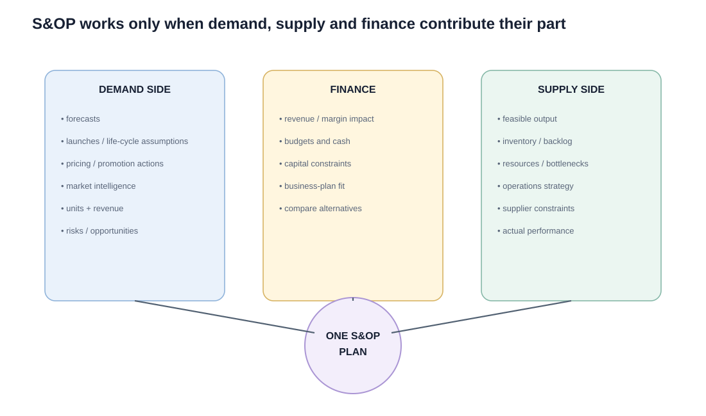

# 6. S&OP Inputs, Outputs, and Functional Interfaces

## Learning objectives

You should be able to:

- explain the main contributions of demand, supply, and finance;
- describe how demand management interfaces with product/brand management, marketing, sales, and operations;
- explain why one common product-family structure improves S&OP.

## One process, different responsibilities

### Demand side

Typical contributions include:

- demand forecasts;
- commercial commitments and actions;
- product launches and life-cycle assumptions;
- pricing and promotion plans;
- market and competitive intelligence;
- volume and revenue estimates;
- assumptions, risks, and opportunities.

### Supply side

Typical contributions include:

- feasible output by product family;
- inventory and backlog targets;
- resource and capacity requirements;
- bottlenecks and supplier constraints;
- operations strategy choices;
- production-environment choices;
- actual production and capacity performance.

### Finance

Finance converts alternatives into financial consequences and tests them against business-plan goals, budgets, cash flow, profit expectations, and capital limits.

## Why demand management sits in the middle

Demand management can act as a translator among groups that speak different business languages.

### Product and brand management

A useful demand-management test is whether a feature creates value **in the customer's eyes**. Features that consume cost, capacity, or complexity without improving customer value should be challenged rather than automatically preserved.

Demand management helps connect customer value, product changes, life-cycle plans, and launch timing to expected demand and supply consequences.

### Marketing

Marketing influences demand through pricing, promotion, positioning, and market selection. Demand management helps connect these actions with available capacity.

### Sales

Sales interacts directly with customers and makes commitments. Demand management helps ensure those promises reflect the approved plan and known supply limitations.

### Operations

Operations needs demand information in terms that can be converted into capacity, materials, production, and delivery plans. Demand management translates commercial assumptions into that operational language.

## Demand plan estimates by audience

| Audience | Primary planning view |
|---|---|
| Product / brand management | Units and life-cycle assumptions |
| Marketing / sales | Units and money |
| Logistics | Units / volume / timing |
| Customer service | Units and service commitments |
| Finance | Money and financial impact |

The underlying plan should remain consistent even when different functions view it through different measures.

## Product families must be shared

A sales team might naturally group products by market segment while a plant prefers to group them by common process. For integrated S&OP, the organization needs a practical common family structure so commercial plans can be translated into resource requirements without repeatedly remapping the data.

## Realistic example

NorthStar sells pumps into municipal water, food processing, and chemicals. Sales initially groups products by industry. Operations groups them by motor frame and test route.

For S&OP, the company creates three common planning families based on similar capacity consumption and commercial relevance. Sales can still use its own market segmentation for selling, but the S&OP numbers reconcile to the common family structure.

## Why it matters

S&OP breaks down when functions provide incompatible inputs or leave the meeting with different interpretations of the approved plan.

## Decision logic

Define an input-output contract for commercial, planning, operations, procurement, finance, product, and executive roles. Do not approve the decision until mandatory conditions are feasible and the residual exposure has a named owner.

## Evidence retained through the workflow

Retain RACI, input definition and due date, source system, unit and horizon, output decision, recipient, acknowledgement, and escalation. Record the decision date and the event or threshold that requires reassessment.

## Applied decision artifact

Use a one-page **S&OP inputs, outputs, and functional interfaces decision record** with these fields:

- **Decision and boundary:** Define an input-output contract for commercial, planning, operations, procurement, finance, product, and executive roles.
- **Required evidence:** RACI, input definition and due date, source system, unit and horizon, output decision, recipient, acknowledgement, and escalation.
- **Expected result:** S&OP breaks down when functions provide incompatible inputs or leave the meeting with different interpretations of the approved plan.
- **Balancing condition:** Broader participation improves decision quality, but unclear decision rights create review cycles without ownership.
- **Accountability:** name the decision owner, approval date, residual exposure owner, and measurable trigger for reassessment.

The record is complete only when another practitioner can reproduce the reasoning and identify the next action without relying on meeting memory.

## Trade-offs

Broader participation improves decision quality, but unclear decision rights create review cycles without ownership.

## Commonly confused with

Do not confuse a preferred decision method with a guaranteed outcome. Define an input-output contract for commercial, planning, operations, procurement, finance, product, and executive roles. Validate the result with RACI, input definition and due date, source system, unit and horizon, output decision, recipient, acknowledgement, and escalation; the evidence, not the method's label, determines whether the choice worked.

## Common mistakes

- Finance is not only a scorekeeper after S&OP; financial feasibility is part of reconciliation.
- Sales should not make commitments beyond the agreed plan without an exception process.
- Different departments may use different internal groupings, but the integrated S&OP process needs a common planning structure.

## Original knowledge check

**Question.** NorthStar is deciding how to apply S&OP inputs, outputs, and functional interfaces. Which proposal is most defensible?

A. Use S&OP inputs, outputs, and functional interfaces as a label for the preferred option before defining the decision outcome, constraints, or owner.
B. Define an input-output contract for commercial, planning, operations, procurement, finance, product, and executive roles.
C. Choose the apparent upside without evaluating this balancing condition: Broader participation improves decision quality, but unclear decision rights create review cycles without ownership.
D. Approve the choice without retaining RACI, input definition and due date, source system, unit and horizon, output decision, recipient, acknowledgement, and escalation; omit the reassessment trigger as well.

Answer and rationale

### Correct answer

**B. Define an input-output contract for commercial, planning, operations, procurement, finance, product, and executive roles.**

### Why it is correct

S&OP breaks down when functions provide incompatible inputs or leave the meeting with different interpretations of the approved plan. The recommended action connects the operating choice to evidence, ownership, and a measurable outcome.

### Why the other answers are wrong

- **A** reverses the decision sequence. The team should first do the required work: define an input-output contract for commercial, planning, operations, procurement, finance, product, and executive roles.
- **C** optimizes one visible result and omits the balancing effects: broader participation improves decision quality, but unclear decision rights create review cycles without ownership.
- **D** leaves the approval unauditable. A reviewer would be missing RACI, input definition and due date, source system, unit and horizon, output decision, recipient, acknowledgement, and escalation, as well as the trigger needed to revisit the decision when conditions change.

Those approaches ignore the governing trade-off: broader participation improves decision quality, but unclear decision rights create review cycles without ownership.

## Practitioner perspective

A review should be able to reconstruct the choice from RACI, input definition and due date, source system, unit and horizon, output decision, recipient, acknowledgement, and escalation. If those records cannot explain what changed, who decided, and when the decision will be revisited, the process is not yet controlled.

## Related concepts

- [Section overview](./README.md)
- [Module 2 continuation](../../02-network-design-digital-connectivity-performance/section-a-network-design-and-technology-investment/03-network-configuration-and-flow-design.md)
Module 1 → Section E → S&OP Inputs and Outputs / Functional Responsibilities. Table and scenario are original.

---

[Previous: Supply Review and the Production Plan](05-supply-review-and-production-plan.md) · [Next: Level, Chase, and Hybrid Operations Strategies](07-level-chase-hybrid-strategies.md)
