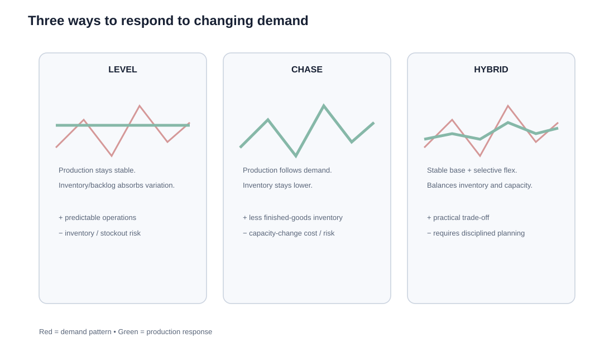

# 7. Level, Chase, and Hybrid Operations Strategies

## Learning objectives

You should be able to:

- distinguish level, chase, and hybrid production strategies;
- explain the inventory/capacity trade-off in each approach;
- select a reasonable strategy for different demand patterns.

## Terminology checkpoint

- **Level production method:** keep the production rate relatively stable and use buffers such as inventory or backlog to absorb demand variation.
- **Chase production method:** vary the production rate or capacity so output follows changes in demand more closely.
- **Hybrid strategy:** combine level and chase tactics rather than relying on only one.

## Level strategy

A level strategy keeps the production rate relatively stable and allows inventory, backlog, or both to absorb the difference between production and demand.

**Strengths**

- stable workforce and equipment loading;
- easier operating rhythm;
- less frequent hiring, layoffs, and schedule disruption.

**Trade-offs**

- inventory can build during low-demand periods;
- stockouts or backlog can occur if a demand spike exceeds the buffer;
- obsolescence risk increases for short-life products.

## Chase strategy

A chase strategy changes output to follow demand more closely.

**Strengths**

- lower finished-goods inventory;
- less risk of producing the wrong quantity ahead of demand.

**Trade-offs**

- overtime, hiring, layoffs, subcontracting, or schedule changes may cost more;
- quality and productivity may suffer if capacity changes too quickly;
- peak capacity must be available when demand rises.

## Hybrid strategy

A hybrid combines the two. Companies may maintain a stable core workforce and use selected overtime, temporary labor, prebuild inventory, or subcontracting during predictable peaks.

## Worked example — six-month plan

NorthStar's family demand is:

| Month | Demand |
|---|---:|
| 1 | 420 |
| 2 | 460 |
| 3 | 520 |
| 4 | 680 |
| 5 | 760 |
| 6 | 640 |

Average demand is **580 units per month**.

### Level option

From a finance perspective, level production can build inventory during weak-sales periods. Manufacturing cost tied to unsold inventory may remain on the balance sheet until the product is sold, while period expenses such as general and administrative costs continue during the period.

Produce 580 each month. Production is predictable, but inventory builds in the first three months and is consumed during the peak.

### Chase option

Produce exactly 420, 460, 520, 680, 760, and 640. Inventory stays low, but labor and machine loading must change rapidly.

### Hybrid option

Maintain a stable base around 520-600 units and use planned overtime and prebuild inventory for the peak months.

## Decision framework

| If the business has... | Strategy often favored |
|---|---|
| Stable labor, cheap inventory, predictable seasonality | More level |
| Expensive/perishable inventory, flexible capacity | More chase |
| Moderate seasonality and some flexible capacity | Hybrid |

## Common confusion

**Level production does not mean demand is level.** It means the production rate is kept relatively stable while another buffer absorbs the demand variation.

## Common mistakes

- Chase is not automatically "leaner" or cheaper; changing capacity has costs.
- Level production can protect against constant capacity adjustment but may create inventory or stockout risk.
- Most real organizations use some hybrid rather than a pure extreme.

## Related concepts

Module 1 → Section E → Operations Strategies. Numerical example and visual are original.
