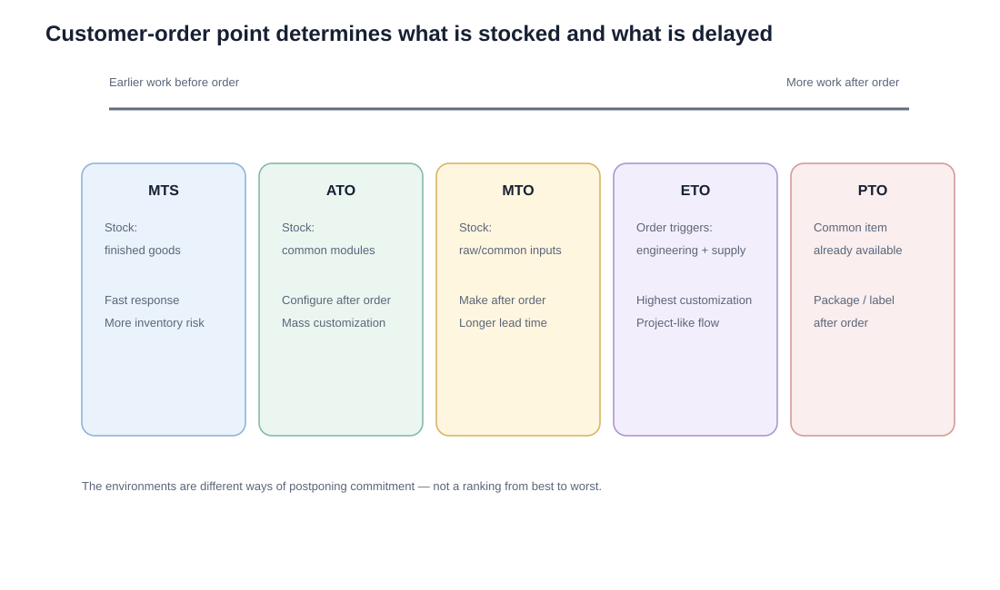

# 8. Supply-Demand Production Environments: MTS, MTO, ETO, ATO, and PTO

## Learning objectives

You should be able to:

- distinguish the main production environments by the point at which the customer order enters;
- explain the inventory and lead-time trade-off of each environment;
- identify the likely master-scheduling focus.

## The central question

> **How much work is completed before the customer order arrives?**

That customer-order decoupling point drives inventory, customization, delivery speed, and planning logic.

## Comparison

| Environment | Before customer order | After customer order | Typical characteristics | Planning focus |
|---|---|---|---|---|
| Make-to-stock (MTS) | Finished goods | Pick / ship | Higher volume, lower variety, fast response | Finished goods |
| Assemble-to-order (ATO) | Common modules/components | Final assembly/configuration | Many end-item combinations from limited modules | Modules/components |
| Make-to-order (MTO) | Possibly raw materials/common parts | Manufacture product | Lower volume, higher variety | Raw materials / capacity |
| Engineer-to-order (ETO) | Little product-specific design | Engineer + procure + manufacture | Unique design / high customization | Project, engineering, long-lead items |
| Package-to-order (PTO) | Common physical product | Customer-specific packaging | Same item, delayed pack/label | Common item + packaging requirements |

## MTS example

NorthStar stocks a standard replacement pump that has stable service demand. Finished units are produced before specific customer orders arrive.

**Risk:** excess inventory and obsolescence if demand changes.

## ATO example

ATO needs enough final-assembly capability near the customer-order point. If assembly is pushed into a distribution center or fulfillment location, the organization may need additional skills, training, equipment, quality controls, and space.

NorthStar holds standard pump modules—motor sizes, seal kits, controllers, and housings—and performs final assembly after the customer selects the configuration.

This supports many end-item combinations without stocking every finished variant.

## MTO example

A specialty process pump is manufactured only after the customer order is accepted. The customer tolerates a longer lead time in exchange for customization.

## ETO example

A refinery requests a pump skid with unique process calculations, piping design, instrumentation, and purchased components. Engineering work is part of the order itself.

## PTO example

A common spare-parts kit is manufactured in advance but packed after the customer order to support different languages, quantities, regulatory labels, or branded cartons.

## Common mistakes

- ATO master scheduling normally focuses on common modules/components rather than every possible finished combination.
- ETO involves unique engineering, not merely selecting standard options.
- PTO delays packaging, not necessarily manufacturing of the common physical item.
- MTS provides fast customer response but shifts risk toward finished-goods inventory.

## Practitioner perspective

The correct production environment is not just a manufacturing choice. It influences forecast granularity, inventory location, product design, order promising, BOM structure, capacity planning, and customer lead time.

## Related concepts

Module 1 → Section E → Supply-Demand Strategies. Definitions are independently summarized; examples and matrix are original.
