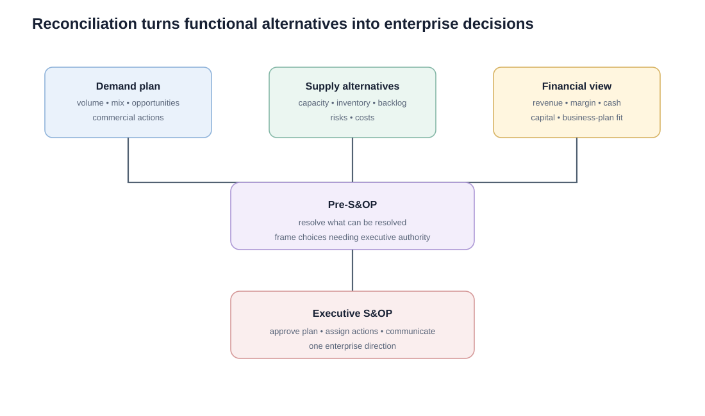

# 9. Financial Reconciliation and Executive S&OP

## Learning objectives

You should be able to:

- explain the purpose of financial review, pre-S&OP, and executive S&OP;
- explain how demand, supply, and finance are reconciled;
- identify the types of decisions that should reach executives;
- explain why communication after the executive meeting is essential.

## Reconciliation is where alternatives become decisions

By this stage, the organization should already understand the commercial demand view and supply capability. The remaining task is to determine which alternative best supports enterprise goals and which issues require executive authority.

## Financial review

Finance evaluates the unit plans in monetary terms. Typical questions include:

- What revenue does each alternative generate?
- What is the expected margin?
- What overtime, inventory, outsourcing, or capital cost is created?
- Is cash available?
- Does the alternative remain inside budget and capital limits?
- Does it support business-plan goals?

## Pre-S&OP

The pre-S&OP meeting should solve issues that do **not** require executive authority and prepare a short, decision-ready agenda for the executive meeting.

A strong pre-meeting converts raw disagreement into choices such as:

> Alternative A protects customer service but requires $180,000 overtime. Alternative B limits overtime but defers 250 low-margin units. Which trade-off best supports our strategy?

> **Terminology:** **Executive sales and operations planning (executive S&OP)** is the executive decision portion of the S&OP process, where unresolved supply, demand, and financial trade-offs are settled at the aggregate/product-family level and aligned with higher-level business direction.

## Executive S&OP

The executive meeting is the decision forum. Executives review significant gaps, risks, opportunities, and required actions by product family.

Typical decisions include:

- approving a family demand/supply plan;
- authorizing material capacity changes;
- approving capital or major outsourcing;
- changing commercial actions;
- accepting planned inventory or backlog;
- choosing how to handle a major opportunity or constraint.

## Realistic reconciliation example

NorthStar faces a 1,100-unit quarterly capacity gap.

Finance compares two alternatives:

| | Plan A | Plan B |
|---|---:|---:|
| Incremental units supported | 1,100 | 800 |
| Incremental operating cost | $282,000 | $146,000 |
| Revenue protected | $1.82M | $1.32M |
| Primary concern | overtime/subcontract quality | lost demand / service impact |

The executive team may choose Plan A if strategic customers and contribution margin justify the added cost, or Plan B if cash and operational risk dominate. The point is that the choice is **cross-functional**, not a local operations decision.

## Communicate the decision

The approved S&OP plan must be communicated to the people who will sell, buy, produce, move, and finance it. A consensus plan that remains in the meeting room is not an operating plan.

## Why it matters

Functional alternatives remain incomplete until their customer, operational, financial, and risk consequences are compared on one basis.

## Decision logic

Translate the demand-supply gap into enterprise alternatives, reconcile volume and value, define residual risk, and obtain an explicit executive decision. Do not approve the decision until mandatory conditions are feasible and the residual exposure has a named owner.

## Evidence retained through the workflow

Retain alternative calculations, income and cash effects, service and risk exposure, recommendation, decision rights, approval, and trigger. Record the decision date and the event or threshold that requires reassessment.

## Applied decision artifact

Use a one-page **financial reconciliation and executive S&OP decision record** with these fields:

- **Decision and boundary:** Translate the demand-supply gap into enterprise alternatives, reconcile volume and value, define residual risk, and obtain an explicit executive decision.
- **Required evidence:** alternative calculations, income and cash effects, service and risk exposure, recommendation, decision rights, approval, and trigger.
- **Expected result:** Functional alternatives remain incomplete until their customer, operational, financial, and risk consequences are compared on one basis.
- **Balancing condition:** Escalation protects enterprise alignment but should not replace delegated authority for routine decisions within agreed thresholds.
- **Accountability:** name the decision owner, approval date, residual exposure owner, and measurable trigger for reassessment.

The record is complete only when another practitioner can reproduce the reasoning and identify the next action without relying on meeting memory.

## Trade-offs

Escalation protects enterprise alignment but should not replace delegated authority for routine decisions within agreed thresholds.

## Commonly confused with

Do not confuse a preferred decision method with a guaranteed outcome. Translate the demand-supply gap into enterprise alternatives, reconcile volume and value, define residual risk, and obtain an explicit executive decision. Validate the result with alternative calculations, income and cash effects, service and risk exposure, recommendation, decision rights, approval, and trigger; the evidence, not the method's label, determines whether the choice worked.

## Common mistakes

- Executive S&OP is not the meeting where every SKU is rescheduled.
- Finance evaluates feasibility and business-plan fit, not just historical accounting results.
- Pre-S&OP should resolve what it can before escalating only decision-worthy issues.

## Original knowledge check

**Question.** NorthStar is deciding how to apply financial reconciliation and executive S&OP. Which proposal is most defensible?

A. Use financial reconciliation and executive S&OP as a label for the preferred option before defining the decision outcome, constraints, or owner.
B. Translate the demand-supply gap into enterprise alternatives, reconcile volume and value, define residual risk, and obtain an explicit executive decision.
C. Choose the apparent upside without evaluating this balancing condition: Escalation protects enterprise alignment but should not replace delegated authority for routine decisions within agreed thresholds.
D. Approve the choice without retaining alternative calculations, income and cash effects, service and risk exposure, recommendation, decision rights, approval, and trigger; omit the reassessment trigger as well.

Answer and rationale

### Correct answer

**B. Translate the demand-supply gap into enterprise alternatives, reconcile volume and value, define residual risk, and obtain an explicit executive decision.**

### Why it is correct

Functional alternatives remain incomplete until their customer, operational, financial, and risk consequences are compared on one basis. The recommended action connects the operating choice to evidence, ownership, and a measurable outcome.

### Why the other answers are wrong

- **A** reverses the decision sequence. The team should first do the required work: translate the demand-supply gap into enterprise alternatives, reconcile volume and value, define residual risk, and obtain an explicit executive decision.
- **C** optimizes one visible result and omits the balancing effects: escalation protects enterprise alignment but should not replace delegated authority for routine decisions within agreed thresholds.
- **D** leaves the approval unauditable. A reviewer would be missing alternative calculations, income and cash effects, service and risk exposure, recommendation, decision rights, approval, and trigger, as well as the trigger needed to revisit the decision when conditions change.

Those approaches ignore the governing trade-off: escalation protects enterprise alignment but should not replace delegated authority for routine decisions within agreed thresholds.

## Practitioner perspective

A review should be able to reconstruct the choice from alternative calculations, income and cash effects, service and risk exposure, recommendation, decision rights, approval, and trigger. If those records cannot explain what changed, who decided, and when the decision will be revisited, the process is not yet controlled.

## Related concepts

- [Section overview](./README.md)
- [Module 2 continuation](../../02-network-design-digital-connectivity-performance/section-a-network-design-and-technology-investment/03-network-configuration-and-flow-design.md)
Module 1 → Section E → Reconciliation / Financial Review / Pre-Meeting / Executive Meeting. Tables and examples are original.

---

[Previous: Supply-Demand Production Environments: MTS, MTO, ETO, ATO, and PTO](08-supply-demand-production-environments.md) · [Next: Implementing S&OP and Gaining Buy-In](10-implementing-sop.md)
