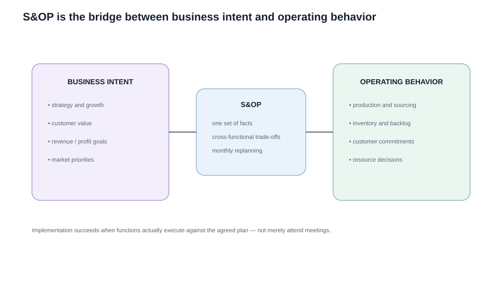

# 10. Implementing S&OP and Gaining Buy-In

## Learning objectives

You should be able to:

- explain why S&OP implementation is primarily a cross-functional management challenge;
- identify organizational benefits of a disciplined process;
- explain why trust, communication, metrics, and executive participation matter.

## S&OP is a behavior change, not just a calendar of meetings

A company can schedule seven monthly meetings and still have weak S&OP if functions continue to protect separate data, make independent commitments, or ignore the approved plan.

The real implementation challenge is moving from **many local plans** to **one enterprise plan**.

## What successful S&OP coordinates

### Quality is part of the trade-off

Quality has both a **customer-fit** side (does the product or service meet the need?) and an **execution/conformance** side (was it produced and delivered as intended?). S&OP should not optimize cost or speed so aggressively that customer fitness-for-use or conformance suffers.

S&OP creates a bridge between:

- business-plan goals and tactical actions;
- customer value and supply-chain efficiency;
- commercial opportunity and operational feasibility;
- unit plans and financial plans;
- current performance and future action.

## Why buy-in can be difficult

Functions may resist because S&OP makes assumptions and performance visible. Common symptoms include:

- sales using unofficial forecasts;
- operations distrusting commercial overrides;
- finance maintaining a separate planning number;
- product launches entering the plan too late;
- executives delegating decisions that require cross-functional trade-offs;
- meetings focused on explaining the past instead of deciding the future.

## Practical implementation principles

### 1. One set of facts

Use common definitions, calendars, family structures, and approved numbers.

### 2. Clear accountability

Each function owns its inputs. The process owner coordinates; the executive team decides unresolved enterprise trade-offs.

### 3. Exception-based review

Spend meeting time on material changes, risks, opportunities, and decisions—not on every line of data.

### 4. Document assumptions

A number without its assumptions becomes impossible to challenge or improve intelligently.

### 5. Measure plan quality

Track forecast/demand-plan accuracy, plan adherence, inventory/backlog, service, and decision follow-through.

### 6. Replan visibly

Show what changed since the prior cycle and why. This builds trust because people can see whether earlier assumptions were correct.

## Realistic example — rebuilding trust

NorthStar operations managers distrust a sales forecast because three major commercial overrides failed in the prior quarter.

A poor response is to stop listening to sales.

A better S&OP response is to:

- review the prior assumptions openly;
- measure forecast value added by overrides;
- require evidence for large adjustments;
- invite operations to explain capacity and lead-time consequences;
- record the final decision and revisit it next month.

Trust grows when the process learns from misses rather than hiding them.

## External collaboration

Where appropriate, organizations may share selected outcomes or assumptions with suppliers, distributors, or other partners. External partners do not need every internal financial detail, but better visibility can help them prepare capacity and reduce surprises.

## Why it matters

A technically correct process will fail if leaders do not use it to make decisions or if teams cannot trust the data and commitments.

## Decision logic

Implement S&OP through a scoped pilot, stable definitions, visible decision rights, behavior measures, issue resolution, and staged expansion. Do not approve the decision until mandatory conditions are feasible and the residual exposure has a named owner.

## Evidence retained through the workflow

Retain baseline maturity, pilot scope, role charter, data definitions, meeting evidence, decision adherence, benefits, and scale gate. Record the decision date and the event or threshold that requires reassessment.

## Applied decision artifact

Use a one-page **implementing S&OP and gaining buy-in decision record** with these fields:

- **Decision and boundary:** Implement S&OP through a scoped pilot, stable definitions, visible decision rights, behavior measures, issue resolution, and staged expansion.
- **Required evidence:** baseline maturity, pilot scope, role charter, data definitions, meeting evidence, decision adherence, benefits, and scale gate.
- **Expected result:** A technically correct process will fail if leaders do not use it to make decisions or if teams cannot trust the data and commitments.
- **Balancing condition:** A narrow pilot accelerates learning but may miss enterprise interdependencies; a broad launch increases coverage but multiplies change risk.
- **Accountability:** name the decision owner, approval date, residual exposure owner, and measurable trigger for reassessment.

The record is complete only when another practitioner can reproduce the reasoning and identify the next action without relying on meeting memory.

## Trade-offs

A narrow pilot accelerates learning but may miss enterprise interdependencies; a broad launch increases coverage but multiplies change risk.

## Commonly confused with

Do not confuse a preferred decision method with a guaranteed outcome. Implement S&OP through a scoped pilot, stable definitions, visible decision rights, behavior measures, issue resolution, and staged expansion. Validate the result with baseline maturity, pilot scope, role charter, data definitions, meeting evidence, decision adherence, benefits, and scale gate; the evidence, not the method's label, determines whether the choice worked.

## Common mistakes

- S&OP is not owned by operations alone.
- A demand manager facilitates; senior commercial leadership remains accountable for the demand plan.
- More meetings do not automatically mean better S&OP.

## Original knowledge check

**Question.** NorthStar is deciding how to apply implementing S&OP and gaining buy-in. Which proposal is most defensible?

A. Use implementing S&OP and gaining buy-in as a label for the preferred option before defining the decision outcome, constraints, or owner.
B. Implement S&OP through a scoped pilot, stable definitions, visible decision rights, behavior measures, issue resolution, and staged expansion.
C. Choose the apparent upside without evaluating this balancing condition: A narrow pilot accelerates learning but may miss enterprise interdependencies; a broad launch increases coverage but multiplies change risk.
D. Approve the choice without retaining baseline maturity, pilot scope, role charter, data definitions, meeting evidence, decision adherence, benefits, and scale gate; omit the reassessment trigger as well.

Answer and rationale

### Correct answer

**B. Implement S&OP through a scoped pilot, stable definitions, visible decision rights, behavior measures, issue resolution, and staged expansion.**

### Why it is correct

A technically correct process will fail if leaders do not use it to make decisions or if teams cannot trust the data and commitments. The recommended action connects the operating choice to evidence, ownership, and a measurable outcome.

### Why the other answers are wrong

- **A** reverses the decision sequence. The team should first do the required work: implement S&OP through a scoped pilot, stable definitions, visible decision rights, behavior measures, issue resolution, and staged expansion.
- **C** optimizes one visible result and omits the balancing effects: A narrow pilot accelerates learning but may miss enterprise interdependencies; a broad launch increases coverage but multiplies change risk.
- **D** leaves the approval unauditable. A reviewer would be missing baseline maturity, pilot scope, role charter, data definitions, meeting evidence, decision adherence, benefits, and scale gate, as well as the trigger needed to revisit the decision when conditions change.

Those approaches ignore the governing trade-off: A narrow pilot accelerates learning but may miss enterprise interdependencies; a broad launch increases coverage but multiplies change risk.

## Practitioner perspective

A review should be able to reconstruct the choice from baseline maturity, pilot scope, role charter, data definitions, meeting evidence, decision adherence, benefits, and scale gate. If those records cannot explain what changed, who decided, and when the decision will be revisited, the process is not yet controlled.

## Related concepts

- [Section overview](./README.md)
- [Module 2 continuation](../../02-network-design-digital-connectivity-performance/section-a-network-design-and-technology-investment/03-network-configuration-and-flow-design.md)
Module 1 → Section E → Implementing S&OP / Coordinating Function / Contributions and Buy-In. Wording and implementation framework are original.

---

[Previous: Financial Reconciliation and Executive S&OP](09-reconciliation-and-executive-sop.md) · [Next: Demand Prioritization and Customer Service](11-demand-prioritization-and-customer-service.md)
