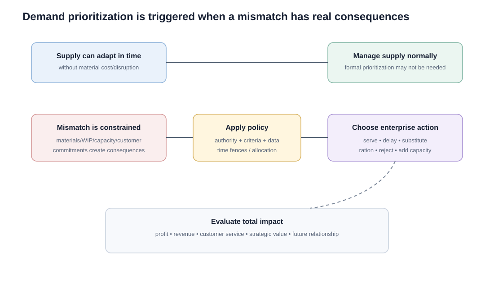
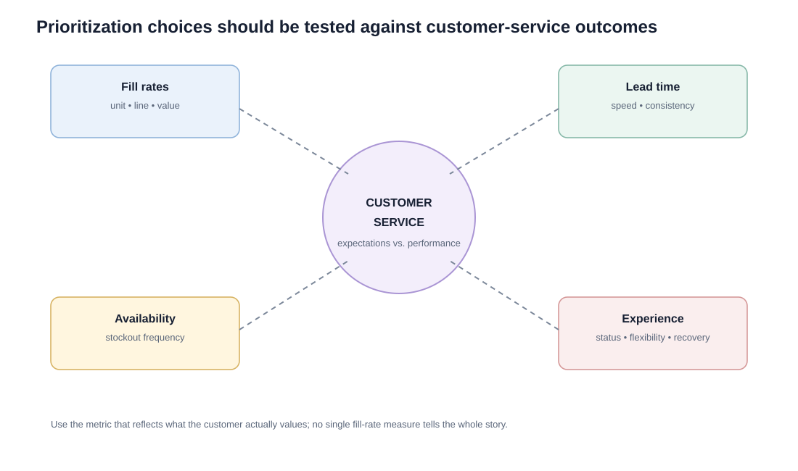

# 11. Demand Prioritization and Customer Service

## Learning objectives

You should be able to:

- explain why demand must sometimes be prioritized;
- distinguish normal supply adjustment from true prioritization decisions;
- explain the role of time fences, allocation, segmentation, substitution, and delayed delivery;
- identify basic customer-service measures used to evaluate the consequences of prioritization.

## Why prioritization is necessary

Demand rarely arrives in the exact volume, mix, and timing assumed in the plan. When supply is constrained and the mismatch creates economic or service consequences, the organization must decide **which demand should be served, delayed, substituted, rationed, or rejected**.

## Prioritization should follow policy

Individual salespeople should not independently decide who gets scarce supply simply because each person will naturally advocate for their own customers.

A good policy defines:

- who has authority at each risk level;
- what customer/value criteria can be used;
- what information supply must provide;
- when executive approval is required;
- how customer-service impact will be measured.

## When prioritization is not necessary

If capacity can be changed in time **without meaningful cost or operational disruption**, supply can simply adapt. Prioritization becomes necessary when commitments, purchased materials, WIP, constrained capacity, or customer promises make the choice economically consequential.

## Delay irreversible decisions

A strong planning process delays expensive commitments until the last responsible moment. Time fences or other decision points protect committed operations while still allowing later information to improve the plan.

## Common prioritization tactics

- allocate scarce supply to high-value or strategic segments;
- ration supply so no region receives zero;
- offer substitute products;
- offer incentives for later delivery;
- prioritize production of the most critical mix;
- de-expedite work when demand falls;
- evaluate large one-time opportunities through incremental profit and customer-service impact.

## Realistic example — scarce controller supply

NorthStar receives only **1,600 controllers** against demand for **1,950 pumps** this month.

Demand includes:

- 700 units for contracted municipal customers;
- 500 for industrial distributors;
- 450 for project customers with flexible dates;
- 300 for spot orders.

A rational policy might first protect contractual commitments and strategically important customers, then offer delayed delivery or alternate controller configurations where feasible. The exact rule depends on enterprise strategy, economics, and customer impact—not simply order arrival sequence.

## Customer-service measures

### Fill rates

- **Unit fill rate:** units supplied ÷ units requested.
- **Line-item fill rate:** order lines filled as required ÷ total order lines.
- **Monetary-value fill rate:** value supplied ÷ value requested.

### Other useful measures

- stockout frequency;
- delivery / response lead time;
- consistency of performance;
- flexibility when needs change;
- recovery from service failures;
- order-status visibility;
- customer satisfaction.

## Worked service example

A customer order contains 10 line items totaling 1,000 units and $96,000.

NorthStar immediately fills:

- 8 of 10 lines;
- 920 of 1,000 units;
- $91,200 of value.

Then:

- line-item fill rate = **80%**;
- unit fill rate = **92%**;
- monetary-value fill rate = **95%**.

All three are correct, but they answer different questions. This is why the service metric must match what the customer actually values.

## Why it matters

When supply is constrained, allocation choices directly affect customer outcomes, revenue, fairness, contracts, and long-term trust.

## Decision logic

Apply a preapproved prioritization policy using mandatory commitments, customer consequence, alternatives, and total enterprise impact, then measure service outcomes. Do not approve the decision until mandatory conditions are feasible and the residual exposure has a named owner.

## Evidence retained through the workflow

Retain available supply, eligible demand, policy criteria, contract and regulatory obligations, allocation record, approvals, and service result. Record the decision date and the event or threshold that requires reassessment.

## Applied decision artifact

Use a one-page **demand prioritization and customer service decision record** with these fields:

- **Decision and boundary:** Apply a preapproved prioritization policy using mandatory commitments, customer consequence, alternatives, and total enterprise impact, then measure service outcomes.
- **Required evidence:** available supply, eligible demand, policy criteria, contract and regulatory obligations, allocation record, approvals, and service result.
- **Expected result:** When supply is constrained, allocation choices directly affect customer outcomes, revenue, fairness, contracts, and long-term trust.
- **Balancing condition:** Protecting the highest immediate value may damage fairness or strategic relationships; equal allocation can ignore materially different consequences.
- **Accountability:** name the decision owner, approval date, residual exposure owner, and measurable trigger for reassessment.

The record is complete only when another practitioner can reproduce the reasoning and identify the next action without relying on meeting memory.

## Trade-offs

Protecting the highest immediate value may damage fairness or strategic relationships; equal allocation can ignore materially different consequences.

## Commonly confused with

Do not confuse a preferred decision method with a guaranteed outcome. Apply a preapproved prioritization policy using mandatory commitments, customer consequence, alternatives, and total enterprise impact, then measure service outcomes. Validate the result with available supply, eligible demand, policy criteria, contract and regulatory obligations, allocation record, approvals, and service result; the evidence, not the method's label, determines whether the choice worked.

## Common mistakes

- Prioritization is an enterprise optimization problem, not a sales-rep preference problem.
- When supply can adjust cheaply and in time, capacity management may solve the problem without formal rationing.
- A high unit fill rate can hide poor performance on strategically important lines; choose the measure carefully.

## Original knowledge check

**Question.** NorthStar is deciding how to apply demand prioritization and customer service. Which proposal is most defensible?

A. Use demand prioritization and customer service as a label for the preferred option before defining the decision outcome, constraints, or owner.
B. Apply a preapproved prioritization policy using mandatory commitments, customer consequence, alternatives, and total enterprise impact, then measure service outcomes.
C. Choose the apparent upside without evaluating this balancing condition: Protecting the highest immediate value may damage fairness or strategic relationships; equal allocation can ignore materially different consequences.
D. Approve the choice without retaining available supply, eligible demand, policy criteria, contract and regulatory obligations, allocation record, approvals, and service result; omit the reassessment trigger as well.

Answer and rationale

### Correct answer

**B. Apply a preapproved prioritization policy using mandatory commitments, customer consequence, alternatives, and total enterprise impact, then measure service outcomes.**

### Why it is correct

When supply is constrained, allocation choices directly affect customer outcomes, revenue, fairness, contracts, and long-term trust. The recommended action connects the operating choice to evidence, ownership, and a measurable outcome.

### Why the other answers are wrong

- **A** reverses the decision sequence. The team should first do the required work: apply a preapproved prioritization policy using mandatory commitments, customer consequence, alternatives, and total enterprise impact, then measure service outcomes.
- **C** optimizes one visible result and omits the balancing effects: protecting the highest immediate value may damage fairness or strategic relationships; equal allocation can ignore materially different consequences.
- **D** leaves the approval unauditable. A reviewer would be missing available supply, eligible demand, policy criteria, contract and regulatory obligations, allocation record, approvals, and service result, as well as the trigger needed to revisit the decision when conditions change.

Those approaches ignore the governing trade-off: protecting the highest immediate value may damage fairness or strategic relationships; equal allocation can ignore materially different consequences.

## Practitioner perspective

A review should be able to reconstruct the choice from available supply, eligible demand, policy criteria, contract and regulatory obligations, allocation record, approvals, and service result. If those records cannot explain what changed, who decided, and when the decision will be revisited, the process is not yet controlled.

## Related concepts

- [Section overview](./README.md)
- [Module 2 continuation](../../02-network-design-digital-connectivity-performance/section-a-network-design-and-technology-investment/03-network-configuration-and-flow-design.md)
Module 1 → Section E → Demand Management and Prioritization / Customer Service Levels and Prioritization. Scenario, formulas, and visual composition are original.

---

[Previous: Implementing S&OP and Gaining Buy-In](10-implementing-sop.md) · [Section review](12-section-e-review.md)
