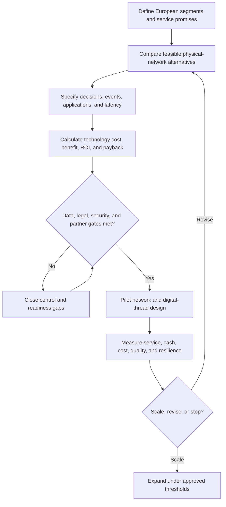

# AsterWorks Network Transformation Capstone

AsterWorks Equipment must support European growth without allowing customer service,
working capital, data quality, cybersecurity exposure, or operating risk to deteriorate.
This capstone connects Module 2's physical-network, technology, data, execution,
performance, and financial decisions into one executive recommendation.

Complete the analysis before opening the [solution guide](solution-guide.md).

## Decision context

AsterWorks produces modular industrial water-treatment skids and replacement
cartridges. Today, one North American assembly plant and distribution center serve both
North America and Europe. European demand is growing, average transit time is long, and
expedited freight is increasing. Leadership is evaluating four network alternatives,
including a European postponement center, together with upgraded planning and execution
applications, partner event integration, governed master data, and a new performance
system.

The executive team will approve only a design that:

- makes the service and financial mechanisms visible;
- applies legal, privacy, cybersecurity, and data-readiness gates before scale;
- distinguishes one-time cash effects from recurring profit effects;
- names decision owners and measurable exit criteria; and
- can be revised if growth, adoption, tariffs, service, or supplier conditions change.

## End-to-end decision flow

## Source data and conventions

All values are fictional and denominated in US dollars unless a column states another
unit. Treat each CSV as one consistent base case; do not silently combine rows from
different scenarios. Use calendar days and a 365-day year for working-capital measures.
Raw evaluation scores use a 1–5 scale, with 5 representing the preferred condition.

| Decision area | Required source |
|---|---|
| Network alternatives | [`network-alternatives.csv`](../../assets/data/module-2/section-a/network-alternatives.csv) |
| Technology investment | [`technology-business-case.csv`](../../assets/data/module-2/section-a/technology-business-case.csv) |
| Network exceptions | [`network-exceptions.csv`](../../assets/data/module-2/section-b/network-exceptions.csv) |
| Master-data quality | [`master-data-quality.csv`](../../assets/data/module-2/section-b/master-data-quality.csv) |
| Transportation lanes | [`transport-lanes.csv`](../../assets/data/module-2/section-b/transport-lanes.csv) |
| Customer service | [`customer-service-metrics.csv`](../../assets/data/module-2/section-c/customer-service-metrics.csv) |
| Working capital | [`working-capital.csv`](../../assets/data/module-2/section-c/working-capital.csv) |
| Supplier financial health | [`supplier-health.csv`](../../assets/data/module-2/section-c/supplier-health.csv) |
| Operational performance | [`operations-scorecard.csv`](../../assets/data/module-2/section-c/operations-scorecard.csv) |

Use the [network and performance formula sheet](../../calculations/network-performance/formula-sheet.md).

## Base assumptions

Use these assumptions unless you clearly state and test an alternative:

1. Annual operating cost, one-time investment, inventory days, and service scores in
   the network file are comparable planning estimates.
2. Convert lower-is-better network criteria to a 1–5 score using:
   `1 + 4 × (maximum − alternative) ÷ (maximum − minimum)`.
3. Base network weights are operating cost 25%, service 25%, resilience 20%,
   implementation feasibility 10%, inventory days 10%, and investment 10%.
4. Technology benefits and recurring support costs occur at year end. No discounting
   is required for the base three-year classroom calculation.
5. Simple payback uses the actual time-phased net cash flows, not an average annual
   benefit.
6. The European pilot may not scale until customer, item, location, lane, and supplier
   records satisfy their critical rules and the legal/security owners approve the
   partner-data design.

## Assignment

### 1. Frame the decision

Define the European product/customer segments, measurable service promises, design
constraints, and success measures. Explain why a single service policy is inappropriate
for standard replacement cartridges and configurable treatment skids.

### 2. Compare network alternatives

Recalculate normalized cost, inventory, and investment scores. Produce the weighted
comparison using the base weights, apply any mandatory feasibility gates, and run a
service-resilience sensitivity case. Recommend one alternative and identify the
assumption most likely to reverse the ranking.

### 3. Build the technology business case

Calculate total three-year cost, benefit-cost ratio, ROI, annual net cash flows, and
time-phased payback. Then test a downside case in which only 70% of stated benefits are
realized while costs remain unchanged. Separate recurring benefits, released cash,
capacity, and risk; do not count one mechanism twice.

### 4. Design the digital thread and control model

Create an application and information-flow diagram covering customer promise, core
transactions, planning, warehouse and transportation execution, partner events,
analytics, and executive decisions. Define authoritative identifiers, event latency,
exception ownership, cybersecurity boundaries, recovery, and the human approval point
for recommendations.

### 5. Establish launch data and partner gates

Calculate the critical-defect rate for each master-data domain and prioritize the launch
remediation backlog. Create a control table covering rule, owner, prevention, monitoring,
correction approval, and evidence. Add legal, privacy, cybersecurity, and partner
readiness gates that cannot be offset by a weighted score.

### 6. Diagnose performance and financial exposure

Calculate or validate:

- lane utilization;
- perfect-order and component service rates;
- first-pass yield, schedule attainment, utilization, MTBF, and MTTR;
- current, target, and downside cash-to-cash time; and
- supplier current, quick, debt-to-equity, and interest-coverage ratios.

Use the results to define a compact executive metric tree with targets, owners,
balancing measures, thresholds, and review cadence.

### 7. Sequence implementation

Create a 90-day, one-year, and two-year roadmap. Show prerequisites, pilot exit criteria,
benefit owners, scale gates, fallback, and the conditions that would stop or redesign
the program.

## Required outputs

- one-page executive recommendation with conditions and residual risk;
- completed network scorecard and sensitivity analysis;
- reproducible technology business case and downside scenario;
- target application and information-flow diagram;
- master-data, legal, security, and partner gate register;
- exception-management operating record;
- executive metric tree and definition cards;
- supplier/customer financial-risk response; and
- gated 90-day, one-year, and two-year roadmap.

## Decision checks

### 1. Weighted score versus mandatory gate

A network alternative has the highest weighted score but cannot meet a mandatory legal
or security requirement. May leadership select it on score alone?

Answer and rationale

### Correct answer

**No.** The alternative is ineligible until the gate failure is resolved and formally
approved.

### Why it is correct

Weighted value compares feasible choices. It cannot compensate for a condition that
makes the operating design noncompliant or unsafe.

### Why the other answers are wrong

Treating a strong service or cost score as compensation would mix preference with
feasibility. Reducing the gate's weight would hide rather than resolve the exposure.

### 2. Technology benefit ownership

The business case counts planner capacity as a benefit, but no leader has approved how
that capacity will be redeployed. Should the full benefit be treated as committed?

Answer and rationale

### Correct answer

**No.** Keep it conditional until the baseline, redeployment action, owner, and evidence
are approved.

### Why it is correct

Available time does not become cash or productive capacity automatically. The benefit
requires an operating change and accountable use plan.

### Why the other answers are wrong

Calling all saved hours cash savings overstates value; excluding the benefit forever
would also ignore a credible mechanism once ownership and measurement are established.

### 3. Control-tower case design

One delayed vessel affects 90 orders. Should AsterWorks open 90 unrelated disruption
investigations?

Answer and rationale

### Correct answer

**No.** Create one disruption case linked to all affected orders while preserving
order-level priority and recovery actions.

### Why it is correct

Case compression preserves the common cause and enables coordinated action without
losing customer-specific impact.

### Why the other answers are wrong

Ninety independent cases duplicate investigation and obscure the shared event; one
unsegmented alert would lose order priority and customer consequence.

### 4. Working-capital interpretation

Can lower cash-to-cash time be declared successful without checking service and supplier
effects?

Answer and rationale

### Correct answer

**No.** Diagnose whether the improvement came from flow, lower inventory, faster
collection, or extended supplier payment, and test the balancing effects.

### Why it is correct

The same numerical improvement can represent genuine process performance or harmful
risk transfer.

### Why the other answers are wrong

Inventory-only interpretation ignores receivables and payables; cash-only optimization
can reduce service or weaken a critical supplier.

### 5. Automation boundary

May a predictive model automatically change customer allocation merely because its
average historical accuracy is high?

Answer and rationale

### Correct answer

**No.** Allocation needs policy, segment-level validation, guardrails, authority,
override, monitoring, and outcome evidence.

### Why it is correct

Average accuracy does not establish fairness, safety, contractual validity, or reliable
performance for priority customers and rare disruptions.

### Why the other answers are wrong

Using accuracy as the only gate confuses prediction quality with decision authority;
requiring manual work forever would ignore low-risk automation after controls are proven.

