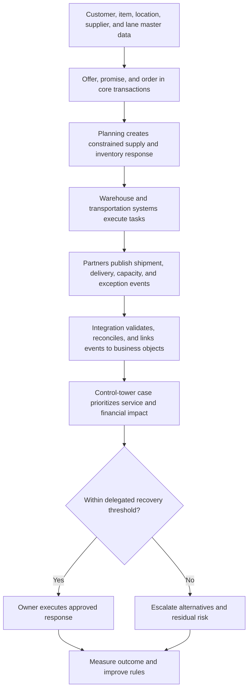

# AsterWorks Capstone Solution Guide

This guide demonstrates one defensible answer. Another recommendation can be valid if
it uses comparable assumptions, reproduces the calculations, applies mandatory gates,
and explains the conditions under which the decision changes.

## Executive recommendation

AsterWorks should pilot a **European postponement center** while retaining core assembly
in North America. Stable replacement cartridges may be positioned regionally; configurable
treatment skids should retain common modules and delay final configuration until demand
is firmer. The recommendation is conditional on five gates:

1. customer, item, location, lane, and supplier launch records pass their critical rules;
2. order, inventory, shipment, delivery, and exception events meet agreed latency and
   reconciliation controls;
3. legal, privacy, cybersecurity, recovery, and partner obligations are approved;
4. the pilot demonstrates service improvement without exceeding inventory and cash
   guardrails; and
5. technology adoption and measured benefits support scale rather than remaining
   presentation assumptions.

The postponement option ranks first under both the base and service-resilience weighting.
The technology case is positive in the base case but becomes unattractive when only 70%
of benefits are realized. AsterWorks should therefore approve a gated pilot, not an
unconditional two-year rollout.

## 1. Segment and service design

Two operating segments are sufficient for the initial case:

| Segment | Demand and configuration | Proposed promise | Operating response |
|---|---|---|---|
| Replacement cartridges | more stable, repeatable, standard product | rapid regional availability | regional finished-goods stock with min-max and expiry controls |
| Treatment skids | lower volume, configurable, higher consequence | reliable configured delivery date | common modules plus regional postponement, capacity reservation, and order-specific completion |

The design should not promise the same response for every order. Premium expedite remains
an exception with approval and margin evidence rather than the normal way of compensating
for a weak network.

## 2. Reproducible network comparison

Source: [`network-alternatives.csv`](../../assets/data/module-2/section-a/network-alternatives.csv).

For annual operating cost, inventory days, and investment, lower is better. Normalize
each to the 1–5 scale:

`normalized score = 1 + 4 × (maximum − alternative) ÷ (maximum − minimum)`

For example, postponement operating-cost score is:

`1 + 4 × ($5.05m − $4.49m) ÷ ($5.05m − $4.20m) = 3.64`

Apply the base weights: operating cost 25%, service 25%, resilience 20%, implementation
10%, inventory days 10%, and investment 10%.

| Alternative | Cost score | Service | Resilience | Implementation | Inventory score | Investment score | Weighted total |
|---|---:|---:|---:|---:|---:|---:|---:|
| Central network | 5.00 | 2 | 2 | 5 | 5.00 | 5.00 | **3.65** |
| Regional stock hub | 2.74 | 5 | 3 | 4 | 1.00 | 4.22 | **3.46** |
| Postponement center | 3.64 | 5 | 4 | 3 | 3.56 | 3.92 | **4.01** |
| Regional production plant | 1.00 | 5 | 5 | 1 | 2.44 | 1.00 | **2.94** |

Postponement combines high service and resilience with less inventory and investment
than a full regional plant. The central network is inexpensive but does not meet the
intended European response. A regional stock hub responds quickly but raises inventory
from 42 to 67 days and exposes finished-product mix. A full plant provides the strongest
resilience score but carries $8.2 million investment and the weakest implementation
score.

### Service-resilience sensitivity

Change weights to cost 15%, service 35%, resilience 25%, implementation 10%, inventory
10%, and investment 5%.

| Alternative | Base total | Service-resilience total | Result |
|---|---:|---:|---|
| Central network | 3.65 | 3.20 | falls because service and resilience are weak |
| Regional stock hub | 3.46 | 3.62 | improves but retains high inventory |
| Postponement center | 4.01 | **4.15** | remains first |
| Regional production plant | 2.94 | 3.54 | improves but investment and feasibility remain weak |

The recommendation is stable under this plausible weighting. It should be reopened if
European volume can support plant economics, postponement cannot meet the promised lead
time, duty changes materially alter flows, or the center cannot control configuration
quality.

## 3. Technology business case

Source: [`technology-business-case.csv`](../../assets/data/module-2/section-a/technology-business-case.csv).

| Year | Cost | Benefit | Net cash flow | Cumulative after initial investment |
|---|---:|---:|---:|---:|
| 0 | $330,000 | $0 | **−$330,000** | **−$330,000** |
| 1 | $60,000 | $170,000 | **$110,000** | **−$220,000** |
| 2 | $60,000 | $250,000 | **$190,000** | **−$30,000** |
| 3 | $60,000 | $270,000 | **$210,000** | **$180,000** |

Three-year cost is `$330,000 + 3 × $60,000 = $510,000`. Three-year benefit is
`$170,000 + $250,000 + $270,000 = $690,000`.

- Benefit-cost ratio: `$690,000 ÷ $510,000 = 1.35`.
- ROI: `($690,000 − $510,000) ÷ $510,000 = 35.3%`.
- Payback: after year 2, $30,000 remains unrecovered. Year 3 generates $210,000, so
  `2 + $30,000 ÷ $210,000 = 2.14 years`.

This time-phased payback is more faithful than dividing the initial investment by an
average annual benefit.

### Benefit-realization downside

At 70% of stated benefits, total benefit becomes `$690,000 × 70% = $483,000` while
cost remains $510,000.

- Benefit-cost ratio: `$483,000 ÷ $510,000 = 0.95`.
- ROI: `($483,000 − $510,000) ÷ $510,000 = −5.3%`.
- Annual net cash flows become $59,000, $115,000, and $129,000.
- Cumulative cash after year 3 remains **−$27,000**, so payback is not achieved inside
  the modeled horizon.

The investment is therefore sensitive to adoption and operating change. Expedite and
write-off reduction need invoice and disposal baselines; planner capacity needs an
approved redeployment plan. Inventory release should not be counted as recurring profit,
and saved hours should not be labeled cash unless spend or approved capacity changes.

## 4. Target digital thread

Core transactions remain authoritative for orders, inventory, shipments, receipts, and
financial postings. Planning applications consume governed records and return approved
plans; WMS and TMS execute warehouse and transport decisions; integration services
validate messages, preserve identifiers, retry safely, and reconcile failures. Analytics
may recommend recovery, but material allocation, customer-promise, legal, safety, or
financial exceptions remain inside named human authority until the control evidence
supports a narrower automated boundary.

The control record should retain source and event time, affected orders, severity,
revenue at risk, owner, response, approval, executed action, and measured outcome. In
[`network-exceptions.csv`](../../assets/data/module-2/section-b/network-exceptions.csv),
the two critical cases average `(17 + 21) ÷ 2 = 19 minutes` response and expose $548,000;
the five high cases average 40.4 minutes and expose $849,000. Severity must therefore
combine customer and financial consequence rather than delay duration alone.

## 5. Data, legal, security, and partner gates

Source: [`master-data-quality.csv`](../../assets/data/module-2/section-b/master-data-quality.csv).
Critical-defect rate is `records with a critical defect ÷ records evaluated`.

| Domain | Critical-defect rate | Completeness | Timeliness | Launch response |
|---|---:|---:|---:|---|
| Item | 3.58% | 97.8% | 96.2% | correct configuration, handling, and customs-critical rules |
| Customer | 2.44% | 99.1% | 98.4% | validate ship-to, tax, promise, and segment fields |
| Supplier | 5.71% | 96.5% | 93.0% | validate identity, payment, capacity, qualification, and risk |
| Location | 9.46% | 95.9% | 94.6% | correct calendar, time zone, capability, and address controls |
| Resource | **10.94%** | 94.7% | 91.8% | highest defect rate; block unreliable constraint planning |
| Lane | 8.48% | 92.4% | **88.7%** | lowest timeliness; validate mode, lead time, rate, and emissions |
| Finance | 2.63% | 99.4% | 98.9% | preserve posting, currency, tax, and reconciliation rules |

Average completeness must not override a failed critical rule. The pilot needs a
rule-level backlog with prevention, monitoring, correction approval, root-cause action,
owner, due date, and evidence.

Mandatory gates include permitted data use and retention, jurisdiction and privacy
assessment, least-privilege access, encryption and monitoring, incident obligations,
tested recovery, partner event and identifier conformance, audit rights, service-level
commitments, and an executable exit route. These conditions are pass/fail before
weighted technology or partner ranking.

## 6. Performance and financial baseline

### Transportation

Source: [`transport-lanes.csv`](../../assets/data/module-2/section-b/transport-lanes.csv).

| Lane | Mode | Utilization | On-time | Interpretation |
|---|---|---:|---:|---|
| L-101 Houston–Rotterdam | Ocean | 83.3% | 91.2% | core European lane; protect event quality and sailing recovery |
| L-102 Houston–Frankfurt | Air | 80.0% | 96.8% | fast and reliable but expensive and emissions-intensive |
| L-103 Rotterdam–Frankfurt | Road | 72.2% | 94.6% | consolidation opportunity subject to delivery windows |
| L-104 Rotterdam–Lyon | Road | 66.7% | 95.1% | lowest use; test frequency against service need |
| L-105 Rotterdam–Warsaw | Rail/road | 75.0% | 89.7% | lowest on-time performance; diagnose interchange variability |
| L-106 Houston–Chicago | Road | 75.0% | 93.4% | domestic comparison and feeder dependency |

Utilization alone must not drive consolidation. Frequency, variability, inventory,
promise, emissions, and recovery remain balancing measures.

### Customer service

Source: [`customer-service-metrics.csv`](../../assets/data/module-2/section-c/customer-service-metrics.csv).
Across 1,000 eligible orders:

| Measure | Calculation | Result |
|---|---:|---:|
| Perfect order | `930 ÷ 1,000` | **93.0%** |
| Complete | `976 ÷ 1,000` | 97.6% |
| On time to request | `938 ÷ 1,000` | 93.8% |
| On time to promise | `967 ÷ 1,000` | 96.7% |
| Damage free | `994 ÷ 1,000` | 99.4% |
| Documentation correct | `989 ÷ 1,000` | 98.9% |

Perfect order is lower than every component because it requires all conditions on the
same order. The gap between requested-date and promised-date performance also signals
that a reliable promise may not be sufficiently competitive.

### Operations

Source: [`operations-scorecard.csv`](../../assets/data/module-2/section-c/operations-scorecard.csv).

- First-pass yield: `26,031 ÷ 27,550 = 94.49%`.
- Schedule attainment: `1,287 ÷ 1,378 = 93.40%`.
- Run-hour utilization: `3,782 ÷ 4,368 = 86.58%`.
- Accepted yield: `26,970 ÷ 27,550 = 97.89%`.
- MTBF: `3,782 run hours ÷ 21 failures = 180.10 hours`.
- MTTR: `152 repair hours ÷ 21 failures = 7.24 hours`.

Accepted yield exceeds first-pass yield, so rework is recovering units; reporting only
accepted output would hide the capacity and quality loss. Utilization must be balanced
with maintenance windows, schedule attainment, and recovery capacity.

### Working capital

Source: [`working-capital.csv`](../../assets/data/module-2/section-c/working-capital.csv).

| Scenario | Inventory days | Receivable days | Payable days | Cash-to-cash |
|---|---:|---:|---:|---:|
| Current | 64.0 | 42.0 | 38.0 | `64 + 42 − 38 =` **68.0 days** |
| Target | 55.0 | 35.0 | 42.0 | `55 + 35 − 42 =` **48.0 days** |
| Downside launch | 73.0 | 48.0 | 36.9 | `73 + 48 − 36.9 =` **84.1 days** |

The target releases cash through lower inventory, faster collection, and four additional
payable days. Finance and procurement must verify that the payable change does not shift
unsustainable financing pressure to critical suppliers. The downside shows why scale
requires service, inventory, invoicing, and supplier balancing measures.

### Supplier financial health

Source: [`supplier-health.csv`](../../assets/data/module-2/section-c/supplier-health.csv).

| Supplier | Current ratio | Quick ratio | Debt/equity | Interest coverage | Response |
|---|---:|---:|---:|---:|---|
| Atlas Controls | 1.55 | 0.78 | 1.08 | 3.06 | monitor liquidity and high dependency |
| BlueRiver Metals | 1.75 | 0.82 | 0.37 | 7.62 | routine monitoring; validate operational trend |
| Cedar Sensorics | **1.14** | **0.43** | **2.75** | **1.58** | critical dependency; executive mitigation and continuity plan |
| Delta Packaging | 1.96 | 1.12 | 0.25 | 8.08 | lowest modeled financial concern |

Cedar Sensorics is the priority because weak liquidity, leverage, interest coverage,
88.1% on-time performance, and critical dependency reinforce one another. AsterWorks
should verify current financial evidence, protect payments from avoidable disputes,
review capacity and recovery, and qualify an executable alternative rather than reacting
only after failure.

## 7. Executive metric tree

| Outcome | Measure and initial threshold | Owner | Balancing evidence | Cadence/action |
|---|---|---|---|---|
| Customer promise | perfect order ≥95%; on-time request ≥95% | customer operations | expedite cost and promise-date changes | monthly; root-cause miss segments |
| Flow reliability | critical exception decision ≤30 min | network duty manager | false alerts and recovery cost | weekly/monthly |
| Quality and capacity | FPY ≥96%; schedule attainment ≥95% | plant operations | utilization, rework, MTBF, MTTR | weekly |
| Cash | cash-to-cash ≤55 days during pilot | finance | service, shortages, supplier payment effect | monthly |
| Data | zero unresolved launch-critical defects | domain owners | recurrence and correction lead time | weekly through stabilization |
| Technology value | benefit realization ≥85% of approved phase case | benefit owners | adoption, incidents, operating cost | monthly/quarterly gate |
| Resilience | critical dependencies have tested recovery | network risk owner | cost and exercise evidence | quarterly |

Targets are initial management hypotheses, not dataset facts. Owners must approve their
definitions, baselines, and decision thresholds before the pilot.

## Implementation roadmap

| Horizon | Work and evidence | Exit decision |
|---|---|---|
| First 90 days | confirm segments and promises; validate network and business-case assumptions; appoint end-to-end, data, security, and benefit owners; cleanse launch-critical records; define event contracts and metric cards; complete legal/security assessment | approve, redesign, or stop the pilot based on feasibility and evidence completeness |
| Months 4–12 | establish the small postponement center; connect warehouse/carrier events; run exception workflow; validate configuration quality; measure service, inventory, cash, adoption, and benefits; exercise recovery | scale only if service improves, critical controls pass, and cash/benefit guardrails hold |
| Year 2 | expand qualified volume and partners; add scenario planning and selected analytics; automate only proven low-risk decisions; retire duplicate processes and interfaces | continue scaling, hold, or reverse based on outcome and residual-risk review |

Fallback retains the central fulfillment route until the European process demonstrates
stable configuration, inventory, data, event, and recovery behavior. A failed legal,
security, quality, or recovery gate stops scale regardless of schedule pressure.

## Sensitivity and failure cases

The decision must be reopened when any of these occurs:

- postponement completion cannot meet the segment promise;
- European volume or tariffs materially change plant or hub economics;
- inventory days approach the 67-day regional-stock case without service improvement;
- technology benefits trend toward the 70% downside and payback leaves the horizon;
- launch-critical master-data defects recur after correction;
- a partner cannot meet event, security, recovery, or audit obligations; or
- Cedar Sensorics or another critical dependency crosses the approved financial or
  performance trigger.

## Evaluation rubric

An incomplete answer names applications and selects a network without reproducible
economics, gates, or ownership. A competent answer reproduces the calculations, connects
the physical and digital design, and states trade-offs. An excellent answer also applies
mandatory gates before ranking, separates cash from profit and capacity, tests a case
that could reverse the decision, completes usable control artifacts, and defines the
evidence that authorizes pilot, scale, pause, or exit.

Return to the [capstone assignment](README.md), the [Module 2 overview](../README.md), or the [network and performance formula sheet](../../calculations/network-performance/formula-sheet.md). Continue into [Module 3: Sourcing Strategy, Product Design, and Supplier Execution](../../03-sourcing-strategy-product-design-supplier-execution/README.md) to convert the approved network and digital requirements into sourcing, supplier, contract, and procure-to-pay controls.
