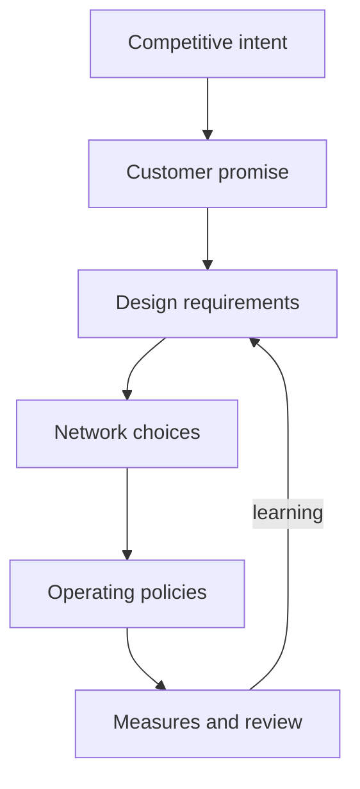
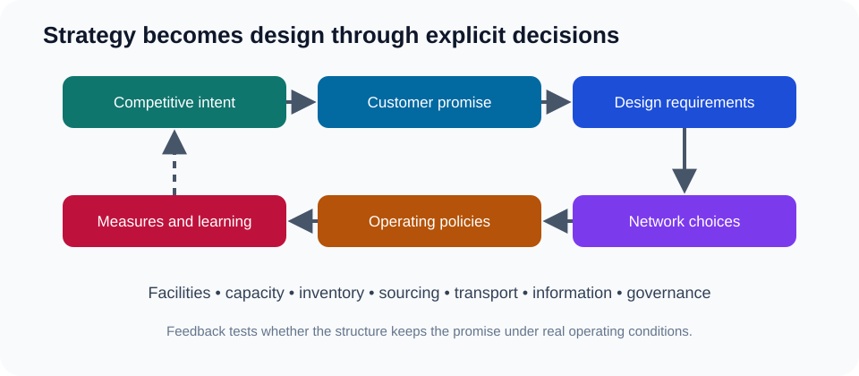

# 1. Strategy to Network Design

## Learning objectives

After this topic, you should be able to:

- translate a competitive strategy into measurable network requirements;
- distinguish network design from day-to-day planning;
- connect customer promises to facilities, flows, policies, technology, and metrics; and
- recognize when an apparently operational problem is actually a design mismatch.

## Concept in plain English

A supply-network design determines **where work happens, where inventory waits, how products and information move, and which partners perform each activity**. It is the operating structure behind the customer promise.

Strategy becomes useful only when it changes design choices. “Grow in Europe” is an aspiration. “Deliver configured units to priority European customers within five working days while keeping regional inventory below 35 days” is a design requirement.

## Strategy-to-design chain

The chain prevents teams from jumping directly to a warehouse, application, or outsourcing decision before defining the outcome it must support.

## Six design dimensions

| Dimension | Representative questions |
|---|---|
| Markets | Which segments and geographies will the network serve? |
| Products and services | Which offerings require speed, customization, traceability, or special handling? |
| Nodes | Where should suppliers, plants, postponement points, warehouses, and returns centers sit? |
| Flows | Which material, information, cash, and reverse flows connect the nodes? |
| Policies | Where should inventory be held, how should capacity be reserved, and how should orders be prioritized? |
| Enablers | Which people, processes, data, technology, and governance capabilities are required? |

Design decisions are coupled. Moving inventory closer to customers can shorten delivery time but may increase duplication and obsolescence. Centralizing production can improve scale efficiency while increasing distance and disruption exposure.

## Realistic example — AsterWorks

AsterWorks historically competed through reliable engineering and a broad product range. Its network, however, was designed for North American customers. European growth creates a mismatch:

- configurable skids cross an ocean after final assembly;
- replacement cartridges use costly expedited freight;
- customer and product data are recreated by regional teams;
- one service target is applied to every product and customer.

The design problem is not simply “freight is expensive.” The strategic question is how much configuration, inventory, data ownership, and decision authority should move closer to the European market.

## Design brief

Before modeling alternatives, write a short design brief:

1. **Strategic intent:** what advantage or outcome is being pursued?
2. **Scope:** which products, customers, geographies, and flows are included?
3. **Customer promise:** what service outcome matters?
4. **Constraints:** which regulatory, capital, capacity, skills, or contractual limits are real?
5. **Decision criteria:** how will alternatives be compared?
6. **Planning horizon:** when must the design work, and for how long?

## Decision logic

Treat a recurring operational symptom as a possible design issue when:

- teams expedite the same lanes repeatedly;
- local inventory reductions create shortages elsewhere;
- planners need manual workarounds to meet ordinary demand;
- data must be recreated at every handoff;
- one facility is persistently overloaded while another is underused; or
- customer requirements have changed materially since the network was built.

## Common mistakes

- Selecting a location before defining the customer promise.
- Optimizing transportation while ignoring inventory and service effects.
- Treating current process rules as permanent constraints.
- Using one network design for products with very different uncertainty and service needs.
- Calling a software implementation a network strategy.

## Practitioner perspective

The most useful early deliverable is not a complex model. It is a design brief that executives, commercial teams, operations, finance, technology, and partners interpret the same way. Modeling a poorly framed decision only creates precise answers to the wrong question.

## Original knowledge check

A company states that its strategy is premium responsiveness but evaluates distribution alternatives only on warehouse operating cost. What is the primary defect?

A. The company needs more facilities
B. Its decision criteria do not represent the customer promise
C. Warehouse cost should never be measured
D. Responsiveness requires local manufacturing

Answer

**B.** A design model must represent the strategic outcome. Cost remains relevant, but it cannot be the sole criterion when response is the stated advantage.

## Related concepts

Continue to [market segmentation and service choices](02-market-segmentation-and-service-choices.md).
