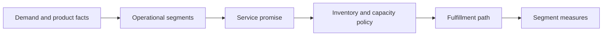

# 2. Market Segmentation and Service Choices

## Learning objectives

After this topic, you should be able to:

- segment demand using operationally meaningful characteristics;
- define differentiated service promises;
- match segments to inventory and fulfillment policies; and
- avoid averages that conceal incompatible requirements.

## Concept in plain English

Segmentation groups demand that should be managed in a similar way. A useful supply-chain segment is not merely a marketing category. It changes a decision such as stocking policy, capacity protection, order promising, delivery mode, or exception priority.

## Useful segmentation variables

| Variable | Why it matters |
|---|---|
| Demand volume and variability | influences pooling, buffer, and planning method |
| Required response time | determines how close inventory or capacity must be |
| Product variety and customization | influences postponement and make-to-order choices |
| Value density | affects transportation and inventory economics |
| Shelf life or obsolescence risk | limits finished-goods inventory |
| Margin and customer criticality | informs differentiated service and allocation |
| Handling and compliance needs | affects facilities, partners, and traceability |

## Segment before setting policy

## AsterWorks segments

| Segment | Demand pattern | Customer need | Suitable operating response |
|---|---|---|---|
| Standard cartridges | recurring and relatively stable | fast replenishment | regional stock and frequent review |
| Configurable skids | lower volume and variable mix | reliable promised date | common modules plus late configuration |
| Engineered systems | project-based and unique | design coordination | engineer-to-order milestones |
| Emergency spares | intermittent but critical | immediate availability | selective strategic stock and premium logistics |

The categories share components and facilities, but they should not share every policy. A single 95% service target could overstock engineered systems while still failing emergency-spare customers.

## Service promise design

A service promise should specify:

- what is measured—order, line, unit, or value;
- which clock is used—request to delivery, confirmation to delivery, or release to delivery;
- whether partial delivery counts;
- what exclusions are permitted;
- the customer or product segment; and
- the consequence when the promise is missed.

“Fast delivery” is not measurable. “Deliver 98% of priority spare-part lines complete within 24 hours of order acceptance” is.

## Decision test

A segment is useful only if all three questions have clear answers:

1. What characteristic makes this demand operationally different?
2. Which policy will change because of that difference?
3. Which measure will show whether the policy works?

If the policy does not change, the segment may be descriptive rather than actionable.

## Why it matters

One service policy forces low-value demand to consume expensive responsiveness or leaves critical demand underserved.

## Decision logic

Segment customers and products using behavior and economics, assign a measurable service promise, and test whether operations can execute it profitably. Do not approve the decision until mandatory conditions are feasible and the residual exposure has a named owner.

## Evidence retained through the workflow

Retain segment definition, demand and margin evidence, promise, operating policy, exceptions, owner, and profitability guardrail. Record the decision date and the event or threshold that requires reassessment.

## Applied decision artifact

Use a one-page **market segmentation and service choices decision record** with these fields:

- **Decision and boundary:** Segment customers and products using behavior and economics, assign a measurable service promise, and test whether operations can execute it profitably.
- **Required evidence:** segment definition, demand and margin evidence, promise, operating policy, exceptions, owner, and profitability guardrail.
- **Expected result:** One service policy forces low-value demand to consume expensive responsiveness or leaves critical demand underserved.
- **Balancing condition:** More service segments improve fit but add inventory, rules, master data, training, and exception complexity.
- **Accountability:** name the decision owner, approval date, residual exposure owner, and measurable trigger for reassessment.

The record is complete only when another practitioner can reproduce the reasoning and identify the next action without relying on meeting memory.

## Trade-offs

Differentiated service can improve economics, but excessive segmentation creates operational complexity. Each segment may require different planning parameters, inventory targets, escalation rules, and reports. Use the smallest number of segments that creates a meaningful decision difference.

## Commonly confused with

Do not confuse a preferred decision method with a guaranteed outcome. Segment customers and products using behavior and economics, assign a measurable service promise, and test whether operations can execute it profitably. Validate the result with segment definition, demand and margin evidence, promise, operating policy, exceptions, owner, and profitability guardrail; the evidence, not the method's label, determines whether the choice worked.

## Common mistakes

- Segmenting only by revenue.
- Designing around the average customer.
- Promising premium service without reserving inventory or capacity.
- Creating dozens of segments that planners cannot maintain.
- Measuring aggregate service while hiding a weak priority segment.

## Original knowledge check

Two products have equal annual volume. Product X sells steadily with a two-week customer lead time; Product Y is highly intermittent but must be available within four hours when a failure occurs. Should they share the same inventory policy?

Answer and rationale

### Correct answer

**No.** Annual volume alone hides variability and service criticality. Product Y may require selective strategic stock despite its intermittent demand.

### Why it is correct

One service policy forces low-value demand to consume expensive responsiveness or leaves critical demand underserved. Segment customers and products using behavior and economics, assign a measurable service promise, and test whether operations can execute it profitably.

### Why the other answers are wrong

Alternative responses reproduce failure modes already discussed:

- Segmenting only by revenue.
- Designing around the average customer.
- Promising premium service without reserving inventory or capacity.

They do not preserve the lesson's decision boundary or evidence. The governing trade-off remains explicit: More service segments improve fit but add inventory, rules, master data, training, and exception complexity.

## Practitioner perspective

Store segment assignments as governed master data, not as private spreadsheet logic. Otherwise planning, order management, warehousing, transportation, and reporting may apply different versions of the policy.

## Related concepts

- [Section overview](./README.md)
- [Module 3 continuation](../../03-sourcing-strategy-product-design-supplier-execution/section-a-sourcing-alignment-and-total-cost/01-strategic-sourcing-from-demand.md)
Continue to [network configuration and flow design](03-network-configuration-and-flow-design.md).

---

[Previous: Strategy to Network Design](01-strategy-to-network-design.md) · [Next: Network Configuration and Flow Design](03-network-configuration-and-flow-design.md)
