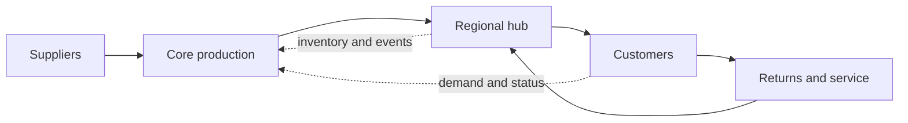
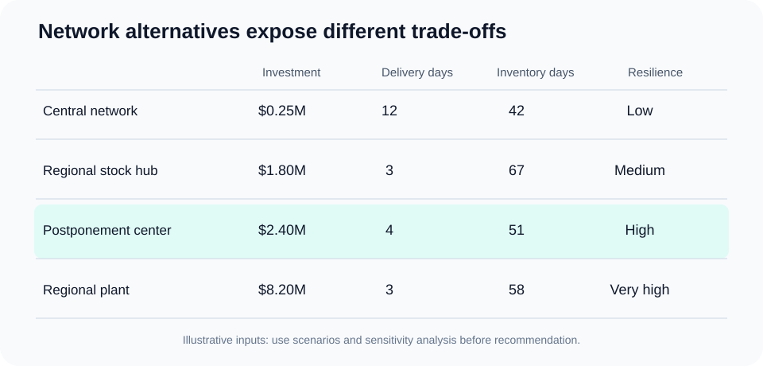

# 3. Network Configuration and Flow Design

## Learning objectives

After this topic, you should be able to:

- identify the major decisions in network configuration;
- compare alternatives using cost, service, resilience, and implementation criteria;
- explain why flow design includes information and reverse flows; and
- use weighted scoring without disguising uncertainty.

## Concept in plain English

Network configuration decides the number, role, location, size, and connections of physical nodes. Typical nodes include suppliers, plants, postponement centers, warehouses, cross-docks, service hubs, ports, and returns centers.

The cheapest collection of individual nodes does not necessarily create the lowest-cost or best-performing network. Total performance emerges from the connections among them.

## Integrated network view

## Configuration decisions

- **Facility role:** production, storage, postponement, consolidation, repair, or returns.
- **Capacity:** installed, usable, reserved, and surge capacity.
- **Inventory placement:** raw material, common modules, finished goods, and strategic spares.
- **Lane design:** origin, destination, mode, frequency, lead time, and consolidation rule.
- **Allocation:** which node serves each market under normal and disrupted conditions.
- **Information flow:** which events, forecasts, and commitments must be visible at each node.

## Comparing alternatives

AsterWorks considers three options:

| Alternative | Description | Main advantage | Main concern |
|---|---|---|---|
| Central network | retain one plant and distribution center | low fixed cost | long European response time |
| Regional stock hub | add finished-goods storage in Europe | rapid standard-product delivery | duplication and obsolescence |
| Postponement center | hold common modules and configure regionally | service with lower variety exposure | added process and data complexity |

The working data are available in [`network-alternatives.csv`](../../assets/data/module-2/section-a/network-alternatives.csv).

## Weighted decision score

If each criterion is scored from 1 to 5 and the weights sum to 100%, then:

$$
\text{Weighted score} = \sum_{i=1}^{n} w_i s_i
$$

For a postponement center with cost 3, service 5, resilience 4, and implementation feasibility 3, using weights of 30%, 30%, 25%, and 15%:

$$
(0.30\times3)+(0.30\times5)+(0.25\times4)+(0.15\times3)=3.85
$$

Weighted scoring makes judgment explicit; it does not eliminate judgment. Results should be tested under alternative weights and uncertain assumptions.

## Model boundaries

Include costs that change among alternatives:

- facility and labor;
- inbound, transfer, outbound, and expedited transportation;
- inventory carrying and obsolescence;
- duties, taxes, brokerage, and compliance;
- systems, integration, and data maintenance;
- transition and dual-running costs; and
- disruption exposure where it can be modeled credibly.

Avoid treating sunk costs as future differences. Document constraints separately from preferences so the model does not reject feasible options merely because the current process is familiar.

## Common mistakes

- Modeling only forward product flow.
- Using average demand without peak, growth, or disruption scenarios.
- Counting facility savings but not inventory and transportation effects.
- Treating a weighted score as objective truth.
- Ignoring transition cost and time.

## Practitioner perspective

Run at least three scenarios: expected demand, upside demand, and a plausible disruption. An alternative that wins only under one precise forecast is fragile even when its base-case cost is attractive.

## Original knowledge check

A regional warehouse reduces customer transit time but requires duplicating slow-moving finished goods. Which additional design should be tested?

Answer

Test **postponement**: hold common modules regionally and delay final configuration until demand is known. This may preserve response while reducing finished-goods variety exposure.

## Related concepts

Continue to [efficiency, responsiveness, and resilience](04-efficiency-responsiveness-resilience.md).
