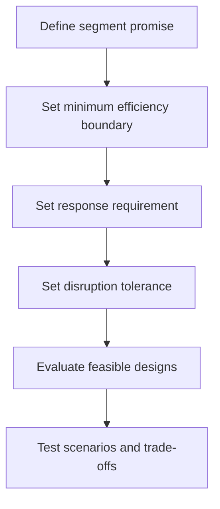

# 4. Efficiency, Responsiveness, and Resilience

## Learning objectives

After this topic, you should be able to:

- distinguish efficiency, responsiveness, and resilience;
- explain why they must be designed at segment level;
- identify structural and policy levers for each objective; and
- evaluate trade-offs without treating them as absolute opposites.

## Three capabilities

- **Efficiency** uses resources economically while meeting the required outcome.
- **Responsiveness** senses and fulfills changes in demand or requirements quickly.
- **Resilience** prepares for, absorbs, adapts to, and recovers from disruption.

The capabilities overlap but are not interchangeable. Fast normal delivery does not prove that the network can recover from a port closure. Extra capacity can improve resilience and responsiveness but reduce measured utilization.

## Design levers

| Lever | Efficiency effect | Responsiveness effect | Resilience effect |
|---|---|---|---|
| Centralized inventory | pooling and lower duplication | may increase distance | concentrates exposure |
| Regional postponement | limits finished-goods variety | faster final response | creates alternate fulfillment point |
| Reserved capacity | may appear underutilized | absorbs demand spikes | provides recovery headroom |
| Multiple qualified sources | may reduce volume leverage | enables switching | reduces single-source dependence |
| Standard interfaces | lowers integration effort | accelerates change | supports alternate partners |
| Strategic buffer | adds carrying cost | protects service | buys response time |

## The false “maximize all three” objective

Every network has constraints. The practical goal is to meet minimum requirements for all three capabilities and then optimize within those boundaries.

## Resilience cycle

A resilient design covers four moments:

1. **Prepare:** identify exposures, qualify options, and define triggers.
2. **Absorb:** use buffers, redundancy, flexible rules, or reserved capacity.
3. **Respond:** see the event, choose an action, and coordinate execution.
4. **Recover and learn:** restore performance and change the design where needed.

## AsterWorks example

AsterWorks can source a control valve from one low-cost supplier or split volume between that supplier and a higher-cost regional source.

The dual-source option is not automatically better. Management should compare:

- price and qualification cost;
- correlated exposure—two suppliers in the same flood zone may not create resilience;
- switching time and available capacity;
- ownership of tooling and technical data;
- quality performance; and
- the financial consequence of a supply interruption.

The decision is segment-specific. A common fastener may justify a different strategy from a proprietary valve that stops final assembly.

## Common mistakes

- Equating high inventory with resilience.
- Measuring efficiency only as utilization.
- Using one operating model for stable and volatile products.
- Adding backup suppliers without testing switch readiness.
- Planning recovery without event visibility or decision authority.

## Practitioner perspective

Resilience options should be treated as executable capabilities. A supplier, alternate bill of material, route, or facility is not a real option until commercial terms, data, quality approval, capacity, and operating instructions are ready.

## Original knowledge check

A plant maintains 99% utilization and has no reserved capacity. Demand increases 8% for six weeks. Which capability is most directly constrained?

Answer

**Responsiveness.** High utilization can be efficient under stable demand, but the lack of headroom limits the ability to absorb a demand increase. It may also reduce resilience during disruption.

## Related concepts

Continue to [sourcing footprint and partner decisions](05-sourcing-footprint-and-partner-decisions.md).
