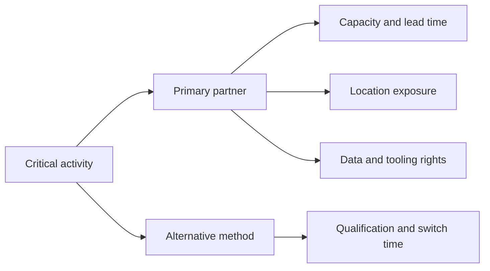

# 5. Sourcing Footprint and Partner Decisions

## Learning objectives

After this topic, you should be able to:

- distinguish price from total delivered economics;
- structure make, buy, outsource, and location decisions;
- evaluate concentration, switching, and dependency risk; and
- define partner capabilities beyond contractual supply.

## Concept in plain English

Sourcing determines **who performs an activity, under what commercial and operating conditions, and with what dependency**. A low quoted price can create a high-cost network if it adds transportation, working capital, quality failure, duties, coordination effort, or interruption risk.

## Total delivered cost

A useful comparison includes:

$$
\text{Total delivered cost}=\text{purchase}+\text{transport}+\text{duties}+\text{inventory}+\text{quality}+\text{administration}+\text{risk allowance}
$$

The risk allowance is not a universal accounting expense. It is a decision estimate that makes exposure visible. Keep it separate so executives can see which results are measured and which are scenario-based.

## Make, buy, or partner

| Consideration | Favor internal capability | Favor external partner |
|---|---|---|
| Strategic differentiation | activity protects distinctive knowledge | activity is standardized |
| Scale and expertise | internal volume supports capability | specialist has superior scale or skill |
| Capital | available and strategically justified | capital better used elsewhere |
| Flexibility | internal assets can change economically | partner offers variable capacity |
| Dependency | control is critical | market has qualified alternatives |
| Data and intellectual property | exposure is difficult to control | interfaces and rights are clear |

## Footprint evaluation

Country and region selection should consider more than wage rates:

- supplier and customer proximity;
- transport infrastructure and border reliability;
- energy, water, and utility continuity;
- skills, labor availability, and productivity;
- regulatory, tax, and trade conditions;
- natural-hazard and geopolitical exposure;
- currency and inflation sensitivity;
- data-transfer and cybersecurity requirements; and
- time-zone and coordination effects.

## Dependency map

## AsterWorks example

AsterWorks buys a sensor at $118 from an overseas supplier and can buy a qualified regional alternative for $132. The $14 price gap is incomplete. The overseas option adds $6 average freight, $4 inventory carrying cost, and $3 expected quality/administrative cost per unit. Its adjusted gap is only $1 before disruption scenarios.

This does not automatically justify moving all volume. AsterWorks might use a capacity-backed split, preserve competition, and validate switching through periodic orders.

## Partner readiness questions

1. Is capacity reserved or merely advertised?
2. Are specifications, tooling, and test methods transferable?
3. Can both parties exchange reliable orders, forecasts, inventory, and events?
4. Who owns data corrections and exception decisions?
5. How quickly can volume move, and has the transfer been exercised?
6. Which sub-tier dependencies remain hidden?

## Why it matters

A low purchase price can be offset by freight, inventory, quality, coordination, sub-tier dependence, and disruption exposure.

## Decision logic

Compare make, buy, partner, and location options on total delivered cost, capability, lead time, dependency, controls, and executable recovery. Do not approve the decision until mandatory conditions are feasible and the residual exposure has a named owner.

## Evidence retained through the workflow

Retain requirement, qualified sources and sub-tiers, total-cost bridge, capacity, lead-time distribution, recovery plan, controls, and exit rights. Record the decision date and the event or threshold that requires reassessment.

## Applied decision artifact

Use a one-page **sourcing footprint and partner decisions decision record** with these fields:

- **Decision and boundary:** Compare make, buy, partner, and location options on total delivered cost, capability, lead time, dependency, controls, and executable recovery.
- **Required evidence:** requirement, qualified sources and sub-tiers, total-cost bridge, capacity, lead-time distribution, recovery plan, controls, and exit rights.
- **Expected result:** A low purchase price can be offset by freight, inventory, quality, coordination, sub-tier dependence, and disruption exposure.
- **Balancing condition:** Consolidation creates leverage and simplicity but increases dependency; diversification improves options but adds qualification and management cost.
- **Accountability:** name the decision owner, approval date, residual exposure owner, and measurable trigger for reassessment.

The record is complete only when another practitioner can reproduce the reasoning and identify the next action without relying on meeting memory.

## Trade-offs

Consolidation creates leverage and simplicity but increases dependency; diversification improves options but adds qualification and management cost.

## Commonly confused with

Do not confuse a preferred decision method with a guaranteed outcome. Compare make, buy, partner, and location options on total delivered cost, capability, lead time, dependency, controls, and executable recovery. Validate the result with requirement, qualified sources and sub-tiers, total-cost bridge, capacity, lead-time distribution, recovery plan, controls, and exit rights; the evidence, not the method's label, determines whether the choice worked.

## Common mistakes

- Comparing suppliers only on unit price.
- Calling two suppliers diversified when they share the same sub-tier source.
- Outsourcing an activity without assigning process and data ownership.
- Assuming a contract creates usable backup capacity.
- Ignoring exit cost and knowledge transfer.

## Original knowledge check

Two suppliers have different names and factories but rely on the same sole-source semiconductor. Does dual sourcing remove the primary interruption risk?

Answer and rationale

### Correct answer

**No.** The apparent diversification disappears at the shared sub-tier dependency. Exposure should be mapped beyond the immediate supplier when the item is critical.

### Why it is correct

A low purchase price can be offset by freight, inventory, quality, coordination, sub-tier dependence, and disruption exposure. Compare make, buy, partner, and location options on total delivered cost, capability, lead time, dependency, controls, and executable recovery.

### Why the other answers are wrong

Alternative responses reproduce failure modes already discussed:

- Comparing suppliers only on unit price.
- Calling two suppliers diversified when they share the same sub-tier source.
- Outsourcing an activity without assigning process and data ownership.

They do not preserve the lesson's decision boundary or evidence. The governing trade-off remains explicit: Consolidation creates leverage and simplicity but increases dependency; diversification improves options but adds qualification and management cost.

## Practitioner perspective

Maintain a small set of executable alternatives for the components and services that determine revenue continuity. A long list of unqualified vendors is not resilience.

## Related concepts

- [Section overview](./README.md)
- [Module 3 continuation](../../03-sourcing-strategy-product-design-supplier-execution/section-a-sourcing-alignment-and-total-cost/01-strategic-sourcing-from-demand.md)
Continue to [digital requirements and information latency](06-digital-requirements-and-information-latency.md).

---

[Previous: Efficiency, Responsiveness, and Resilience](04-efficiency-responsiveness-resilience.md) · [Next: Digital Requirements and Information Latency](06-digital-requirements-and-information-latency.md)
