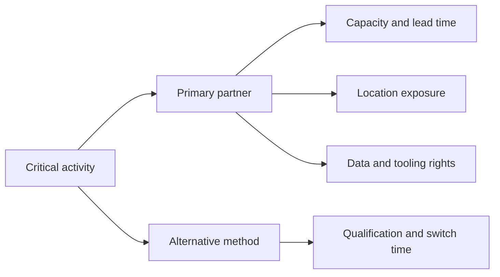

# 5. Sourcing Footprint and Partner Decisions

## Learning objectives

After this topic, you should be able to:

- distinguish price from total delivered economics;
- structure make, buy, outsource, and location decisions;
- evaluate concentration, switching, and dependency risk; and
- define partner capabilities beyond contractual supply.

## Concept in plain English

Sourcing determines **who performs an activity, under what commercial and operating conditions, and with what dependency**. A low quoted price can create a high-cost network if it adds transportation, working capital, quality failure, duties, coordination effort, or interruption risk.

## Total delivered cost

A useful comparison includes:

$$
\text{Total delivered cost}=\text{purchase}+\text{transport}+\text{duties}+\text{inventory}+\text{quality}+\text{administration}+\text{risk allowance}
$$

The risk allowance is not a universal accounting expense. It is a decision estimate that makes exposure visible. Keep it separate so executives can see which results are measured and which are scenario-based.

## Make, buy, or partner

| Consideration | Favor internal capability | Favor external partner |
|---|---|---|
| Strategic differentiation | activity protects distinctive knowledge | activity is standardized |
| Scale and expertise | internal volume supports capability | specialist has superior scale or skill |
| Capital | available and strategically justified | capital better used elsewhere |
| Flexibility | internal assets can change economically | partner offers variable capacity |
| Dependency | control is critical | market has qualified alternatives |
| Data and intellectual property | exposure is difficult to control | interfaces and rights are clear |

## Footprint evaluation

Country and region selection should consider more than wage rates:

- supplier and customer proximity;
- transport infrastructure and border reliability;
- energy, water, and utility continuity;
- skills, labor availability, and productivity;
- regulatory, tax, and trade conditions;
- natural-hazard and geopolitical exposure;
- currency and inflation sensitivity;
- data-transfer and cybersecurity requirements; and
- time-zone and coordination effects.

## Dependency map

## AsterWorks example

AsterWorks buys a sensor at $118 from an overseas supplier and can buy a qualified regional alternative for $132. The $14 price gap is incomplete. The overseas option adds $6 average freight, $4 inventory carrying cost, and $3 expected quality/administrative cost per unit. Its adjusted gap is only $1 before disruption scenarios.

This does not automatically justify moving all volume. AsterWorks might use a capacity-backed split, preserve competition, and validate switching through periodic orders.

## Partner readiness questions

1. Is capacity reserved or merely advertised?
2. Are specifications, tooling, and test methods transferable?
3. Can both parties exchange reliable orders, forecasts, inventory, and events?
4. Who owns data corrections and exception decisions?
5. How quickly can volume move, and has the transfer been exercised?
6. Which sub-tier dependencies remain hidden?

## Common mistakes

- Comparing suppliers only on unit price.
- Calling two suppliers diversified when they share the same sub-tier source.
- Outsourcing an activity without assigning process and data ownership.
- Assuming a contract creates usable backup capacity.
- Ignoring exit cost and knowledge transfer.

## Practitioner perspective

Maintain a small set of executable alternatives for the components and services that determine revenue continuity. A long list of unqualified vendors is not resilience.

## Original knowledge check

Two suppliers have different names and factories but rely on the same sole-source semiconductor. Does dual sourcing remove the primary interruption risk?

Answer

**No.** The apparent diversification disappears at the shared sub-tier dependency. Exposure should be mapped beyond the immediate supplier when the item is critical.

## Related concepts

Continue to [digital requirements and information latency](06-digital-requirements-and-information-latency.md).
