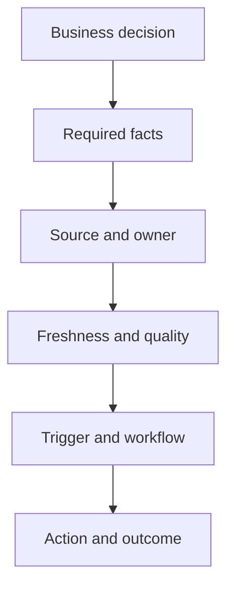

# 6. Digital Requirements and Information Latency

## Learning objectives

After this topic, you should be able to:

- derive information requirements from business decisions;
- distinguish data freshness from end-to-end decision latency;
- select batch, event, or real-time exchange based on value; and
- explain why more data does not automatically create better visibility.

## Concept in plain English

A digital requirement should state **which decision must improve, which information is needed, how quickly it must arrive, how reliable it must be, and who acts on it**.

“We need real-time visibility” is incomplete. A stronger requirement is: “When a critical European shipment misses a carrier milestone by more than two hours, notify the order owner within fifteen minutes with the affected customer promise and approved recovery options.”

## Decision-to-data method

## Four clocks

| Clock | Meaning | Example |
|---|---|---|
| Event time | when the physical event occurred | truck departed at 10:04 |
| Capture time | when the event was recorded | scan completed at 10:07 |
| Availability time | when the event reached the consuming system | message posted at 10:09 |
| Action time | when an accountable person or automation responded | recovery booked at 10:25 |

End-to-end decision latency is the time from event to useful action. Improving only message transmission may have little value if events are captured late or exceptions wait in an unowned queue.

## Choosing an update pattern

| Pattern | Best fit | Example |
|---|---|---|
| Scheduled batch | stable decisions with longer horizons | nightly supplier master synchronization |
| Frequent micro-batch | aggregated operational planning | inventory refresh every fifteen minutes |
| Event-driven | time-sensitive state change | shipment departure or quality hold |
| Request-response | information needed at a decision point | delivery-promise check during order entry |

Real time has cost: interfaces, monitoring, message volume, support, cybersecurity, and data-correction complexity. Use it where decision value decays quickly.

## AsterWorks example

AsterWorks initially asks for live inventory from every supplier. Analysis shows three different decisions:

- strategic capacity review needs a monthly certified view;
- replenishment planning needs daily available inventory;
- a production-stop component needs an event when supply falls below a protected threshold.

One universal frequency would either overspend on low-value data or under-serve a critical decision.

## Information requirement card

For each high-value decision, document:

- decision owner;
- business event or review cadence;
- required data elements and definitions;
- source and authoritative owner;
- maximum acceptable age;
- completeness and accuracy threshold;
- exception trigger;
- response deadline; and
- fallback when data are missing.

## Why it matters

Late or incomplete information turns a manageable deviation into a customer, cost, or inventory exception.

## Decision logic

Work backward from each decision to define the event, data fields, latency, quality, owner, threshold, and action required. Do not approve the decision until mandatory conditions are feasible and the residual exposure has a named owner.

## Evidence retained through the workflow

Retain decision-to-data card, event source, timestamp, required fields, latency target, quality rule, owner, and fallback. Record the decision date and the event or threshold that requires reassessment.

## Applied decision artifact

Use a one-page **digital requirements and information latency decision record** with these fields:

- **Decision and boundary:** Work backward from each decision to define the event, data fields, latency, quality, owner, threshold, and action required.
- **Required evidence:** decision-to-data card, event source, timestamp, required fields, latency target, quality rule, owner, and fallback.
- **Expected result:** Late or incomplete information turns a manageable deviation into a customer, cost, or inventory exception.
- **Balancing condition:** Lower latency supports faster action but raises integration, monitoring, false-alert, and partner-readiness demands.
- **Accountability:** name the decision owner, approval date, residual exposure owner, and measurable trigger for reassessment.

The record is complete only when another practitioner can reproduce the reasoning and identify the next action without relying on meeting memory.

## Trade-offs

Lower latency supports faster action but raises integration, monitoring, false-alert, and partner-readiness demands.

## Commonly confused with

Do not confuse a preferred decision method with a guaranteed outcome. Work backward from each decision to define the event, data fields, latency, quality, owner, threshold, and action required. Validate the result with decision-to-data card, event source, timestamp, required fields, latency target, quality rule, owner, and fallback; the evidence, not the method's label, determines whether the choice worked.

## Common mistakes

- Starting with a preferred technology rather than a decision.
- Treating a dashboard as visibility even when no action follows.
- Using “real time” without defining seconds, minutes, or hours.
- Ignoring event-time and time-zone semantics.
- Sharing all available data instead of the minimum useful and permitted data.

## Original knowledge check

A carrier sends status messages within seconds, but warehouse departure scans are entered four hours late. Has real-time integration solved the visibility problem?

Answer and rationale

### Correct answer

**No.** Transmission is fast, but capture latency keeps the information stale. End-to-end latency must be measured from the physical event to the decision or action.

### Why it is correct

Late or incomplete information turns a manageable deviation into a customer, cost, or inventory exception. Work backward from each decision to define the event, data fields, latency, quality, owner, threshold, and action required.

### Why the other answers are wrong

Alternative responses reproduce failure modes already discussed:

- Starting with a preferred technology rather than a decision.
- Treating a dashboard as visibility even when no action follows.
- Using “real time” without defining seconds, minutes, or hours.

They do not preserve the lesson's decision boundary or evidence. The governing trade-off remains explicit: Lower latency supports faster action but raises integration, monitoring, false-alert, and partner-readiness demands.

## Practitioner perspective

Design information around exceptions and decisions, not around every possible field. High-value visibility is selective: it makes the material change obvious, connects it to impact, and routes it to someone who can act.

## Related concepts

- [Section overview](./README.md)
- [Module 3 continuation](../../03-sourcing-strategy-product-design-supplier-execution/section-a-sourcing-alignment-and-total-cost/01-strategic-sourcing-from-demand.md)
Continue to [technology business case and total cost](07-technology-business-case-and-tco.md).

---

[Previous: Sourcing Footprint and Partner Decisions](05-sourcing-footprint-and-partner-decisions.md) · [Next: Technology Business Case and Total Cost](07-technology-business-case-and-tco.md)
