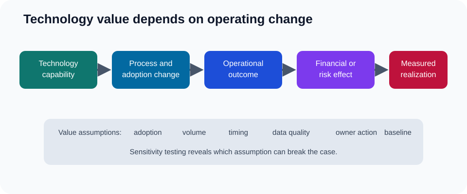

# 7. Technology Business Case and Total Cost

## Learning objectives

After this topic, you should be able to:

- distinguish benefits, costs, risks, and enabling assumptions;
- calculate benefit-cost ratio, ROI, and simple payback;
- build a total-cost view across implementation and operation; and
- test whether benefits are owned and measurable.

## Concept in plain English

A technology business case explains how a changed capability produces an operational outcome and how that outcome creates economic value. The application is an enabler, not the benefit itself.

Example: event integration → earlier delay detection → more recovery time → fewer expedites and service failures → lower cost and retained revenue.

## Cost categories

Include the full lifecycle:

- subscription, license, infrastructure, or device cost;
- implementation, configuration, integration, migration, and testing;
- data cleansing and governance;
- process redesign, training, and change support;
- internal subject-matter and backfill time;
- security, privacy, assurance, and partner onboarding;
- support, monitoring, upgrades, and continuous improvement;
- transition, parallel operation, and retirement of old services; and
- contingency for defined risks.

The analysis dataset is [`technology-business-case.csv`](../../assets/data/module-2/section-a/technology-business-case.csv).

## Benefit categories

Benefits may be:

- **cost removed:** freight, labor, write-offs, downtime, or fees;
- **cash released:** lower inventory or faster collection;
- **capacity created:** more throughput without equivalent capital;
- **revenue protected or enabled:** better availability or service;
- **risk reduced:** lower probability or consequence of a defined event; or
- **decision quality improved:** faster, more consistent, or more explainable choices.

Keep cash, accounting profit, capacity, and risk benefits separate. They are not interchangeable.

## Core calculations

Assume three-year quantified benefits of $690,000 and total costs of $510,000.

### Benefit-cost ratio

$$
\text{Benefit-cost ratio}=\frac{690{,}000}{510{,}000}=1.35
$$

A value above 1.0 means quantified benefits exceed quantified costs under the stated assumptions.

### Return on investment

$$
\text{ROI}=\frac{690{,}000-510{,}000}{510{,}000}=35.3\%
$$

### Simple payback

If initial implementation is $330,000 and steady annual net cash benefit is $150,000:

$$
\text{Payback}=\frac{330{,}000}{150{,}000}=2.2\text{ years}
$$

Simple payback ignores the timing of cash flows after recovery. For large or long-duration investments, discounted cash-flow analysis is more informative.

## Benefit ownership table

| Benefit | Baseline | Target | Owner | Evidence |
|---|---:|---:|---|---|
| Expedite cost | $420k/year | $270k/year | transportation lead | freight invoices |
| Inventory write-off | $180k/year | $120k/year | planning lead | disposal postings |
| Planner rework | 2,400 h/year | 1,200 h/year | planning manager | activity sample |

If no operational owner accepts the target or no baseline exists, the benefit is not ready for approval.

## Sensitivity analysis

Test at least:

- slower adoption;
- lower transaction volume;
- implementation delay;
- cost overrun;
- partial partner participation; and
- benefits beginning later than planned.

Do not use false precision. Present a base case, downside case, and key break-even assumption.

## Common mistakes

- Counting every saved minute as headcount reduction.
- Including revenue opportunity without probability or capacity constraints.
- Omitting internal time and ongoing data cost.
- Treating sunk cost as a reason to continue a weak investment.
- Approving benefits without an accountable operational owner.

## Original knowledge check

A project claims 10,000 hours of capacity benefit but has no plan to reduce overtime, avoid hiring, increase output, or redeploy the time. Is the amount a realized cash benefit?

Answer

**Not yet.** It is potential capacity. The business case must state how the released time changes cash, cost, throughput, or another measured outcome.

## Related concepts

Continue to [capability maturity and transformation roadmap](08-capability-maturity-and-transformation-roadmap.md).
