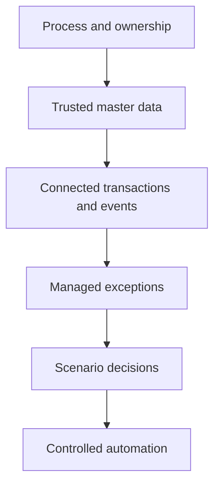

# 8. Capability Maturity and Transformation Roadmap

## Learning objectives

After this topic, you should be able to:

- assess capability maturity without using it as a vanity score;
- sequence foundation, integration, decision, and optimization capabilities;
- distinguish technology installation from operational adoption; and
- build a roadmap around dependencies and value releases.

## Concept in plain English

Capability maturity describes how reliably an organization can perform and improve a business capability. It includes process, people, data, technology, governance, and partner behavior—not software age alone.

## Five practical stages

| Stage | Operating characteristics | Next priority |
|---|---|---|
| 1. Fragmented | local records, manual handoffs, unclear ownership | define process and authoritative data |
| 2. Repeatable | common procedures in selected areas | standardize measures and controls |
| 3. Connected | integrated transactions and shared identifiers | manage end-to-end exceptions |
| 4. Coordinated | cross-functional planning and partner workflows | improve scenario decisions |
| 5. Adaptive | rapid learning and controlled automation | continuously test value and risk |

Maturity is capability-specific. A company may have adaptive transportation visibility and fragmented supplier capacity data.

## Dependency logic

Skipping layers creates fragile progress. Predictive models cannot compensate for undefined timestamps, inconsistent identifiers, or unowned exceptions.

## Maturity assessment questions

Evaluate each capability across six dimensions:

1. Is the process defined end to end?
2. Are decision rights and exception owners clear?
3. Are critical data defined, timely, and governed?
4. Do applications and interfaces support the process reliably?
5. Are partners included where the process crosses boundaries?
6. Are outcomes measured and used for improvement?

Use evidence—cycle times, defect rates, adoption, interface reliability, and decision records—rather than opinion alone.

## AsterWorks roadmap

AsterWorks initially wants predictive shipment-risk alerts. Its assessment finds that carriers use inconsistent shipment identifiers and departure events are missing on 18% of priority loads.

A sensible sequence is:

- define canonical shipment and order identifiers;
- improve milestone completeness;
- assign exception ownership;
- implement deterministic late-event rules;
- establish response history; and
- train a predictive model only when the label and action data are credible.

## Roadmap design

Organize the roadmap into value releases, not technology components:

| Release | Business outcome | Required foundation |
|---|---|---|
| Reliable promise | consistent available date and allocation | item, location, capacity, and lead-time data |
| Managed delivery | early exception detection and ownership | shipment events and customer impact link |
| Scenario response | comparable recovery options | cost, capacity, and policy data |
| Controlled automation | low-risk actions executed within guardrails | proven rules, monitoring, and override |

## Common mistakes

- Assigning one maturity score to the entire enterprise.
- Assuming technology deployment proves adoption.
- Automating an unstable process.
- Building a roadmap by vendor product rather than business outcome.
- Advancing analytics while foundational data remain unreliable.

## Practitioner perspective

The purpose of maturity assessment is sequencing. A lower score is not a failure if it reveals the dependency that prevents value. The dangerous result is a high score unsupported by operating evidence.

## Original knowledge check

A company has a sophisticated optimization engine, but planners export results to spreadsheets because capacity and lead-time data are unreliable. Which capability should be addressed first?

Answer

**Trusted planning data and ownership.** More advanced optimization will not create reliable decisions until the foundational inputs are controlled.

## Related concepts

Continue to [governance, change, and network orchestration](09-governance-change-and-network-orchestration.md).
