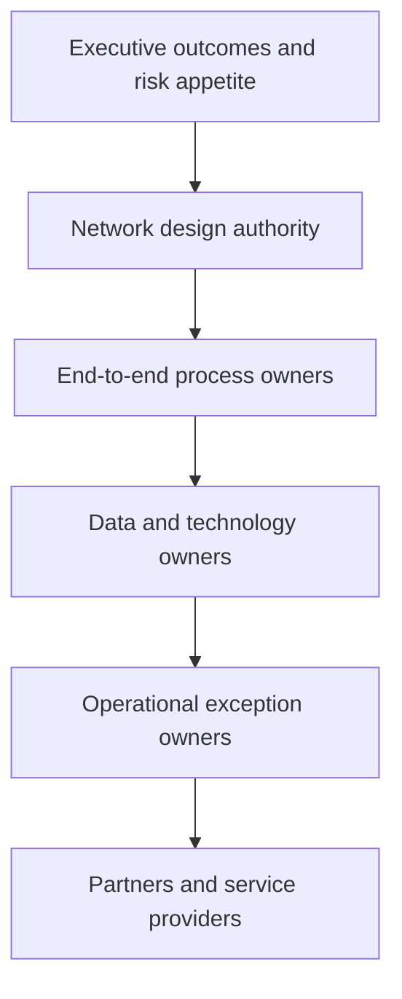

# 9. Governance, Change, and Network Orchestration

## Learning objectives

After this topic, you should be able to:

- assign governance at executive, design, process, data, and operational levels;
- explain the role of a network convener;
- separate decision rights from meeting structures; and
- build adoption and control into the design.

## Concept in plain English

Network orchestration coordinates decisions that cross functions, legal entities, and partners. It does not mean one company controls every participant. It means the network has workable rules for shared decisions, information, exceptions, and improvement.

## Governance layers

## Decision-right matrix

| Decision | Recommend | Approve | Execute | Monitor |
|---|---|---|---|---|
| Open regional node | network design | executive team | program lead | finance and operations |
| Change inventory policy | planning | process owner | planners | service and inventory owners |
| Add partner data field | data steward | data owner | integration team | data-quality lead |
| Divert delayed shipment | logistics control | duty manager | carrier/warehouse | customer service |

Names matter more than committees. Every recurring decision needs one accountable approver and an escalation path.

## Network convener

A company may act as convener when it:

- defines common identifiers and exchange rules;
- provides a shared planning or visibility mechanism;
- coordinates joint scenarios and improvement priorities;
- resolves cross-partner exceptions; and
- distributes value and obligations credibly.

Convening works only when partners see mutual benefit. Requiring data without explaining use, security, service benefit, or commercial fairness usually produces weak participation.

## Change design

Adoption should be designed alongside the process:

1. identify roles whose decisions will change;
2. define old and new behavior;
3. remove conflicting measures and incentives;
4. train with realistic exceptions, not only navigation;
5. provide early support and feedback;
6. measure usage and outcome separately; and
7. retire shadow processes when the new control is stable.

## AsterWorks example

The regional postponement center affects commercial promises, product configuration, customs, planning, warehousing, quality, transportation, finance, and technology. AsterWorks creates one design authority with named end-to-end owners. The European team can divert shipments within approved cost and service thresholds; exceptions beyond those thresholds go to the network duty manager.

This prevents every disruption from waiting for an executive meeting while preserving control over material decisions.

## Common mistakes

- Treating governance as more meetings.
- Assigning responsibility to a department rather than a named role.
- Giving partners obligations without shared benefit or data safeguards.
- Training users before decision rules are stable.
- Keeping old spreadsheets indefinitely “just in case.”

## Practitioner perspective

Good governance accelerates routine decisions because thresholds, ownership, and escalation are already agreed. If every exception requires a new negotiation, governance has documented structure without creating operating capability.

## Original knowledge check

A cross-functional exception has five consulted managers but no single approver. What is the most likely result?

Answer

Delayed or inconsistent action. Consultation can be broad, but approval accountability must be explicit.

## Related concepts

Complete the [Section A review](10-section-a-review.md).
