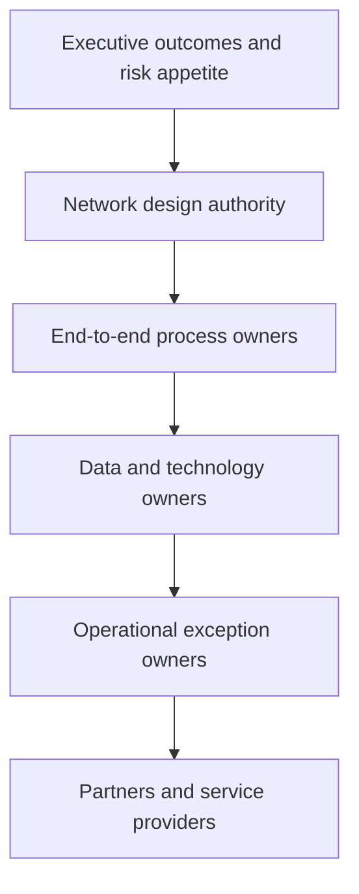

# 9. Governance, Change, and Network Orchestration

## Learning objectives

After this topic, you should be able to:

- assign governance at executive, design, process, data, and operational levels;
- explain the role of a network convener;
- separate decision rights from meeting structures; and
- build adoption and control into the design.

## Concept in plain English

Network orchestration coordinates decisions that cross functions, legal entities, and partners. It does not mean one company controls every participant. It means the network has workable rules for shared decisions, information, exceptions, and improvement.

## Governance layers

## Decision-right matrix

| Decision | Recommend | Approve | Execute | Monitor |
|---|---|---|---|---|
| Open regional node | network design | executive team | program lead | finance and operations |
| Change inventory policy | planning | process owner | planners | service and inventory owners |
| Add partner data field | data steward | data owner | integration team | data-quality lead |
| Divert delayed shipment | logistics control | duty manager | carrier/warehouse | customer service |

Names matter more than committees. Every recurring decision needs one accountable approver and an escalation path.

## Network convener

A company may act as convener when it:

- defines common identifiers and exchange rules;
- provides a shared planning or visibility mechanism;
- coordinates joint scenarios and improvement priorities;
- resolves cross-partner exceptions; and
- distributes value and obligations credibly.

Convening works only when partners see mutual benefit. Requiring data without explaining use, security, service benefit, or commercial fairness usually produces weak participation.

## Change design

Adoption should be designed alongside the process:

1. identify roles whose decisions will change;
2. define old and new behavior;
3. remove conflicting measures and incentives;
4. train with realistic exceptions, not only navigation;
5. provide early support and feedback;
6. measure usage and outcome separately; and
7. retire shadow processes when the new control is stable.

## AsterWorks example

The regional postponement center affects commercial promises, product configuration, customs, planning, warehousing, quality, transportation, finance, and technology. AsterWorks creates one design authority with named end-to-end owners. The European team can divert shipments within approved cost and service thresholds; exceptions beyond those thresholds go to the network duty manager.

This prevents every disruption from waiting for an executive meeting while preserving control over material decisions.

## Why it matters

Cross-functional networks respond slowly or inconsistently when decision rights, partner roles, and escalation thresholds are undefined.

## Decision logic

Assign end-to-end ownership, delegated thresholds, consultation rules, partner obligations, evidence, and escalation for routine and material exceptions. Do not approve the decision until mandatory conditions are feasible and the residual exposure has a named owner.

## Evidence retained through the workflow

Retain decision-right matrix, thresholds, named roles, partner commitments, exception log, response time, adoption evidence, and review. Record the decision date and the event or threshold that requires reassessment.

## Applied decision artifact

Use a one-page **governance, change, and network orchestration decision record** with these fields:

- **Decision and boundary:** Assign end-to-end ownership, delegated thresholds, consultation rules, partner obligations, evidence, and escalation for routine and material exceptions.
- **Required evidence:** decision-right matrix, thresholds, named roles, partner commitments, exception log, response time, adoption evidence, and review.
- **Expected result:** Cross-functional networks respond slowly or inconsistently when decision rights, partner roles, and escalation thresholds are undefined.
- **Balancing condition:** Central governance improves consistency, while excessive escalation delays decisions that should be made close to the event.
- **Accountability:** name the decision owner, approval date, residual exposure owner, and measurable trigger for reassessment.

The record is complete only when another practitioner can reproduce the reasoning and identify the next action without relying on meeting memory.

## Trade-offs

Central governance improves consistency, while excessive escalation delays decisions that should be made close to the event.

## Commonly confused with

Do not confuse a preferred decision method with a guaranteed outcome. Assign end-to-end ownership, delegated thresholds, consultation rules, partner obligations, evidence, and escalation for routine and material exceptions. Validate the result with decision-right matrix, thresholds, named roles, partner commitments, exception log, response time, adoption evidence, and review; the evidence, not the method's label, determines whether the choice worked.

## Common mistakes

- Treating governance as more meetings.
- Assigning responsibility to a department rather than a named role.
- Giving partners obligations without shared benefit or data safeguards.
- Training users before decision rules are stable.
- Keeping old spreadsheets indefinitely “just in case.”

## Original knowledge check

A cross-functional exception has five consulted managers but no single approver. What is the most likely result?

Answer and rationale

### Correct answer

Delayed or inconsistent action. Consultation can be broad, but approval accountability must be explicit.

### Why it is correct

Cross-functional networks respond slowly or inconsistently when decision rights, partner roles, and escalation thresholds are undefined. Assign end-to-end ownership, delegated thresholds, consultation rules, partner obligations, evidence, and escalation for routine and material exceptions.

### Why the other answers are wrong

Alternative responses reproduce failure modes already discussed:

- Treating governance as more meetings.
- Assigning responsibility to a department rather than a named role.
- Giving partners obligations without shared benefit or data safeguards.

They do not preserve the lesson's decision boundary or evidence. The governing trade-off remains explicit: Central governance improves consistency, while excessive escalation delays decisions that should be made close to the event.

## Practitioner perspective

Good governance accelerates routine decisions because thresholds, ownership, and escalation are already agreed. If every exception requires a new negotiation, governance has documented structure without creating operating capability.

## Related concepts

- [Section overview](./README.md)
- [Module 3 continuation](../../03-sourcing-strategy-product-design-supplier-execution/section-a-sourcing-alignment-and-total-cost/01-strategic-sourcing-from-demand.md)
Complete the [Section A review](10-section-a-review.md).

---

[Previous: Capability Maturity and Transformation Roadmap](08-capability-maturity-and-transformation-roadmap.md) · [Section review](10-section-a-review.md)
