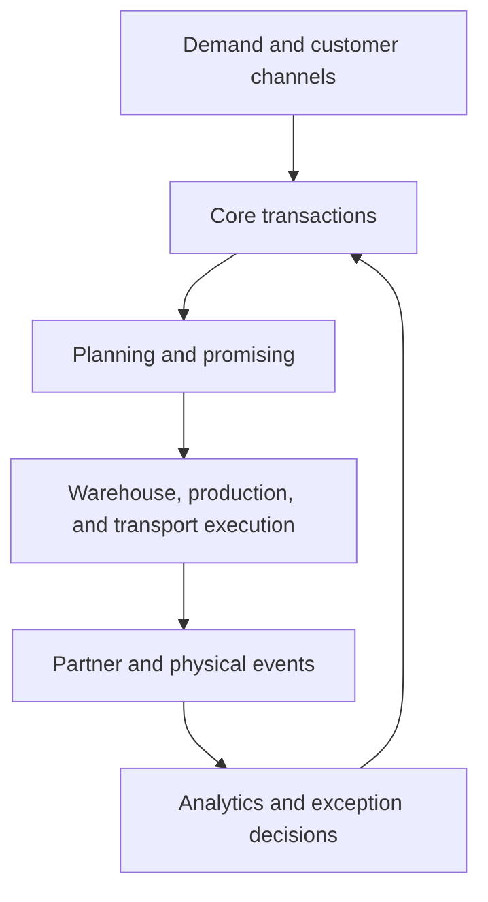
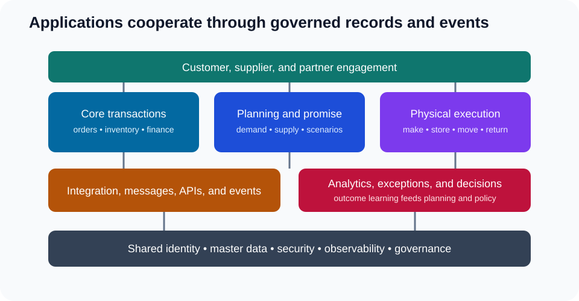

# 1. Application Landscape and Digital Thread

## Learning objectives

After this topic, you should be able to:

- describe the roles of transaction, planning, execution, integration, and analytics applications;
- trace a decision across the application landscape;
- explain why one screen is not the same as one source of truth; and
- identify ownership at application boundaries.

## Concept in plain English

A connected supply network uses several application types. The goal is not to place every capability in one system. It is to create a controlled digital thread in which identifiers, decisions, transactions, and events remain connected from demand through delivery and return.

## Capability layers

| Layer | Primary purpose | Typical records |
|---|---|---|
| Engagement | interact with customers and suppliers | quote, order request, forecast response |
| Transaction core | maintain commercial and accounting truth | order, purchase, inventory, shipment, invoice |
| Planning | evaluate future demand, supply, capacity, and scenarios | forecast, constraint, plan, promise |
| Execution | direct physical work | task, pick, load, production operation, delivery event |
| Integration | move, translate, validate, and monitor information | message, API request, event, error queue |
| Data and analytics | combine history and signals for insight | metric, feature, model output, decision record |

## Digital-thread test

Choose one customer order and ask whether the organization can trace:

- the customer and product identifiers;
- the promise and assumptions used;
- the demand and supply allocation;
- production, warehouse, and transportation execution;
- partner status events;
- exceptions and decisions; and
- invoice, return, and service outcome.

Broken links create manual reconciliation and unreliable metrics.

## AsterWorks example

AsterWorks’ customer portal displays an order as “shipped,” the core platform shows goods issue, and the carrier platform shows the freight still at the dock. Each status answers a different question. AsterWorks defines canonical milestones and exposes the event time, source, and confidence so users do not confuse internal posting with physical departure.

## Common mistakes

- Drawing applications without the decisions and records that cross them.
- Calling a reporting platform the source of every underlying fact.
- Duplicating master-data ownership in multiple applications.
- Ignoring interface failures and replay.
- Treating physical status and system status as identical.

## Practitioner perspective

Architecture becomes operational when every critical field has an authoritative owner and every cross-system handoff has monitoring, error ownership, and recovery instructions.

## Original knowledge check

An order dashboard combines data from five systems. Does the dashboard become the authoritative source for every displayed field?

Answer

**No.** It may be the preferred consumption view, while each field retains an authoritative operational source and owner.

## Related concepts

Continue to [core platforms versus specialized applications](02-core-platforms-vs-specialized-applications.md).
