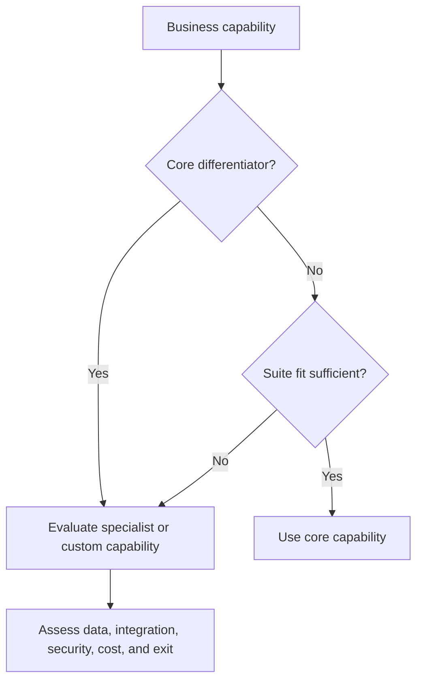

# 2. Core Platforms Versus Specialized Applications

## Learning objectives

After this topic, you should be able to:

- compare integrated-suite and specialized-application strategies;
- evaluate capability fit, data ownership, integration, and lifecycle cost;
- distinguish configuration from customization; and
- define an architecture principle for capability placement.

## Concept in plain English

A core enterprise platform standardizes shared transactions and data. Specialized applications provide deeper capability in areas such as planning, warehousing, transportation, commerce, or analytics. The design decision is **where each capability belongs and how its data remains controlled**.

## Comparison

| Consideration | Core suite | Specialized application |
|---|---|---|
| Process integration | usually simpler inside the suite | requires explicit interfaces |
| Functional depth | broad and consistent | deeper for a defined domain |
| Innovation speed | tied to suite roadmap | may advance faster in its niche |
| Data ownership | common model is easier to govern | duplication risk must be controlled |
| Vendor landscape | fewer commercial relationships | more contracts and dependencies |
| Change impact | broad regression surface | narrower function, more interfaces |

## Placement decision

## Configuration and customization

- **Configuration** selects supported behavior through parameters, rules, and master data.
- **Extension** adds bounded behavior through published interfaces or services.
- **Customization** changes or tightly couples internal behavior.

Customization can be justified, but it should have an explicit business owner, value, upgrade impact, test obligation, and retirement path.

## AsterWorks example

AsterWorks’ core platform can create shipments and record freight cost, but it cannot optimize multi-stop carrier plans. The company retains shipment accounting in the core and places route optimization in a transportation application. A governed shipment identifier links both systems, while financial posting remains authoritative in the core.

## Decision scorecard

Assess each option on:

- capability fit;
- user and partner adoption;
- data authority;
- integration and exception handling;
- cybersecurity and privacy;
- implementation and ongoing cost;
- upgrade compatibility;
- vendor viability and exit; and
- measurable business value.

## Common mistakes

- Selecting a specialist tool for features that the core already supports adequately.
- Forcing every requirement into the suite to avoid all integration.
- Comparing license price instead of lifecycle cost.
- Allowing both systems to update the same critical field.
- Building fragile custom code for temporary process preferences.

## Original knowledge check

A specialized warehouse tool provides clear execution value. What architecture decision must still be explicit?

Answer

Which system owns inventory and shipment records, how transactions synchronize, and who resolves interface or reconciliation exceptions.

## Related concepts

Continue to [advanced planning and constraint management](03-advanced-planning-and-constraint-management.md).
