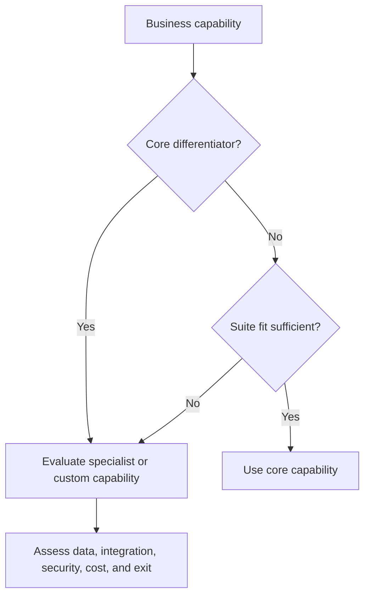

# 2. Core Platforms Versus Specialized Applications

## Learning objectives

After this topic, you should be able to:

- compare integrated-suite and specialized-application strategies;
- evaluate capability fit, data ownership, integration, and lifecycle cost;
- distinguish configuration from customization; and
- define an architecture principle for capability placement.

## Concept in plain English

A core enterprise platform standardizes shared transactions and data. Specialized applications provide deeper capability in areas such as planning, warehousing, transportation, commerce, or analytics. The design decision is **where each capability belongs and how its data remains controlled**.

## Comparison

| Consideration | Core suite | Specialized application |
|---|---|---|
| Process integration | usually simpler inside the suite | requires explicit interfaces |
| Functional depth | broad and consistent | deeper for a defined domain |
| Innovation speed | tied to suite roadmap | may advance faster in its niche |
| Data ownership | common model is easier to govern | duplication risk must be controlled |
| Vendor landscape | fewer commercial relationships | more contracts and dependencies |
| Change impact | broad regression surface | narrower function, more interfaces |

## Placement decision

## Configuration and customization

- **Configuration** selects supported behavior through parameters, rules, and master data.
- **Extension** adds bounded behavior through published interfaces or services.
- **Customization** changes or tightly couples internal behavior.

Customization can be justified, but it should have an explicit business owner, value, upgrade impact, test obligation, and retirement path.

## AsterWorks example

AsterWorks’ core platform can create shipments and record freight cost, but it cannot optimize multi-stop carrier plans. The company retains shipment accounting in the core and places route optimization in a transportation application. A governed shipment identifier links both systems, while financial posting remains authoritative in the core.

## Decision scorecard

Assess each option on:

- capability fit;
- user and partner adoption;
- data authority;
- integration and exception handling;
- cybersecurity and privacy;
- implementation and ongoing cost;
- upgrade compatibility;
- vendor viability and exit; and
- measurable business value.

## Why it matters

Application boundaries determine process continuity, upgradeability, data consistency, vendor dependence, and the cost of future change.

## Decision logic

Keep stable enterprise records and controls in the core, place differentiating capability where it creates measurable value, and define integration and exit boundaries. Do not approve the decision until mandatory conditions are feasible and the residual exposure has a named owner.

## Evidence retained through the workflow

Retain capability requirements, fit-gap evidence, record ownership, interfaces, lifecycle cost, vendor viability, upgrade path, and exit plan. Record the decision date and the event or threshold that requires reassessment.

## Applied decision artifact

Use a one-page **core platforms versus specialized applications decision record** with these fields:

- **Decision and boundary:** Keep stable enterprise records and controls in the core, place differentiating capability where it creates measurable value, and define integration and exit boundaries.
- **Required evidence:** capability requirements, fit-gap evidence, record ownership, interfaces, lifecycle cost, vendor viability, upgrade path, and exit plan.
- **Expected result:** Application boundaries determine process continuity, upgradeability, data consistency, vendor dependence, and the cost of future change.
- **Balancing condition:** Core standardization reduces complexity; specialized applications improve fit but add contracts, data replication, interfaces, and support obligations.
- **Accountability:** name the decision owner, approval date, residual exposure owner, and measurable trigger for reassessment.

The record is complete only when another practitioner can reproduce the reasoning and identify the next action without relying on meeting memory.

## Trade-offs

Core standardization reduces complexity; specialized applications improve fit but add contracts, data replication, interfaces, and support obligations.

## Commonly confused with

Do not confuse a preferred decision method with a guaranteed outcome. Keep stable enterprise records and controls in the core, place differentiating capability where it creates measurable value, and define integration and exit boundaries. Validate the result with capability requirements, fit-gap evidence, record ownership, interfaces, lifecycle cost, vendor viability, upgrade path, and exit plan; the evidence, not the method's label, determines whether the choice worked.

## Common mistakes

- Selecting a specialist tool for features that the core already supports adequately.
- Forcing every requirement into the suite to avoid all integration.
- Comparing license price instead of lifecycle cost.
- Allowing both systems to update the same critical field.
- Building fragile custom code for temporary process preferences.

## Original knowledge check

A specialized warehouse tool provides clear execution value. What architecture decision must still be explicit?

Answer and rationale

### Correct answer

Which system owns inventory and shipment records, how transactions synchronize, and who resolves interface or reconciliation exceptions.

### Why it is correct

Application boundaries determine process continuity, upgradeability, data consistency, vendor dependence, and the cost of future change. Keep stable enterprise records and controls in the core, place differentiating capability where it creates measurable value, and define integration and exit boundaries.

### Why the other answers are wrong

Alternative responses reproduce failure modes already discussed:

- Selecting a specialist tool for features that the core already supports adequately.
- Forcing every requirement into the suite to avoid all integration.
- Comparing license price instead of lifecycle cost.

They do not preserve the lesson's decision boundary or evidence. The governing trade-off remains explicit: Core standardization reduces complexity; specialized applications improve fit but add contracts, data replication, interfaces, and support obligations.

## Practitioner perspective

Use capability requirements, fit-gap evidence, record ownership, interfaces, lifecycle cost, vendor viability, upgrade path, and exit plan as the minimum review record. The artifact should let another practitioner reproduce the conclusion, identify the remaining exposure, and know which trigger reopens the decision.

## Related concepts

- [Section overview](./README.md)
- [Module 3 continuation](../../03-sourcing-strategy-product-design-supplier-execution/section-d-supplier-selection-contracting-and-procurement/01-purchasing-flow-and-selection-routes.md)
Continue to [advanced planning and constraint management](03-advanced-planning-and-constraint-management.md).

---

[Previous: Application Landscape and Digital Thread](01-application-landscape-and-digital-thread.md) · [Next: Advanced Planning and Constraint Management](03-advanced-planning-and-constraint-management.md)
