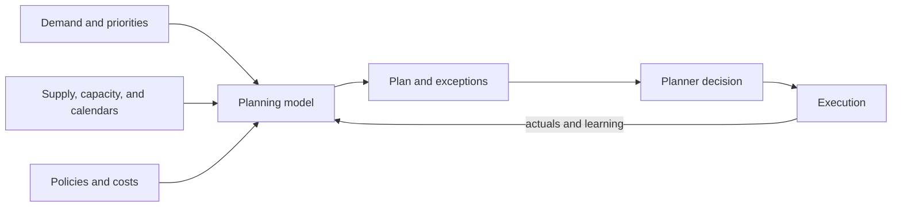

# 3. Advanced Planning and Constraint Management

## Learning objectives

After this topic, you should be able to:

- explain the role of constraint-aware planning;
- distinguish planning, scheduling, simulation, and optimization;
- identify the data required for a feasible plan; and
- interpret model output as a decision proposal rather than certainty.

## Concept in plain English

Advanced planning evaluates demand and supply across time while considering constraints such as materials, capacity, calendars, lead times, storage, transportation, and business rules. It helps planners compare feasible or near-feasible choices before execution.

## Related activities

| Activity | Main question |
|---|---|
| Planning | what should be supplied, where, and when? |
| Scheduling | in what detailed sequence should work occur? |
| Simulation | what happens under a specified policy or scenario? |
| Optimization | which feasible choice best fits the stated objective? |
| Order promising | when and from where can a specific demand be committed? |

## Feasibility depends on data

Critical inputs include:

- item and location relationships;
- bills, recipes, or service dependencies;
- usable resource capacity and calendars;
- yields, lot sizes, and changeovers;
- transportation lanes and lead-time distributions;
- inventory status and expected receipts;
- demand priority and fulfillment policy; and
- frozen, flexible, and planning horizons.

An optimization engine can return a mathematically optimal answer to an operationally incorrect model.

## AsterWorks example

The plan assumes 80 hours of weekly test capacity. Actual usable time averages 66 hours after maintenance, calibration, and product changeovers. Planners repeatedly override the schedule.

The problem is not planner resistance. The capacity model is wrong. AsterWorks separates nominal, scheduled, demonstrated, and available capacity and assigns ownership for calendar maintenance.

## Objective functions and guardrails

A model may minimize delivered cost, lateness, inventory, changeover, or emissions—or balance several. Hard constraints should represent rules that truly cannot be violated. Preferences belong in penalties or priorities so the model can reveal trade-offs rather than declare unnecessary infeasibility.

## Common mistakes

- Loading nominal capacity instead of demonstrated usable capacity.
- Treating all constraints as equally hard.
- Hiding commercial priorities in undocumented planner overrides.
- Accepting an optimized plan without explaining its objective.
- Measuring adherence without checking whether the original plan was feasible.

## Original knowledge check

A planning model creates frequent shortages even though actual resources have spare time. What should be checked first?

Answer

Validate the modeled relationships, calendars, lead times, yields, and constraint settings. The apparent shortage may be a data or model defect.

## Related concepts

Continue to [event management and control towers](04-event-management-and-control-towers.md).
