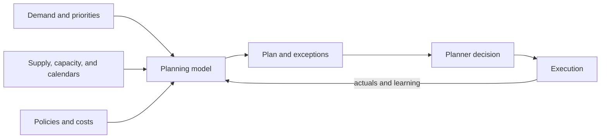

# 3. Advanced Planning and Constraint Management

## Learning objectives

After this topic, you should be able to:

- explain the role of constraint-aware planning;
- distinguish planning, scheduling, simulation, and optimization;
- identify the data required for a feasible plan; and
- interpret model output as a decision proposal rather than certainty.

## Concept in plain English

Advanced planning evaluates demand and supply across time while considering constraints such as materials, capacity, calendars, lead times, storage, transportation, and business rules. It helps planners compare feasible or near-feasible choices before execution.

## Related activities

| Activity | Main question |
|---|---|
| Planning | what should be supplied, where, and when? |
| Scheduling | in what detailed sequence should work occur? |
| Simulation | what happens under a specified policy or scenario? |
| Optimization | which feasible choice best fits the stated objective? |
| Order promising | when and from where can a specific demand be committed? |

## Feasibility depends on data

Critical inputs include:

- item and location relationships;
- bills, recipes, or service dependencies;
- usable resource capacity and calendars;
- yields, lot sizes, and changeovers;
- transportation lanes and lead-time distributions;
- inventory status and expected receipts;
- demand priority and fulfillment policy; and
- frozen, flexible, and planning horizons.

An optimization engine can return a mathematically optimal answer to an operationally incorrect model.

## AsterWorks example

The plan assumes 80 hours of weekly test capacity. Actual usable time averages 66 hours after maintenance, calibration, and product changeovers. Planners repeatedly override the schedule.

The problem is not planner resistance. The capacity model is wrong. AsterWorks separates nominal, scheduled, demonstrated, and available capacity and assigns ownership for calendar maintenance.

## Objective functions and guardrails

A model may minimize delivered cost, lateness, inventory, changeover, or emissions—or balance several. Hard constraints should represent rules that truly cannot be violated. Preferences belong in penalties or priorities so the model can reveal trade-offs rather than declare unnecessary infeasibility.

## Why it matters

Optimization can recommend infeasible or economically harmful actions when constraints, costs, priorities, or data freshness are incomplete.

## Decision logic

Define the planning decision, objective, hard constraints, soft penalties, horizon, data cut, exception route, and human approval boundary. Do not approve the decision until mandatory conditions are feasible and the residual exposure has a named owner.

## Evidence retained through the workflow

Retain model scope, objective and units, constraint register, source data and vintage, infeasibility handling, override, and outcome. Record the decision date and the event or threshold that requires reassessment.

## Applied decision artifact

Use a one-page **advanced planning and constraint management decision record** with these fields:

- **Decision and boundary:** Define the planning decision, objective, hard constraints, soft penalties, horizon, data cut, exception route, and human approval boundary.
- **Required evidence:** model scope, objective and units, constraint register, source data and vintage, infeasibility handling, override, and outcome.
- **Expected result:** Optimization can recommend infeasible or economically harmful actions when constraints, costs, priorities, or data freshness are incomplete.
- **Balancing condition:** More constraints improve realism but increase data maintenance, solve complexity, and the risk of embedding obsolete policies.
- **Accountability:** name the decision owner, approval date, residual exposure owner, and measurable trigger for reassessment.

The record is complete only when another practitioner can reproduce the reasoning and identify the next action without relying on meeting memory.

## Trade-offs

More constraints improve realism but increase data maintenance, solve complexity, and the risk of embedding obsolete policies.

## Commonly confused with

Do not confuse a preferred decision method with a guaranteed outcome. Define the planning decision, objective, hard constraints, soft penalties, horizon, data cut, exception route, and human approval boundary. Validate the result with model scope, objective and units, constraint register, source data and vintage, infeasibility handling, override, and outcome; the evidence, not the method's label, determines whether the choice worked.

## Common mistakes

- Loading nominal capacity instead of demonstrated usable capacity.
- Treating all constraints as equally hard.
- Hiding commercial priorities in undocumented planner overrides.
- Accepting an optimized plan without explaining its objective.
- Measuring adherence without checking whether the original plan was feasible.

## Original knowledge check

A planning model creates frequent shortages even though actual resources have spare time. What should be checked first?

Answer and rationale

### Correct answer

Validate the modeled relationships, calendars, lead times, yields, and constraint settings. The apparent shortage may be a data or model defect.

### Why it is correct

Optimization can recommend infeasible or economically harmful actions when constraints, costs, priorities, or data freshness are incomplete. Define the planning decision, objective, hard constraints, soft penalties, horizon, data cut, exception route, and human approval boundary.

### Why the other answers are wrong

Alternative responses reproduce failure modes already discussed:

- Loading nominal capacity instead of demonstrated usable capacity.
- Treating all constraints as equally hard.
- Hiding commercial priorities in undocumented planner overrides.

They do not preserve the lesson's decision boundary or evidence. The governing trade-off remains explicit: More constraints improve realism but increase data maintenance, solve complexity, and the risk of embedding obsolete policies.

## Practitioner perspective

Use model scope, objective and units, constraint register, source data and vintage, infeasibility handling, override, and outcome as the minimum review record. The artifact should let another practitioner reproduce the conclusion, identify the remaining exposure, and know which trigger reopens the decision.

## Related concepts

- [Section overview](./README.md)
- [Module 3 continuation](../../03-sourcing-strategy-product-design-supplier-execution/section-d-supplier-selection-contracting-and-procurement/01-purchasing-flow-and-selection-routes.md)
Continue to [event management and control towers](04-event-management-and-control-towers.md).

---

[Previous: Core Platforms Versus Specialized Applications](02-core-platforms-vs-specialized-applications.md) · [Next: Event Management and Control Towers](04-event-management-and-control-towers.md)
