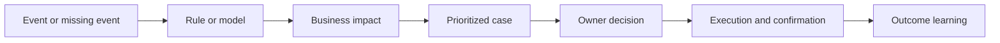
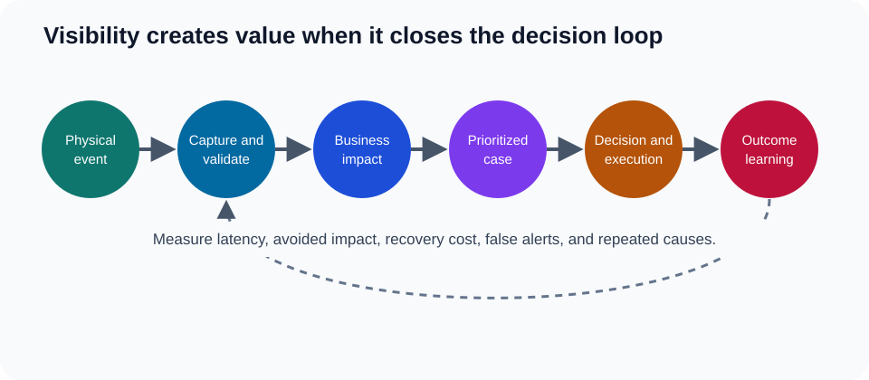

# 4. Event Management and Control Towers

## Learning objectives

After this topic, you should be able to:

- distinguish an event, exception, alert, case, and decision;
- design a closed-loop exception workflow;
- prioritize by business impact rather than message volume; and
- evaluate control-tower value using outcomes.

## Concept in plain English

An event records that something happened. An exception states that the event or missing event matters. An alert notifies someone. A case groups the evidence, ownership, actions, and resolution. A decision changes the expected outcome.

## Exception design

Each exception type needs:

- event and timing definition;
- affected order, product, customer, or resource;
- severity logic;
- accountable owner and response time;
- permitted actions and approval thresholds;
- escalation rule;
- closure evidence; and
- outcome measurement.

The original sample data are in [`network-exceptions.csv`](../../assets/data/module-2/section-b/network-exceptions.csv).

## AsterWorks example

A delayed vessel creates 180 shipment alerts. Without order and customer context, the team works the list chronologically. AsterWorks instead groups alerts into one disruption case, connects affected orders, identifies two production-stop customers, and prioritizes recovery by service and financial impact.

## Control-tower maturity

| Level | Behavior |
|---|---|
| Observe | display status from several sources |
| Detect | identify threshold breaches or missing events |
| Prioritize | rank exceptions by likely business impact |
| Recommend | compare feasible recovery options |
| Orchestrate | route approvals and coordinate execution |
| Learn | measure outcomes and improve triggers |

## Useful measures

- event completeness and latency;
- alert-to-case compression;
- time to acknowledge and decide;
- percentage resolved before customer impact;
- recovery cost and avoided loss;
- repeat-exception rate; and
- false-positive and ignored-alert rates.

## Why it matters

Visibility creates value only when a trusted event changes a prioritized decision before avoidable impact occurs.

## Decision logic

Define material events, validate them, estimate business impact, route prioritized exceptions to an owner, record action, and learn from outcome. Do not approve the decision until mandatory conditions are feasible and the residual exposure has a named owner.

## Evidence retained through the workflow

Retain event definition, source and timestamp, validation status, affected objects, impact, priority, owner, response, and outcome. Record the decision date and the event or threshold that requires reassessment.

## Applied decision artifact

Use a one-page **event management and control towers decision record** with these fields:

- **Decision and boundary:** Define material events, validate them, estimate business impact, route prioritized exceptions to an owner, record action, and learn from outcome.
- **Required evidence:** event definition, source and timestamp, validation status, affected objects, impact, priority, owner, response, and outcome.
- **Expected result:** Visibility creates value only when a trusted event changes a prioritized decision before avoidable impact occurs.
- **Balancing condition:** More alerts increase coverage but create fatigue; tighter filtering reduces noise but may miss emerging conditions.
- **Accountability:** name the decision owner, approval date, residual exposure owner, and measurable trigger for reassessment.

The record is complete only when another practitioner can reproduce the reasoning and identify the next action without relying on meeting memory.

## Trade-offs

More alerts increase coverage but create fatigue; tighter filtering reduces noise but may miss emerging conditions.

## Commonly confused with

Do not confuse a preferred decision method with a guaranteed outcome. Define material events, validate them, estimate business impact, route prioritized exceptions to an owner, record action, and learn from outcome. Validate the result with event definition, source and timestamp, validation status, affected objects, impact, priority, owner, response, and outcome; the evidence, not the method's label, determines whether the choice worked.

## Common mistakes

- Calling a dashboard a control tower.
- Creating one alert per message instead of one case per problem.
- Prioritizing by delay duration alone.
- Recommending actions that execution systems cannot carry out.
- Closing cases when a user clicks “complete” rather than when outcome evidence arrives.

## Original knowledge check

A storm delays one vessel containing 90 orders. Should the system create 90 unrelated disruption investigations?

Answer and rationale

### Correct answer

Usually no. Group the common event into one disruption case while retaining order-level impact, priority, and recovery actions.

### Why it is correct

Visibility creates value only when a trusted event changes a prioritized decision before avoidable impact occurs. Define material events, validate them, estimate business impact, route prioritized exceptions to an owner, record action, and learn from outcome.

### Why the other answers are wrong

Alternative responses reproduce failure modes already discussed:

- Calling a dashboard a control tower.
- Creating one alert per message instead of one case per problem.
- Prioritizing by delay duration alone.

They do not preserve the lesson's decision boundary or evidence. The governing trade-off remains explicit: More alerts increase coverage but create fatigue; tighter filtering reduces noise but may miss emerging conditions.

## Practitioner perspective

Use event definition, source and timestamp, validation status, affected objects, impact, priority, owner, response, and outcome as the minimum review record. The artifact should let another practitioner reproduce the conclusion, identify the remaining exposure, and know which trigger reopens the decision.

## Related concepts

- [Section overview](./README.md)
- [Module 3 continuation](../../03-sourcing-strategy-product-design-supplier-execution/section-d-supplier-selection-contracting-and-procurement/01-purchasing-flow-and-selection-routes.md)
Continue to [warehouse management systems](05-warehouse-management-systems.md).

---

[Previous: Advanced Planning and Constraint Management](03-advanced-planning-and-constraint-management.md) · [Next: Warehouse Management Systems](05-warehouse-management-systems.md)
