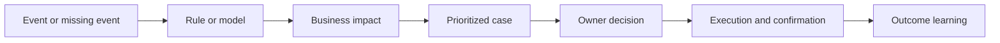

# 4. Event Management and Control Towers

## Learning objectives

After this topic, you should be able to:

- distinguish an event, exception, alert, case, and decision;
- design a closed-loop exception workflow;
- prioritize by business impact rather than message volume; and
- evaluate control-tower value using outcomes.

## Concept in plain English

An event records that something happened. An exception states that the event or missing event matters. An alert notifies someone. A case groups the evidence, ownership, actions, and resolution. A decision changes the expected outcome.

## Exception design

Each exception type needs:

- event and timing definition;
- affected order, product, customer, or resource;
- severity logic;
- accountable owner and response time;
- permitted actions and approval thresholds;
- escalation rule;
- closure evidence; and
- outcome measurement.

The original sample data are in [`network-exceptions.csv`](../../assets/data/module-2/section-b/network-exceptions.csv).

## AsterWorks example

A delayed vessel creates 180 shipment alerts. Without order and customer context, the team works the list chronologically. AsterWorks instead groups alerts into one disruption case, connects affected orders, identifies two production-stop customers, and prioritizes recovery by service and financial impact.

## Control-tower maturity

| Level | Behavior |
|---|---|
| Observe | display status from several sources |
| Detect | identify threshold breaches or missing events |
| Prioritize | rank exceptions by likely business impact |
| Recommend | compare feasible recovery options |
| Orchestrate | route approvals and coordinate execution |
| Learn | measure outcomes and improve triggers |

## Useful measures

- event completeness and latency;
- alert-to-case compression;
- time to acknowledge and decide;
- percentage resolved before customer impact;
- recovery cost and avoided loss;
- repeat-exception rate; and
- false-positive and ignored-alert rates.

## Common mistakes

- Calling a dashboard a control tower.
- Creating one alert per message instead of one case per problem.
- Prioritizing by delay duration alone.
- Recommending actions that execution systems cannot carry out.
- Closing cases when a user clicks “complete” rather than when outcome evidence arrives.

## Original knowledge check

A storm delays one vessel containing 90 orders. Should the system create 90 unrelated disruption investigations?

Answer

Usually no. Group the common event into one disruption case while retaining order-level impact, priority, and recovery actions.

## Related concepts

Continue to [warehouse management systems](05-warehouse-management-systems.md).
