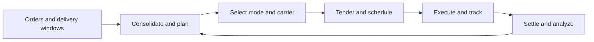

# 6. Transportation Management Systems

## Learning objectives

After this topic, you should be able to:

- describe planning, tendering, tracking, settlement, and analysis capabilities;
- identify the data needed for reliable transportation decisions;
- separate route optimization from execution visibility; and
- calculate basic lane and utilization measures.

## Concept in plain English

A transportation-management application plans and controls the movement of freight. It converts orders and shipment requirements into loads, modes, routes, carrier commitments, milestones, freight charges, and performance evidence.

## Capability groups

| Group | Examples |
|---|---|
| Design | lane, mode, and carrier strategy |
| Planning | consolidation, routing, equipment, appointment |
| Procurement | rate, contract, bid, and carrier selection |
| Execution | tender, document, pickup, milestone, proof of delivery |
| Settlement | freight audit, accrual, invoice match, allocation |
| Analytics | cost, service, utilization, emissions, claims |

Use [`transport-lanes.csv`](../../assets/data/module-2/section-b/transport-lanes.csv) for the original lane example.

## Basic measures

### Equipment utilization

$$
\text{Weight utilization}=\frac{\text{loaded weight}}{\text{usable weight capacity}}
$$

If a trailer carries 14,400 kg against 18,000 kg usable capacity, utilization is 80%.

### Freight cost per delivered unit

$$
\text{Freight cost per unit}=\frac{\text{total lane freight cost}}{\text{units delivered}}
$$

Cost must be interpreted with service, damage, and inventory effects. A slow low-rate mode can create more inventory and expedite cost elsewhere.

## AsterWorks example

AsterWorks planners select the lowest line-haul rate, while regional teams later expedite customer orders. The transportation design adds a “planned total delivered cost” view that includes mode cost, consolidation, expected transit, inventory effect, and service risk. Expedites are linked back to the original plan reason.

## Data requirements

- accurate origin, destination, calendars, and time zones;
- product weight, volume, stackability, hazard, and temperature attributes;
- order priority and delivery window;
- carrier service, equipment, rates, accessorials, and capacity;
- route, border, port, and transit assumptions;
- milestone definitions and event identifiers; and
- invoice, claim, and proof-of-delivery evidence.

## Common mistakes

- Optimizing freight rate rather than delivered outcome.
- Using inaccurate product dimensions.
- Comparing carriers without common service definitions.
- Ignoring empty distance and failed delivery.
- Tracking a shipment without linking it to customer impact.

## Original knowledge check

A lower-cost mode adds twelve days of transit for high-value inventory. What additional economic effect should be assessed?

Answer

Additional inventory in transit, working capital, service exposure, and possible recovery cost—not only the freight-rate difference.

## Related concepts

Continue to [information architecture and data platforms](07-information-architecture-and-data-platforms.md).
