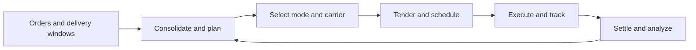

# 6. Transportation Management Systems

## Learning objectives

After this topic, you should be able to:

- describe planning, tendering, tracking, settlement, and analysis capabilities;
- identify the data needed for reliable transportation decisions;
- separate route optimization from execution visibility; and
- calculate basic lane and utilization measures.

## Concept in plain English

A transportation-management application plans and controls the movement of freight. It converts orders and shipment requirements into loads, modes, routes, carrier commitments, milestones, freight charges, and performance evidence.

## Capability groups

| Group | Examples |
|---|---|
| Design | lane, mode, and carrier strategy |
| Planning | consolidation, routing, equipment, appointment |
| Procurement | rate, contract, bid, and carrier selection |
| Execution | tender, document, pickup, milestone, proof of delivery |
| Settlement | freight audit, accrual, invoice match, allocation |
| Analytics | cost, service, utilization, emissions, claims |

Use [`transport-lanes.csv`](../../assets/data/module-2/section-b/transport-lanes.csv) for the original lane example.

## Basic measures

### Equipment utilization

$$
\text{Weight utilization}=\frac{\text{loaded weight}}{\text{usable weight capacity}}
$$

If a trailer carries 14,400 kg against 18,000 kg usable capacity, utilization is 80%.

### Freight cost per delivered unit

$$
\text{Freight cost per unit}=\frac{\text{total lane freight cost}}{\text{units delivered}}
$$

Cost must be interpreted with service, damage, and inventory effects. A slow low-rate mode can create more inventory and expedite cost elsewhere.

## AsterWorks example

AsterWorks planners select the lowest line-haul rate, while regional teams later expedite customer orders. The transportation design adds a “planned total delivered cost” view that includes mode cost, consolidation, expected transit, inventory effect, and service risk. Expedites are linked back to the original plan reason.

## Data requirements

- accurate origin, destination, calendars, and time zones;
- product weight, volume, stackability, hazard, and temperature attributes;
- order priority and delivery window;
- carrier service, equipment, rates, accessorials, and capacity;
- route, border, port, and transit assumptions;
- milestone definitions and event identifiers; and
- invoice, claim, and proof-of-delivery evidence.

## Why it matters

Transportation choices change service, freight cost, capacity use, emissions, inventory in transit, and customer communication.

## Decision logic

Plan and tender comparable lanes using service and cost constraints, capture carrier events, manage exceptions, and settle against executed evidence. Do not approve the decision until mandatory conditions are feasible and the residual exposure has a named owner.

## Evidence retained through the workflow

Retain lane master, shipment demand, mode and carrier constraints, rate and tender evidence, events, cost, service, emissions, and claims. Record the decision date and the event or threshold that requires reassessment.

## Applied decision artifact

Use a one-page **transportation management systems decision record** with these fields:

- **Decision and boundary:** Plan and tender comparable lanes using service and cost constraints, capture carrier events, manage exceptions, and settle against executed evidence.
- **Required evidence:** lane master, shipment demand, mode and carrier constraints, rate and tender evidence, events, cost, service, emissions, and claims.
- **Expected result:** Transportation choices change service, freight cost, capacity use, emissions, inventory in transit, and customer communication.
- **Balancing condition:** Cost-efficient modes and consolidation reduce freight expense but may increase lead time, variability, inventory, and response risk.
- **Accountability:** name the decision owner, approval date, residual exposure owner, and measurable trigger for reassessment.

The record is complete only when another practitioner can reproduce the reasoning and identify the next action without relying on meeting memory.

## Trade-offs

Cost-efficient modes and consolidation reduce freight expense but may increase lead time, variability, inventory, and response risk.

## Commonly confused with

Do not confuse a preferred decision method with a guaranteed outcome. Plan and tender comparable lanes using service and cost constraints, capture carrier events, manage exceptions, and settle against executed evidence. Validate the result with lane master, shipment demand, mode and carrier constraints, rate and tender evidence, events, cost, service, emissions, and claims; the evidence, not the method's label, determines whether the choice worked.

## Common mistakes

- Optimizing freight rate rather than delivered outcome.
- Using inaccurate product dimensions.
- Comparing carriers without common service definitions.
- Ignoring empty distance and failed delivery.
- Tracking a shipment without linking it to customer impact.

## Original knowledge check

A lower-cost mode adds twelve days of transit for high-value inventory. What additional economic effect should be assessed?

Answer and rationale

### Correct answer

Additional inventory in transit, working capital, service exposure, and possible recovery cost—not only the freight-rate difference.

### Why it is correct

Transportation choices change service, freight cost, capacity use, emissions, inventory in transit, and customer communication. Plan and tender comparable lanes using service and cost constraints, capture carrier events, manage exceptions, and settle against executed evidence.

### Why the other answers are wrong

Alternative responses reproduce failure modes already discussed:

- Optimizing freight rate rather than delivered outcome.
- Using inaccurate product dimensions.
- Comparing carriers without common service definitions.

They do not preserve the lesson's decision boundary or evidence. The governing trade-off remains explicit: Cost-efficient modes and consolidation reduce freight expense but may increase lead time, variability, inventory, and response risk.

## Practitioner perspective

Use lane master, shipment demand, mode and carrier constraints, rate and tender evidence, events, cost, service, emissions, and claims as the minimum review record. The artifact should let another practitioner reproduce the conclusion, identify the remaining exposure, and know which trigger reopens the decision.

## Related concepts

- [Network and performance formula sheet](../../calculations/network-performance/formula-sheet.md)
- [Section overview](./README.md)
- [Module 3 continuation](../../03-sourcing-strategy-product-design-supplier-execution/section-d-supplier-selection-contracting-and-procurement/01-purchasing-flow-and-selection-routes.md)
Continue to [information architecture and data platforms](07-information-architecture-and-data-platforms.md).

---

[Previous: Warehouse Management Systems](05-warehouse-management-systems.md) · [Next: Information Architecture and Data Platforms](07-information-architecture-and-data-platforms.md)
