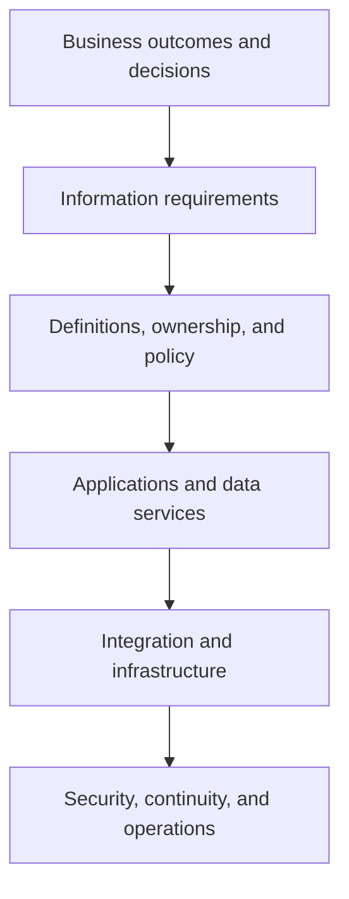

# 7. Information Architecture and Data Platforms

## Learning objectives

After this topic, you should be able to:

- connect information strategy to data, applications, infrastructure, and controls;
- distinguish operational, analytical, and reference data uses;
- explain authoritative source and consumption views; and
- design architecture from business requirements downward.

## Concept in plain English

Information architecture defines what information the organization needs, how it is represented, where it is mastered, how it moves, who may use it, and how its lifecycle is controlled.

## Architecture stack

Starting at the bottom encourages teams to buy infrastructure before agreeing on the decisions and information it must support.

## Data purposes

| Data type | Purpose | Examples |
|---|---|---|
| Master and reference | identify and classify stable business objects | item, customer, location, unit, calendar |
| Transaction | record a business commitment or posting | order, receipt, shipment, invoice |
| Event | record a state change at a time | departed, arrived, inspected, released |
| Planning | represent future assumptions and decisions | forecast, capacity, allocation, planned receipt |
| Analytical | support comparison, trend, model, and metric | curated history, feature, aggregate, benchmark |

## Authoritative does not mean exclusive

One application should have authority to create or approve a critical attribute. Other applications may cache, enrich, or present it. The architecture must distinguish:

- the authoritative business definition;
- the system and role allowed to change it;
- copies and transformations;
- synchronization expectations; and
- reconciliation when versions disagree.

## AsterWorks example

AsterWorks has three definitions of “requested delivery date.” One reflects the customer request, one the confirmed promise, and one the current planned arrival. The data platform previously collapsed them into one field, making service analysis unreliable.

The architecture preserves each date with its meaning and change history. Reports can then explain whether performance missed the original request, the accepted promise, or the latest plan.

## Common mistakes

- Treating a data lake or warehouse as a substitute for ownership.
- Using one field for multiple business meanings.
- Moving data without lineage or effective dates.
- Designing analytics separately from operational definitions.
- Ignoring retention, deletion, residency, and recovery requirements.

## Original knowledge check

Can an analytical platform hold the most useful consolidated view while another application remains authoritative for individual fields?

Answer

**Yes.** Consolidated consumption and authoritative maintenance are different responsibilities, provided lineage and synchronization are controlled.

## Related concepts

Continue to [cloud, SaaS, and deployment choices](08-cloud-saas-and-deployment-choices.md).
