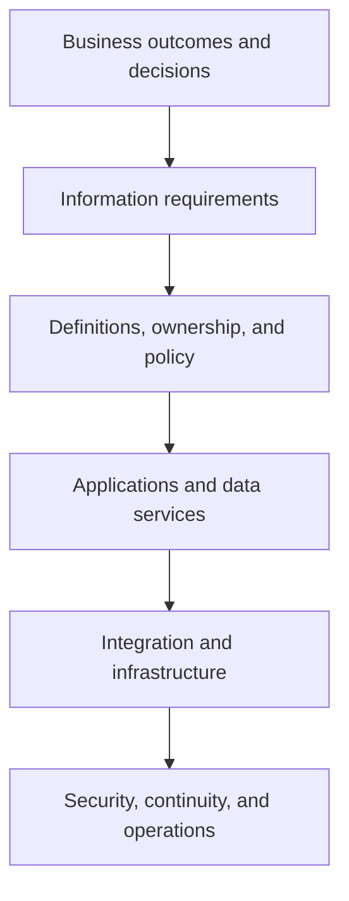

# 7. Information Architecture and Data Platforms

## Learning objectives

After this topic, you should be able to:

- connect information strategy to data, applications, infrastructure, and controls;
- distinguish operational, analytical, and reference data uses;
- explain authoritative source and consumption views; and
- design architecture from business requirements downward.

## Concept in plain English

Information architecture defines what information the organization needs, how it is represented, where it is mastered, how it moves, who may use it, and how its lifecycle is controlled.

## Architecture stack

Starting at the bottom encourages teams to buy infrastructure before agreeing on the decisions and information it must support.

## Data purposes

| Data type | Purpose | Examples |
|---|---|---|
| Master and reference | identify and classify stable business objects | item, customer, location, unit, calendar |
| Transaction | record a business commitment or posting | order, receipt, shipment, invoice |
| Event | record a state change at a time | departed, arrived, inspected, released |
| Planning | represent future assumptions and decisions | forecast, capacity, allocation, planned receipt |
| Analytical | support comparison, trend, model, and metric | curated history, feature, aggregate, benchmark |

## Authoritative does not mean exclusive

One application should have authority to create or approve a critical attribute. Other applications may cache, enrich, or present it. The architecture must distinguish:

- the authoritative business definition;
- the system and role allowed to change it;
- copies and transformations;
- synchronization expectations; and
- reconciliation when versions disagree.

## AsterWorks example

AsterWorks has three definitions of “requested delivery date.” One reflects the customer request, one the confirmed promise, and one the current planned arrival. The data platform previously collapsed them into one field, making service analysis unreliable.

The architecture preserves each date with its meaning and change history. Reports can then explain whether performance missed the original request, the accepted promise, or the latest plan.

## Why it matters

Data copied without ownership, semantics, lineage, and timing can make every application technically connected but operationally inconsistent.

## Decision logic

Assign authoritative records, define integration and analytical copies, preserve lineage and meaning, and match data freshness to the consuming decision. Do not approve the decision until mandatory conditions are feasible and the residual exposure has a named owner.

## Evidence retained through the workflow

Retain business object and definition, authoritative source, lineage, refresh, transformation, access, retention, quality rule, and owner. Record the decision date and the event or threshold that requires reassessment.

## Applied decision artifact

Use a one-page **information architecture and data platforms decision record** with these fields:

- **Decision and boundary:** Assign authoritative records, define integration and analytical copies, preserve lineage and meaning, and match data freshness to the consuming decision.
- **Required evidence:** business object and definition, authoritative source, lineage, refresh, transformation, access, retention, quality rule, and owner.
- **Expected result:** Data copied without ownership, semantics, lineage, and timing can make every application technically connected but operationally inconsistent.
- **Balancing condition:** Centralized data improves consistency and governance, while distributed ownership can improve domain accountability and speed.
- **Accountability:** name the decision owner, approval date, residual exposure owner, and measurable trigger for reassessment.

The record is complete only when another practitioner can reproduce the reasoning and identify the next action without relying on meeting memory.

## Trade-offs

Centralized data improves consistency and governance, while distributed ownership can improve domain accountability and speed.

## Commonly confused with

Do not confuse a preferred decision method with a guaranteed outcome. Assign authoritative records, define integration and analytical copies, preserve lineage and meaning, and match data freshness to the consuming decision. Validate the result with business object and definition, authoritative source, lineage, refresh, transformation, access, retention, quality rule, and owner; the evidence, not the method's label, determines whether the choice worked.

## Common mistakes

- Treating a data lake or warehouse as a substitute for ownership.
- Using one field for multiple business meanings.
- Moving data without lineage or effective dates.
- Designing analytics separately from operational definitions.
- Ignoring retention, deletion, residency, and recovery requirements.

## Original knowledge check

Can an analytical platform hold the most useful consolidated view while another application remains authoritative for individual fields?

Answer and rationale

### Correct answer

**Yes.** Consolidated consumption and authoritative maintenance are different responsibilities, provided lineage and synchronization are controlled.

### Why it is correct

Data copied without ownership, semantics, lineage, and timing can make every application technically connected but operationally inconsistent. Assign authoritative records, define integration and analytical copies, preserve lineage and meaning, and match data freshness to the consuming decision.

### Why the other answers are wrong

Alternative responses reproduce failure modes already discussed:

- Treating a data lake or warehouse as a substitute for ownership.
- Using one field for multiple business meanings.
- Moving data without lineage or effective dates.

They do not preserve the lesson's decision boundary or evidence. The governing trade-off remains explicit: Centralized data improves consistency and governance, while distributed ownership can improve domain accountability and speed.

## Practitioner perspective

Use business object and definition, authoritative source, lineage, refresh, transformation, access, retention, quality rule, and owner as the minimum review record. The artifact should let another practitioner reproduce the conclusion, identify the remaining exposure, and know which trigger reopens the decision.

## Related concepts

- [Section overview](./README.md)
- [Module 3 continuation](../../03-sourcing-strategy-product-design-supplier-execution/section-d-supplier-selection-contracting-and-procurement/01-purchasing-flow-and-selection-routes.md)
Continue to [cloud, SaaS, and deployment choices](08-cloud-saas-and-deployment-choices.md).

---

[Previous: Transportation Management Systems](06-transportation-management-systems.md) · [Next: Cloud, SaaS, and Deployment Choices](08-cloud-saas-and-deployment-choices.md)
