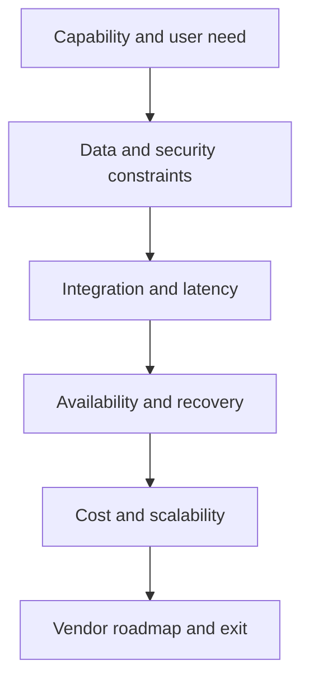

# 8. Cloud, SaaS, and Deployment Choices

## Learning objectives

After this topic, you should be able to:

- compare software-service and customer-managed deployment responsibilities;
- evaluate integration, security, continuity, cost, and exit implications;
- distinguish scalability from resilience; and
- ask practical questions before selecting a deployment model.

## Concept in plain English

Deployment choice determines who operates infrastructure and software, how capacity is consumed, how changes are released, and how responsibilities are divided between customer and provider.

## Shared responsibility

| Responsibility | Provider contribution | Customer contribution |
|---|---|---|
| Availability | resilient service design and published commitment | network access, integration recovery, business continuity |
| Security | platform controls and vulnerability management | identity, configuration, data use, endpoint and process controls |
| Data | storage and technical protection | classification, quality, access approval, retention, lawful use |
| Change | release and platform roadmap | testing, adoption, interface compatibility, operating procedures |
| Recovery | service backup and restoration | business reconciliation and fallback process |

Contract language should match the actual operating model. Outsourcing operation does not outsource accountability for customer promises, data, or regulatory obligations.

## Decision factors

## Lifecycle cost

Compare:

- subscription or infrastructure consumption;
- implementation and integration;
- release testing and change adoption;
- identity, monitoring, logging, and assurance;
- data movement and storage;
- partner onboarding;
- service support; and
- extraction, transition, and exit.

## AsterWorks example

AsterWorks selects a software service for carrier connectivity because the provider maintains many carrier adapters. The value depends on reuse. If every carrier still requires a unique custom interface and support model, the expected scale advantage weakens.

AsterWorks therefore makes connector coverage, event quality, onboarding lead time, service continuity, data portability, and exit assistance part of the selection criteria.

## Scalability versus resilience

- **Scalability** is the ability to handle increased or reduced workload.
- **Resilience** is the ability to continue or recover acceptable service during failure or disruption.

A service can scale rapidly while still depending on one identity provider, region, network path, or integration gateway.

## Common mistakes

- Assuming hosted software has no implementation or upgrade work.
- Treating a provider assurance report as proof that customer configuration is secure.
- Omitting data-extraction and termination obligations.
- Comparing annual subscription with only the hardware portion of another option.
- Confusing infrastructure recovery with completed business reconciliation.

## Original knowledge check

A provider restores its service after an outage, but 600 shipment events were missed. Is recovery complete?

Answer

Not necessarily. AsterWorks must replay or reconcile missing events and confirm downstream business state before the process is recovered.

## Related concepts

Continue to [integration patterns, APIs, middleware, and events](09-integration-patterns-apis-middleware-events.md).
