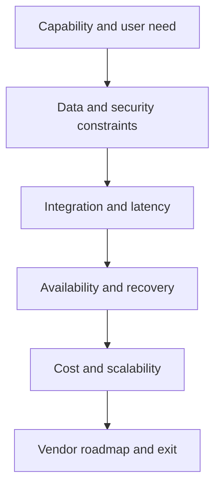

# 8. Cloud, SaaS, and Deployment Choices

## Learning objectives

After this topic, you should be able to:

- compare software-service and customer-managed deployment responsibilities;
- evaluate integration, security, continuity, cost, and exit implications;
- distinguish scalability from resilience; and
- ask practical questions before selecting a deployment model.

## Concept in plain English

Deployment choice determines who operates infrastructure and software, how capacity is consumed, how changes are released, and how responsibilities are divided between customer and provider.

## Shared responsibility

| Responsibility | Provider contribution | Customer contribution |
|---|---|---|
| Availability | resilient service design and published commitment | network access, integration recovery, business continuity |
| Security | platform controls and vulnerability management | identity, configuration, data use, endpoint and process controls |
| Data | storage and technical protection | classification, quality, access approval, retention, lawful use |
| Change | release and platform roadmap | testing, adoption, interface compatibility, operating procedures |
| Recovery | service backup and restoration | business reconciliation and fallback process |

Contract language should match the actual operating model. Outsourcing operation does not outsource accountability for customer promises, data, or regulatory obligations.

## Decision factors

## Lifecycle cost

Compare:

- subscription or infrastructure consumption;
- implementation and integration;
- release testing and change adoption;
- identity, monitoring, logging, and assurance;
- data movement and storage;
- partner onboarding;
- service support; and
- extraction, transition, and exit.

## AsterWorks example

AsterWorks selects a software service for carrier connectivity because the provider maintains many carrier adapters. The value depends on reuse. If every carrier still requires a unique custom interface and support model, the expected scale advantage weakens.

AsterWorks therefore makes connector coverage, event quality, onboarding lead time, service continuity, data portability, and exit assistance part of the selection criteria.

## Scalability versus resilience

- **Scalability** is the ability to handle increased or reduced workload.
- **Resilience** is the ability to continue or recover acceptable service during failure or disruption.

A service can scale rapidly while still depending on one identity provider, region, network path, or integration gateway.

## Why it matters

Deployment choices affect control, scalability, resilience, integration, upgrade timing, security, cost, and exit flexibility.

## Decision logic

Compare options against workload criticality, data obligations, latency, customization need, operating capability, recovery, lifecycle cost, and exit. Do not approve the decision until mandatory conditions are feasible and the residual exposure has a named owner.

## Evidence retained through the workflow

Retain requirement and classification, architecture option, shared-responsibility matrix, integration, recovery objective, cost, contract, and exit test. Record the decision date and the event or threshold that requires reassessment.

## Applied decision artifact

Use a one-page **cloud, saas, and deployment choices decision record** with these fields:

- **Decision and boundary:** Compare options against workload criticality, data obligations, latency, customization need, operating capability, recovery, lifecycle cost, and exit.
- **Required evidence:** requirement and classification, architecture option, shared-responsibility matrix, integration, recovery objective, cost, contract, and exit test.
- **Expected result:** Deployment choices affect control, scalability, resilience, integration, upgrade timing, security, cost, and exit flexibility.
- **Balancing condition:** SaaS accelerates standard capability and upgrades but limits modification and increases dependence on vendor service and release policy.
- **Accountability:** name the decision owner, approval date, residual exposure owner, and measurable trigger for reassessment.

The record is complete only when another practitioner can reproduce the reasoning and identify the next action without relying on meeting memory.

## Trade-offs

SaaS accelerates standard capability and upgrades but limits modification and increases dependence on vendor service and release policy.

## Commonly confused with

Do not confuse a preferred decision method with a guaranteed outcome. Compare options against workload criticality, data obligations, latency, customization need, operating capability, recovery, lifecycle cost, and exit. Validate the result with requirement and classification, architecture option, shared-responsibility matrix, integration, recovery objective, cost, contract, and exit test; the evidence, not the method's label, determines whether the choice worked.

## Common mistakes

- Assuming hosted software has no implementation or upgrade work.
- Treating a provider assurance report as proof that customer configuration is secure.
- Omitting data-extraction and termination obligations.
- Comparing annual subscription with only the hardware portion of another option.
- Confusing infrastructure recovery with completed business reconciliation.

## Original knowledge check

A provider restores its service after an outage, but 600 shipment events were missed. Is recovery complete?

Answer and rationale

### Correct answer

Not necessarily. AsterWorks must replay or reconcile missing events and confirm downstream business state before the process is recovered.

### Why it is correct

Deployment choices affect control, scalability, resilience, integration, upgrade timing, security, cost, and exit flexibility. Compare options against workload criticality, data obligations, latency, customization need, operating capability, recovery, lifecycle cost, and exit.

### Why the other answers are wrong

Alternative responses reproduce failure modes already discussed:

- Assuming hosted software has no implementation or upgrade work.
- Treating a provider assurance report as proof that customer configuration is secure.
- Omitting data-extraction and termination obligations.

They do not preserve the lesson's decision boundary or evidence. The governing trade-off remains explicit: SaaS accelerates standard capability and upgrades but limits modification and increases dependence on vendor service and release policy.

## Practitioner perspective

Use requirement and classification, architecture option, shared-responsibility matrix, integration, recovery objective, cost, contract, and exit test as the minimum review record. The artifact should let another practitioner reproduce the conclusion, identify the remaining exposure, and know which trigger reopens the decision.

## Related concepts

- [Section overview](./README.md)
- [Module 3 continuation](../../03-sourcing-strategy-product-design-supplier-execution/section-d-supplier-selection-contracting-and-procurement/01-purchasing-flow-and-selection-routes.md)
Continue to [integration patterns, APIs, middleware, and events](09-integration-patterns-apis-middleware-events.md).

---

[Previous: Information Architecture and Data Platforms](07-information-architecture-and-data-platforms.md) · [Next: Integration Patterns, APIs, Middleware, and Events](09-integration-patterns-apis-middleware-events.md)
