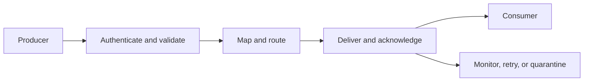

# 9. Integration Patterns, APIs, Middleware, and Events

## Learning objectives

After this topic, you should be able to:

- compare file, message, API, and event-based integration;
- explain the role of middleware;
- define idempotency, correlation, acknowledgement, and replay; and
- choose a pattern based on the business interaction.

## Concept in plain English

Integration connects applications and organizations so that a business interaction can continue across boundaries. A protocol moves data; a complete design also preserves meaning, identity, order, security, monitoring, and recovery.

## Pattern comparison

| Pattern | Strength | Typical use | Main control need |
|---|---|---|---|
| Managed file | simple bulk exchange | daily catalog or forecast | completeness and duplicate control |
| Business message | durable asynchronous transaction | order, invoice, shipment notice | acknowledgement and replay |
| Request-response API | immediate query or command | promise check or status request | timeout and safe retry |
| Published event | distribute state change to several consumers | departure, hold, release | ordering, subscription, and idempotency |

## Middleware responsibilities

Middleware may translate formats, route messages, orchestrate steps, enforce policy, manage certificates, throttle traffic, and provide observability. It should not become an unowned location for hidden business logic.

## Essential controls

- **Correlation identifier:** connects request, response, transaction, and event.
- **Idempotency:** a safe retry does not create duplicate business effect.
- **Acknowledgement:** distinguishes accepted transport from successful business processing.
- **Schema versioning:** allows controlled change in structure and meaning.
- **Replay:** reprocesses missed or failed information safely.
- **Quarantine:** separates invalid messages without losing evidence.
- **Observability:** exposes latency, failure, backlog, and ownership.

## AsterWorks example

A carrier times out after receiving a pickup request. AsterWorks retries, and the carrier creates two pickups because the request lacks an idempotency key. The technical interface worked twice; the business process failed.

The corrected design uses one booking identifier, safe retry, response correlation, and duplicate detection.

## Common mistakes

- Calling a successful network response a completed business transaction.
- Retrying non-idempotent commands blindly.
- Mapping data without governing its meaning.
- Embedding pricing or allocation rules in middleware with no process owner.
- Monitoring server availability but not message backlog or business failure.

## Original knowledge check

An API returns HTTP success, but the receiving application rejects the order because the unit of measure is invalid. Was the business transaction successful?

Answer

**No.** Transport success and business acceptance are separate states and require separate acknowledgement.

## Related concepts

Continue to [digital commerce and order connectivity](10-digital-commerce-and-order-connectivity.md).
