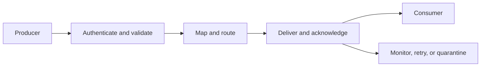

# 9. Integration Patterns, APIs, Middleware, and Events

## Learning objectives

After this topic, you should be able to:

- compare file, message, API, and event-based integration;
- explain the role of middleware;
- define idempotency, correlation, acknowledgement, and replay; and
- choose a pattern based on the business interaction.

## Concept in plain English

Integration connects applications and organizations so that a business interaction can continue across boundaries. A protocol moves data; a complete design also preserves meaning, identity, order, security, monitoring, and recovery.

## Pattern comparison

| Pattern | Strength | Typical use | Main control need |
|---|---|---|---|
| Managed file | simple bulk exchange | daily catalog or forecast | completeness and duplicate control |
| Business message | durable asynchronous transaction | order, invoice, shipment notice | acknowledgement and replay |
| Request-response API | immediate query or command | promise check or status request | timeout and safe retry |
| Published event | distribute state change to several consumers | departure, hold, release | ordering, subscription, and idempotency |

## Middleware responsibilities

Middleware may translate formats, route messages, orchestrate steps, enforce policy, manage certificates, throttle traffic, and provide observability. It should not become an unowned location for hidden business logic.

## Essential controls

- **Correlation identifier:** connects request, response, transaction, and event.
- **Idempotency:** a safe retry does not create duplicate business effect.
- **Acknowledgement:** distinguishes accepted transport from successful business processing.
- **Schema versioning:** allows controlled change in structure and meaning.
- **Replay:** reprocesses missed or failed information safely.
- **Quarantine:** separates invalid messages without losing evidence.
- **Observability:** exposes latency, failure, backlog, and ownership.

## AsterWorks example

A carrier times out after receiving a pickup request. AsterWorks retries, and the carrier creates two pickups because the request lacks an idempotency key. The technical interface worked twice; the business process failed.

The corrected design uses one booking identifier, safe retry, response correlation, and duplicate detection.

## Why it matters

The wrong integration pattern creates delay, duplication, brittle coupling, and ambiguous recovery when messages fail.

## Decision logic

Choose batch, synchronous API, asynchronous message, or event streaming according to decision latency, volume, coupling, replay, and failure behavior. Do not approve the decision until mandatory conditions are feasible and the residual exposure has a named owner.

## Evidence retained through the workflow

Retain interface contract, identifiers, schema version, timing, idempotency, acknowledgement, retry, monitoring, reconciliation, and owner. Record the decision date and the event or threshold that requires reassessment.

## Applied decision artifact

Use a one-page **integration patterns, apis, middleware, and events decision record** with these fields:

- **Decision and boundary:** Choose batch, synchronous API, asynchronous message, or event streaming according to decision latency, volume, coupling, replay, and failure behavior.
- **Required evidence:** interface contract, identifiers, schema version, timing, idempotency, acknowledgement, retry, monitoring, reconciliation, and owner.
- **Expected result:** The wrong integration pattern creates delay, duplication, brittle coupling, and ambiguous recovery when messages fail.
- **Balancing condition:** Synchronous integration gives immediate response but couples availability; asynchronous patterns improve resilience but require ordering and reconciliation controls.
- **Accountability:** name the decision owner, approval date, residual exposure owner, and measurable trigger for reassessment.

The record is complete only when another practitioner can reproduce the reasoning and identify the next action without relying on meeting memory.

## Trade-offs

Synchronous integration gives immediate response but couples availability; asynchronous patterns improve resilience but require ordering and reconciliation controls.

## Commonly confused with

Do not confuse a preferred decision method with a guaranteed outcome. Choose batch, synchronous API, asynchronous message, or event streaming according to decision latency, volume, coupling, replay, and failure behavior. Validate the result with interface contract, identifiers, schema version, timing, idempotency, acknowledgement, retry, monitoring, reconciliation, and owner; the evidence, not the method's label, determines whether the choice worked.

## Common mistakes

- Calling a successful network response a completed business transaction.
- Retrying non-idempotent commands blindly.
- Mapping data without governing its meaning.
- Embedding pricing or allocation rules in middleware with no process owner.
- Monitoring server availability but not message backlog or business failure.

## Original knowledge check

An API returns HTTP success, but the receiving application rejects the order because the unit of measure is invalid. Was the business transaction successful?

Answer and rationale

### Correct answer

**No.** Transport success and business acceptance are separate states and require separate acknowledgement.

### Why it is correct

The wrong integration pattern creates delay, duplication, brittle coupling, and ambiguous recovery when messages fail. Choose batch, synchronous API, asynchronous message, or event streaming according to decision latency, volume, coupling, replay, and failure behavior.

### Why the other answers are wrong

Alternative responses reproduce failure modes already discussed:

- Calling a successful network response a completed business transaction.
- Retrying non-idempotent commands blindly.
- Mapping data without governing its meaning.

They do not preserve the lesson's decision boundary or evidence. The governing trade-off remains explicit: Synchronous integration gives immediate response but couples availability; asynchronous patterns improve resilience but require ordering and reconciliation controls.

## Practitioner perspective

Use interface contract, identifiers, schema version, timing, idempotency, acknowledgement, retry, monitoring, reconciliation, and owner as the minimum review record. The artifact should let another practitioner reproduce the conclusion, identify the remaining exposure, and know which trigger reopens the decision.

## Related concepts

- [Section overview](./README.md)
- [Module 3 continuation](../../03-sourcing-strategy-product-design-supplier-execution/section-d-supplier-selection-contracting-and-procurement/01-purchasing-flow-and-selection-routes.md)
Continue to [digital commerce and order connectivity](10-digital-commerce-and-order-connectivity.md).

---

[Previous: Cloud, SaaS, and Deployment Choices](08-cloud-saas-and-deployment-choices.md) · [Next: Digital Commerce and Order Connectivity](10-digital-commerce-and-order-connectivity.md)
