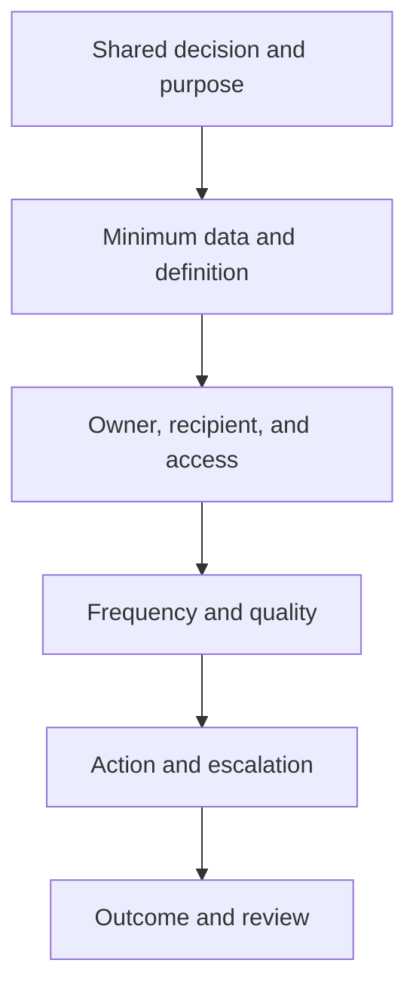

# 11. Partner Visibility and Data Sharing

## Learning objectives

After this topic, you should be able to:

- define visibility as decision-relevant shared information;
- distinguish strategic, planning, and execution information;
- specify reciprocity, purpose, quality, and access controls; and
- measure whether sharing improves outcomes.

## Concept in plain English

Partner visibility means that authorized participants can access sufficiently timely, accurate, and contextual information to coordinate a defined decision. It is not unrestricted access to every record.

## Information tiers

| Tier | Examples | Typical cadence |
|---|---|---|
| Strategic | capacity strategy, network change, risk scenario | quarterly or event-driven |
| Planning | forecast, capacity outlook, inventory policy | weekly or monthly |
| Execution | order, shipment, receipt, quality hold, exception | transaction or event-driven |

## Sharing agreement

Document:

- business purpose and permitted use;
- field definitions and identifiers;
- frequency, latency, and completeness;
- access, retention, deletion, and onward sharing;
- correction and dispute process;
- cybersecurity and incident obligations;
- service and decision ownership; and
- termination and data return.

## AsterWorks example

A critical supplier sends weekly capacity totals. AsterWorks cannot tell which product families consume the capacity or whether maintenance downtime is included. Rather than requesting the supplier’s entire schedule, both parties agree on a 16-week capacity-versus-committed-load view by shared resource family, with assumptions and confidence.

## Trust and verification

Trust grows when data are used consistently, corrections are transparent, and commercial behavior matches the agreement. Verification remains necessary. Reconcile critical shared facts, track missing events, and separate estimates from confirmed commitments.

## Measures

- data completeness and timeliness;
- forecast or commitment change frequency;
- exception response time;
- percentage of exceptions resolved before impact;
- dispute and correction rate; and
- service, inventory, and cost improvement attributable to the collaboration.

## Common mistakes

- Sharing data without a defined decision.
- Requesting unnecessary sensitive detail.
- Treating a forecast as a purchase commitment.
- Hiding corrections to preserve a quality score.
- Measuring interface volume instead of business outcomes.

## Original knowledge check

A supplier shares a forecast every day, but AsterWorks never changes capacity, inventory, or procurement decisions from it. Is the exchange creating demonstrated visibility value?

Answer

Not yet. Data availability alone is not value; the exchange must improve a decision or outcome.

## Related concepts

Continue to [inventory collaboration and replenishment](12-inventory-collaboration-and-replenishment.md).
