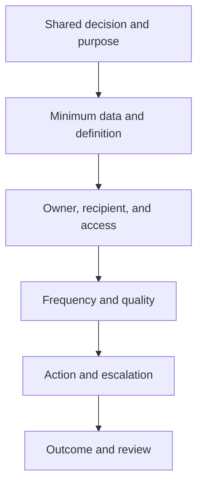

# 11. Partner Visibility and Data Sharing

## Learning objectives

After this topic, you should be able to:

- define visibility as decision-relevant shared information;
- distinguish strategic, planning, and execution information;
- specify reciprocity, purpose, quality, and access controls; and
- measure whether sharing improves outcomes.

## Concept in plain English

Partner visibility means that authorized participants can access sufficiently timely, accurate, and contextual information to coordinate a defined decision. It is not unrestricted access to every record.

## Information tiers

| Tier | Examples | Typical cadence |
|---|---|---|
| Strategic | capacity strategy, network change, risk scenario | quarterly or event-driven |
| Planning | forecast, capacity outlook, inventory policy | weekly or monthly |
| Execution | order, shipment, receipt, quality hold, exception | transaction or event-driven |

## Sharing agreement

Document:

- business purpose and permitted use;
- field definitions and identifiers;
- frequency, latency, and completeness;
- access, retention, deletion, and onward sharing;
- correction and dispute process;
- cybersecurity and incident obligations;
- service and decision ownership; and
- termination and data return.

## AsterWorks example

A critical supplier sends weekly capacity totals. AsterWorks cannot tell which product families consume the capacity or whether maintenance downtime is included. Rather than requesting the supplier’s entire schedule, both parties agree on a 16-week capacity-versus-committed-load view by shared resource family, with assumptions and confidence.

## Trust and verification

Trust grows when data are used consistently, corrections are transparent, and commercial behavior matches the agreement. Verification remains necessary. Reconcile critical shared facts, track missing events, and separate estimates from confirmed commitments.

## Measures

- data completeness and timeliness;
- forecast or commitment change frequency;
- exception response time;
- percentage of exceptions resolved before impact;
- dispute and correction rate; and
- service, inventory, and cost improvement attributable to the collaboration.

## Why it matters

Sharing data that does not change a joint decision creates cost and exposure without demonstrated operating value.

## Decision logic

Define the decision and minimum necessary information, agree semantics and timing, protect access, assign response, and measure avoided impact. Do not approve the decision until mandatory conditions are feasible and the residual exposure has a named owner.

## Evidence retained through the workflow

Retain shared decision, fields and aggregation, permitted purpose, timing, quality, access, retention, response obligation, and value measure. Record the decision date and the event or threshold that requires reassessment.

## Applied decision artifact

Use a one-page **partner visibility and data sharing decision record** with these fields:

- **Decision and boundary:** Define the decision and minimum necessary information, agree semantics and timing, protect access, assign response, and measure avoided impact.
- **Required evidence:** shared decision, fields and aggregation, permitted purpose, timing, quality, access, retention, response obligation, and value measure.
- **Expected result:** Sharing data that does not change a joint decision creates cost and exposure without demonstrated operating value.
- **Balancing condition:** Greater transparency can improve coordination but increases confidentiality, misuse, quality, and dependency exposure.
- **Accountability:** name the decision owner, approval date, residual exposure owner, and measurable trigger for reassessment.

The record is complete only when another practitioner can reproduce the reasoning and identify the next action without relying on meeting memory.

## Trade-offs

Greater transparency can improve coordination but increases confidentiality, misuse, quality, and dependency exposure.

## Commonly confused with

Do not confuse a preferred decision method with a guaranteed outcome. Define the decision and minimum necessary information, agree semantics and timing, protect access, assign response, and measure avoided impact. Validate the result with shared decision, fields and aggregation, permitted purpose, timing, quality, access, retention, response obligation, and value measure; the evidence, not the method's label, determines whether the choice worked.

## Common mistakes

- Sharing data without a defined decision.
- Requesting unnecessary sensitive detail.
- Treating a forecast as a purchase commitment.
- Hiding corrections to preserve a quality score.
- Measuring interface volume instead of business outcomes.

## Original knowledge check

A supplier shares a forecast every day, but AsterWorks never changes capacity, inventory, or procurement decisions from it. Is the exchange creating demonstrated visibility value?

Answer and rationale

### Correct answer

Not yet. Data availability alone is not value; the exchange must improve a decision or outcome.

### Why it is correct

Sharing data that does not change a joint decision creates cost and exposure without demonstrated operating value. Define the decision and minimum necessary information, agree semantics and timing, protect access, assign response, and measure avoided impact.

### Why the other answers are wrong

Alternative responses reproduce failure modes already discussed:

- Sharing data without a defined decision.
- Requesting unnecessary sensitive detail.
- Treating a forecast as a purchase commitment.

They do not preserve the lesson's decision boundary or evidence. The governing trade-off remains explicit: Greater transparency can improve coordination but increases confidentiality, misuse, quality, and dependency exposure.

## Practitioner perspective

Use shared decision, fields and aggregation, permitted purpose, timing, quality, access, retention, response obligation, and value measure as the minimum review record. The artifact should let another practitioner reproduce the conclusion, identify the remaining exposure, and know which trigger reopens the decision.

## Related concepts

- [Section overview](./README.md)
- [Module 3 continuation](../../03-sourcing-strategy-product-design-supplier-execution/section-d-supplier-selection-contracting-and-procurement/01-purchasing-flow-and-selection-routes.md)
Continue to [inventory collaboration and replenishment](12-inventory-collaboration-and-replenishment.md).

---

[Previous: Digital Commerce and Order Connectivity](10-digital-commerce-and-order-connectivity.md) · [Next: Inventory Collaboration and Replenishment](12-inventory-collaboration-and-replenishment.md)
