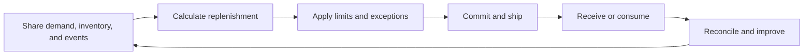

# 12. Inventory Collaboration and Replenishment

## Learning objectives

After this topic, you should be able to:

- distinguish information collaboration from inventory ownership;
- compare buyer-managed, supplier-managed, and consigned arrangements;
- define replenishment boundaries and exception rules; and
- select measures that avoid local optimization.

## Concept in plain English

Collaborative replenishment assigns information, planning, execution, ownership, and financial responsibilities across trading partners. These responsibilities can be combined in different ways.

## Arrangement comparison

| Arrangement | Replenishment decision | Inventory ownership before consumption | Essential control |
|---|---|---|---|
| Buyer-managed | buyer | buyer | accurate usage and parameter maintenance |
| Supplier-managed | supplier within agreed rules | often buyer | visibility, limits, and service accountability |
| Consigned | buyer or supplier | supplier | consumption event and reconciliation |
| Joint planning | jointly agreed plan | contract-specific | one assumptions log and escalation process |

Supplier-managed does not automatically mean consigned. Replenishment authority and financial ownership are separate dimensions.

## Closed-loop process

## Required agreement

- item and location scope;
- target, minimum, maximum, and review period;
- usable inventory and in-transit definitions;
- forecast versus commitment status;
- order, shipment, receipt, and consumption triggers;
- ownership, title transfer, and payment event;
- excess, obsolete, damaged, and return responsibility;
- exception thresholds and approvals; and
- termination and inventory disposition.

## AsterWorks example

A sensor supplier manages replenishment to AsterWorks’ plant. The first design uses total on-hand inventory, including quality-hold stock, and repeatedly under-replenishes. The agreement is corrected to use unrestricted stock plus qualified in-transit supply, with a separate quality exception.

## Measures

Track the shared outcome:

- service or material availability;
- total inventory across both parties;
- expedite and premium freight;
- aging and obsolescence;
- schedule stability;
- forecast and parameter quality;
- reconciliation differences; and
- exception closure.

## Why it matters

Replenishment authority, inventory ownership, payment timing, and service accountability are separate choices that must be designed explicitly.

## Decision logic

Select buyer-managed, supplier-managed, consigned, or collaborative rules using demand, visibility, lead time, economics, trust, and exception capability. Do not approve the decision until mandatory conditions are feasible and the residual exposure has a named owner.

## Evidence retained through the workflow

Retain inventory definition and status, ownership transfer, min-max or forecast rule, lead time, service target, payment event, exceptions, and reconciliation. Record the decision date and the event or threshold that requires reassessment.

## Applied decision artifact

Use a one-page **inventory collaboration and replenishment decision record** with these fields:

- **Decision and boundary:** Select buyer-managed, supplier-managed, consigned, or collaborative rules using demand, visibility, lead time, economics, trust, and exception capability.
- **Required evidence:** inventory definition and status, ownership transfer, min-max or forecast rule, lead time, service target, payment event, exceptions, and reconciliation.
- **Expected result:** Replenishment authority, inventory ownership, payment timing, and service accountability are separate choices that must be designed explicitly.
- **Balancing condition:** Supplier management can reduce buyer workload and shortages but may increase dependence, gaming risk, or inventory if incentives are misaligned.
- **Accountability:** name the decision owner, approval date, residual exposure owner, and measurable trigger for reassessment.

The record is complete only when another practitioner can reproduce the reasoning and identify the next action without relying on meeting memory.

## Trade-offs

Supplier management can reduce buyer workload and shortages but may increase dependence, gaming risk, or inventory if incentives are misaligned.

## Commonly confused with

Do not confuse a preferred decision method with a guaranteed outcome. Select buyer-managed, supplier-managed, consigned, or collaborative rules using demand, visibility, lead time, economics, trust, and exception capability. Validate the result with inventory definition and status, ownership transfer, min-max or forecast rule, lead time, service target, payment event, exceptions, and reconciliation; the evidence, not the method's label, determines whether the choice worked.

## Common mistakes

- Confusing supplier-managed and consigned inventory.
- Optimizing inventory at one party while total network inventory rises.
- Excluding blocked, returned, or in-transit status from the definition.
- Allowing automatic replenishment outside agreed boundaries.
- Ignoring ownership when material is damaged or obsolete.

## Original knowledge check

A supplier decides replenishment quantity, but the buyer takes ownership at receipt. Is the inventory necessarily consigned?

Answer and rationale

### Correct answer

**No.** Supplier-managed replenishment describes decision authority; consignment describes inventory ownership and payment timing.

### Why it is correct

Replenishment authority, inventory ownership, payment timing, and service accountability are separate choices that must be designed explicitly. Select buyer-managed, supplier-managed, consigned, or collaborative rules using demand, visibility, lead time, economics, trust, and exception capability.

### Why the other answers are wrong

Alternative responses reproduce failure modes already discussed:

- Confusing supplier-managed and consigned inventory.
- Optimizing inventory at one party while total network inventory rises.
- Excluding blocked, returned, or in-transit status from the definition.

They do not preserve the lesson's decision boundary or evidence. The governing trade-off remains explicit: Supplier management can reduce buyer workload and shortages but may increase dependence, gaming risk, or inventory if incentives are misaligned.

## Practitioner perspective

Use inventory definition and status, ownership transfer, min-max or forecast rule, lead time, service target, payment event, exceptions, and reconciliation as the minimum review record. The artifact should let another practitioner reproduce the conclusion, identify the remaining exposure, and know which trigger reopens the decision.

## Related concepts

- [Section overview](./README.md)
- [Module 3 continuation](../../03-sourcing-strategy-product-design-supplier-execution/section-d-supplier-selection-contracting-and-procurement/01-purchasing-flow-and-selection-routes.md)
Continue to [legal, privacy, and contract controls](13-legal-privacy-and-contract-controls.md).

---

[Previous: Partner Visibility and Data Sharing](11-partner-visibility-and-data-sharing.md) · [Next: Legal, Privacy, and Contract Controls](13-legal-privacy-and-contract-controls.md)
