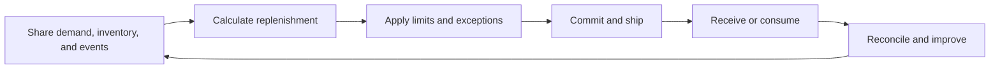

# 12. Inventory Collaboration and Replenishment

## Learning objectives

After this topic, you should be able to:

- distinguish information collaboration from inventory ownership;
- compare buyer-managed, supplier-managed, and consigned arrangements;
- define replenishment boundaries and exception rules; and
- select measures that avoid local optimization.

## Concept in plain English

Collaborative replenishment assigns information, planning, execution, ownership, and financial responsibilities across trading partners. These responsibilities can be combined in different ways.

## Arrangement comparison

| Arrangement | Replenishment decision | Inventory ownership before consumption | Essential control |
|---|---|---|---|
| Buyer-managed | buyer | buyer | accurate usage and parameter maintenance |
| Supplier-managed | supplier within agreed rules | often buyer | visibility, limits, and service accountability |
| Consigned | buyer or supplier | supplier | consumption event and reconciliation |
| Joint planning | jointly agreed plan | contract-specific | one assumptions log and escalation process |

Supplier-managed does not automatically mean consigned. Replenishment authority and financial ownership are separate dimensions.

## Closed-loop process

## Required agreement

- item and location scope;
- target, minimum, maximum, and review period;
- usable inventory and in-transit definitions;
- forecast versus commitment status;
- order, shipment, receipt, and consumption triggers;
- ownership, title transfer, and payment event;
- excess, obsolete, damaged, and return responsibility;
- exception thresholds and approvals; and
- termination and inventory disposition.

## AsterWorks example

A sensor supplier manages replenishment to AsterWorks’ plant. The first design uses total on-hand inventory, including quality-hold stock, and repeatedly under-replenishes. The agreement is corrected to use unrestricted stock plus qualified in-transit supply, with a separate quality exception.

## Measures

Track the shared outcome:

- service or material availability;
- total inventory across both parties;
- expedite and premium freight;
- aging and obsolescence;
- schedule stability;
- forecast and parameter quality;
- reconciliation differences; and
- exception closure.

## Common mistakes

- Confusing supplier-managed and consigned inventory.
- Optimizing inventory at one party while total network inventory rises.
- Excluding blocked, returned, or in-transit status from the definition.
- Allowing automatic replenishment outside agreed boundaries.
- Ignoring ownership when material is damaged or obsolete.

## Original knowledge check

A supplier decides replenishment quantity, but the buyer takes ownership at receipt. Is the inventory necessarily consigned?

Answer

**No.** Supplier-managed replenishment describes decision authority; consignment describes inventory ownership and payment timing.

## Related concepts

Continue to [legal, privacy, and contract controls](13-legal-privacy-and-contract-controls.md).
