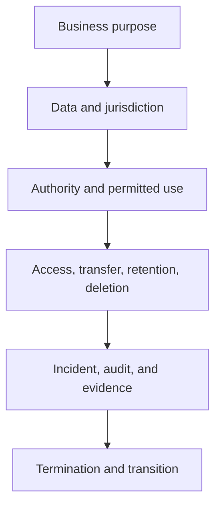

# 13. Legal, Privacy, and Contract Controls

## Learning objectives

After this topic, you should be able to:

- identify common legal and contractual questions in information sharing;
- apply purpose limitation and data minimization;
- distinguish business, legal, privacy, and security responsibilities; and
- include exit, incident, and evidence provisions in partner agreements.

## Concept in plain English

Cross-company data sharing changes rights, obligations, and exposure. The operating design must state what data are exchanged, why, where, for how long, by whom, and what happens when the relationship or service fails.

This topic provides operating-design guidance, not legal advice. Applicable requirements vary by jurisdiction, industry, data type, and contract; qualified counsel should review material arrangements.

## Control questions

## Contract areas

| Area | Questions to resolve |
|---|---|
| Purpose and scope | What decision or service permits the exchange? |
| Data rights | Who owns source data, corrections, enrichment, and derived output? |
| Confidentiality | Which information is restricted and who may receive it? |
| Privacy | Is personal data necessary, lawful, minimized, and protected? |
| Service | What availability, latency, completeness, and support are required? |
| Security | Which controls, notification periods, and evidence are required? |
| Liability | How are loss, error, infringement, and interruption allocated? |
| Audit | What records and assurance may be reviewed? |
| Exit | How are data returned, deleted, migrated, and certified? |

## Privacy-by-design practices

- collect the minimum data needed for the defined purpose;
- separate business identifiers from personal identifiers where possible;
- restrict access by role and context;
- define retention and deletion before collection;
- control onward sharing and cross-border transfer;
- preserve correction, consent, or request workflows where applicable; and
- test that reports and non-production environments do not expose unnecessary data.

## AsterWorks example

AsterWorks initially plans to send full customer-contact records to a carrier. The actual delivery decision requires destination, delivery window, access instruction, and one contact channel. The design removes unrelated commercial history and limits retention after proof of delivery.

## Why it matters

Connected networks can create obligations and exposure across jurisdictions, data subjects, intellectual property, records, and partner actions.

## Decision logic

Map data and process flows, classify obligations, minimize collection, assign permitted use and accountability, and retain control evidence. Do not approve the decision until mandatory conditions are feasible and the residual exposure has a named owner.

## Evidence retained through the workflow

Retain data-flow map, legal basis and purpose, roles, contract terms, access, retention, location, incident duty, audit rights, and deletion evidence. Record the decision date and the event or threshold that requires reassessment.

## Applied decision artifact

Use a one-page **legal, privacy, and contract controls decision record** with these fields:

- **Decision and boundary:** Map data and process flows, classify obligations, minimize collection, assign permitted use and accountability, and retain control evidence.
- **Required evidence:** data-flow map, legal basis and purpose, roles, contract terms, access, retention, location, incident duty, audit rights, and deletion evidence.
- **Expected result:** Connected networks can create obligations and exposure across jurisdictions, data subjects, intellectual property, records, and partner actions.
- **Balancing condition:** Broader data use may improve planning and analytics but increases privacy, contractual, retention, localization, and breach exposure.
- **Accountability:** name the decision owner, approval date, residual exposure owner, and measurable trigger for reassessment.

The record is complete only when another practitioner can reproduce the reasoning and identify the next action without relying on meeting memory.

## Trade-offs

Broader data use may improve planning and analytics but increases privacy, contractual, retention, localization, and breach exposure.

## Commonly confused with

Do not confuse a preferred decision method with a guaranteed outcome. Map data and process flows, classify obligations, minimize collection, assign permitted use and accountability, and retain control evidence. Validate the result with data-flow map, legal basis and purpose, roles, contract terms, access, retention, location, incident duty, audit rights, and deletion evidence; the evidence, not the method's label, determines whether the choice worked.

## Common mistakes

- Adding legal review after architecture is complete.
- Sharing all available fields because the interface can carry them.
- Assuming the provider owns every derived analytic output.
- Omitting subcontractors and onward sharing.
- Defining deletion without evidence or backup treatment.
- Forgetting transition assistance and usable export formats.

## Original knowledge check

A partner requests ten years of detailed customer data for a six-month routing pilot. What should AsterWorks challenge first?

Answer and rationale

### Correct answer

Necessity and proportionality. The purpose may require a smaller field set, shorter history, aggregation, or de-identification.

### Why it is correct

Connected networks can create obligations and exposure across jurisdictions, data subjects, intellectual property, records, and partner actions. Map data and process flows, classify obligations, minimize collection, assign permitted use and accountability, and retain control evidence.

### Why the other answers are wrong

Alternative responses reproduce failure modes already discussed:

- Adding legal review after architecture is complete.
- Sharing all available fields because the interface can carry them.
- Assuming the provider owns every derived analytic output.

They do not preserve the lesson's decision boundary or evidence. The governing trade-off remains explicit: Broader data use may improve planning and analytics but increases privacy, contractual, retention, localization, and breach exposure.

## Practitioner perspective

Use data-flow map, legal basis and purpose, roles, contract terms, access, retention, location, incident duty, audit rights, and deletion evidence as the minimum review record. The artifact should let another practitioner reproduce the conclusion, identify the remaining exposure, and know which trigger reopens the decision.

## Related concepts

- [Section overview](./README.md)
- [Module 3 continuation](../../03-sourcing-strategy-product-design-supplier-execution/section-d-supplier-selection-contracting-and-procurement/01-purchasing-flow-and-selection-routes.md)
Continue to [cybersecurity and third-party risk](14-cybersecurity-and-third-party-risk.md).

---

[Previous: Inventory Collaboration and Replenishment](12-inventory-collaboration-and-replenishment.md) · [Next: Cybersecurity and Third-Party Risk](14-cybersecurity-and-third-party-risk.md)
