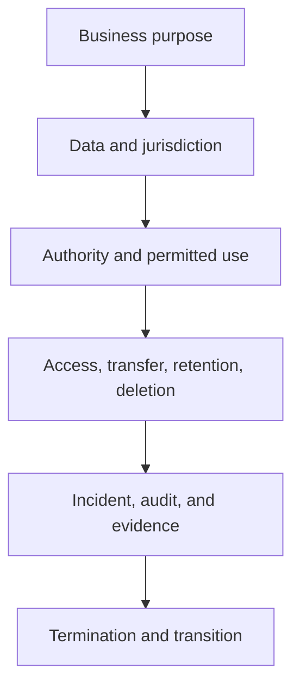

# 13. Legal, Privacy, and Contract Controls

## Learning objectives

After this topic, you should be able to:

- identify common legal and contractual questions in information sharing;
- apply purpose limitation and data minimization;
- distinguish business, legal, privacy, and security responsibilities; and
- include exit, incident, and evidence provisions in partner agreements.

## Concept in plain English

Cross-company data sharing changes rights, obligations, and exposure. The operating design must state what data are exchanged, why, where, for how long, by whom, and what happens when the relationship or service fails.

This topic provides operating-design guidance, not legal advice. Applicable requirements vary by jurisdiction, industry, data type, and contract; qualified counsel should review material arrangements.

## Control questions

## Contract areas

| Area | Questions to resolve |
|---|---|
| Purpose and scope | What decision or service permits the exchange? |
| Data rights | Who owns source data, corrections, enrichment, and derived output? |
| Confidentiality | Which information is restricted and who may receive it? |
| Privacy | Is personal data necessary, lawful, minimized, and protected? |
| Service | What availability, latency, completeness, and support are required? |
| Security | Which controls, notification periods, and evidence are required? |
| Liability | How are loss, error, infringement, and interruption allocated? |
| Audit | What records and assurance may be reviewed? |
| Exit | How are data returned, deleted, migrated, and certified? |

## Privacy-by-design practices

- collect the minimum data needed for the defined purpose;
- separate business identifiers from personal identifiers where possible;
- restrict access by role and context;
- define retention and deletion before collection;
- control onward sharing and cross-border transfer;
- preserve correction, consent, or request workflows where applicable; and
- test that reports and non-production environments do not expose unnecessary data.

## AsterWorks example

AsterWorks initially plans to send full customer-contact records to a carrier. The actual delivery decision requires destination, delivery window, access instruction, and one contact channel. The design removes unrelated commercial history and limits retention after proof of delivery.

## Common mistakes

- Adding legal review after architecture is complete.
- Sharing all available fields because the interface can carry them.
- Assuming the provider owns every derived analytic output.
- Omitting subcontractors and onward sharing.
- Defining deletion without evidence or backup treatment.
- Forgetting transition assistance and usable export formats.

## Original knowledge check

A partner requests ten years of detailed customer data for a six-month routing pilot. What should AsterWorks challenge first?

Answer

Necessity and proportionality. The purpose may require a smaller field set, shorter history, aggregation, or de-identification.

## Related concepts

Continue to [cybersecurity and third-party risk](14-cybersecurity-and-third-party-risk.md).
