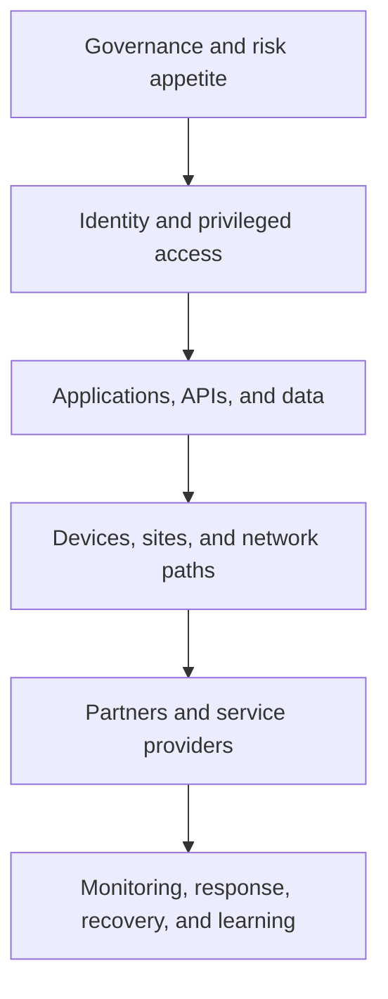

# 14. Cybersecurity and Third-Party Risk

## Learning objectives

After this topic, you should be able to:

- apply risk governance across supply-network technology;
- identify identity, interface, data, device, availability, and partner exposures;
- design prevention, detection, response, and recovery together; and
- connect cybersecurity controls to operational continuity.

## Concept in plain English

Supply-network cybersecurity protects the confidentiality, integrity, and availability of the information and technology used to plan and execute operations. Because the process crosses organizations and devices, a weakness at a partner can become an operational disruption.

The [NIST Cybersecurity Framework 2.0](https://doi.org/10.6028/NIST.CSWP.29) organizes cybersecurity outcomes around six functions: Govern, Identify, Protect, Detect, Respond, and Recover. These functions can be translated into supply-network operating questions.

## Supply-network control model

| Function | Operating question |
|---|---|
| Govern | Who owns cyber risk, policy, supplier requirements, and exceptions? |
| Identify | Which applications, interfaces, identities, devices, data, and dependencies are critical? |
| Protect | How are access, configuration, encryption, segmentation, and training controlled? |
| Detect | How are abnormal access, message behavior, device state, and data changes recognized? |
| Respond | Who contains the event and preserves business continuity and evidence? |
| Recover | How are services, data, interfaces, and physical operations restored and reconciled? |

## Layered view

Identity-centered verification, least privilege, and continuous evaluation are consistent with [NIST's Zero Trust Architecture](https://doi.org/10.6028/NIST.SP.800-207).

## Third-party controls

- risk-tier suppliers and services by business impact;
- review control evidence proportionate to exposure;
- define access boundaries, named accounts, and credential rotation;
- restrict partner connections to required services and data;
- monitor interfaces, anomalous behavior, and administrative actions;
- require incident notification and joint-response contacts;
- test backup communication and manual operation; and
- revoke access and verify data disposition at exit.

## AsterWorks example

A logistics provider account can download shipment data for all regions even though it serves one country. AsterWorks changes access to region-scoped service identities, separates human and system credentials, limits export volume, and alerts on unusual queries.

## Why it matters

A connected partner or application can become an operational interruption, data-loss, fraud, safety, or recovery pathway.

## Decision logic

Classify critical services and data, assess controls, limit access, monitor activity, test recovery, manage vulnerabilities, and preserve an exit route. Do not approve the decision until mandatory conditions are feasible and the residual exposure has a named owner.

## Evidence retained through the workflow

Retain asset and dependency inventory, access model, security evidence, monitoring, incident duties, recovery test, residual risk, and exception approval. Record the decision date and the event or threshold that requires reassessment.

## Applied decision artifact

Use a one-page **cybersecurity and third-party risk decision record** with these fields:

- **Decision and boundary:** Classify critical services and data, assess controls, limit access, monitor activity, test recovery, manage vulnerabilities, and preserve an exit route.
- **Required evidence:** asset and dependency inventory, access model, security evidence, monitoring, incident duties, recovery test, residual risk, and exception approval.
- **Expected result:** A connected partner or application can become an operational interruption, data-loss, fraud, safety, or recovery pathway.
- **Balancing condition:** Stronger controls reduce exposure but can slow onboarding, increase operating effort, and constrain information sharing.
- **Accountability:** name the decision owner, approval date, residual exposure owner, and measurable trigger for reassessment.

The record is complete only when another practitioner can reproduce the reasoning and identify the next action without relying on meeting memory.

## Trade-offs

Stronger controls reduce exposure but can slow onboarding, increase operating effort, and constrain information sharing.

## Commonly confused with

Do not confuse a preferred decision method with a guaranteed outcome. Classify critical services and data, assess controls, limit access, monitor activity, test recovery, manage vulnerabilities, and preserve an exit route. Validate the result with asset and dependency inventory, access model, security evidence, monitoring, incident duties, recovery test, residual risk, and exception approval; the evidence, not the method's label, determines whether the choice worked.

## Common mistakes

- Treating a questionnaire as continuous third-party risk management.
- Sharing administrator credentials.
- Protecting applications while ignoring integration credentials and devices.
- Restoring servers without reconciling missed business transactions.
- Keeping dormant partner access after contract termination.

## Original knowledge check

Why is restoring an interface endpoint insufficient after a cyber incident?

Answer and rationale

### Correct answer

Messages may be missing, duplicated, altered, or processed out of sequence. Business state and downstream effects must be reconciled before recovery is complete.

### Why it is correct

A connected partner or application can become an operational interruption, data-loss, fraud, safety, or recovery pathway. Classify critical services and data, assess controls, limit access, monitor activity, test recovery, manage vulnerabilities, and preserve an exit route.

### Why the other answers are wrong

Alternative responses reproduce failure modes already discussed:

- Treating a questionnaire as continuous third-party risk management.
- Sharing administrator credentials.
- Protecting applications while ignoring integration credentials and devices.

They do not preserve the lesson's decision boundary or evidence. The governing trade-off remains explicit: Stronger controls reduce exposure but can slow onboarding, increase operating effort, and constrain information sharing.

## Practitioner perspective

Use asset and dependency inventory, access model, security evidence, monitoring, incident duties, recovery test, residual risk, and exception approval as the minimum review record. The artifact should let another practitioner reproduce the conclusion, identify the remaining exposure, and know which trigger reopens the decision.

## Related concepts

- [Section overview](./README.md)
- [Module 3 continuation](../../03-sourcing-strategy-product-design-supplier-execution/section-d-supplier-selection-contracting-and-procurement/01-purchasing-flow-and-selection-routes.md)
Continue to [master-data domains and lifecycle](15-master-data-domains-and-lifecycle.md).

---

[Previous: Legal, Privacy, and Contract Controls](13-legal-privacy-and-contract-controls.md) · [Next: Master-Data Domains and Lifecycle](15-master-data-domains-and-lifecycle.md)
