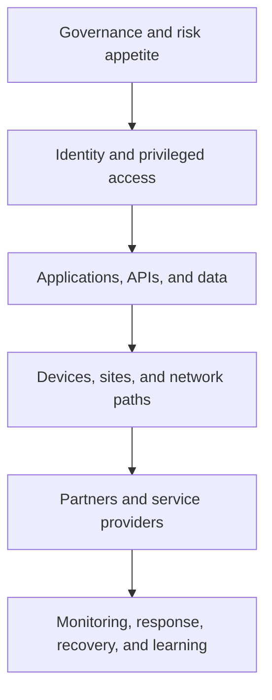

# 14. Cybersecurity and Third-Party Risk

## Learning objectives

After this topic, you should be able to:

- apply risk governance across supply-network technology;
- identify identity, interface, data, device, availability, and partner exposures;
- design prevention, detection, response, and recovery together; and
- connect cybersecurity controls to operational continuity.

## Concept in plain English

Supply-network cybersecurity protects the confidentiality, integrity, and availability of the information and technology used to plan and execute operations. Because the process crosses organizations and devices, a weakness at a partner can become an operational disruption.

The [NIST Cybersecurity Framework 2.0](https://doi.org/10.6028/NIST.CSWP.29) organizes cybersecurity outcomes around six functions: Govern, Identify, Protect, Detect, Respond, and Recover. These functions can be translated into supply-network operating questions.

## Supply-network control model

| Function | Operating question |
|---|---|
| Govern | Who owns cyber risk, policy, supplier requirements, and exceptions? |
| Identify | Which applications, interfaces, identities, devices, data, and dependencies are critical? |
| Protect | How are access, configuration, encryption, segmentation, and training controlled? |
| Detect | How are abnormal access, message behavior, device state, and data changes recognized? |
| Respond | Who contains the event and preserves business continuity and evidence? |
| Recover | How are services, data, interfaces, and physical operations restored and reconciled? |

## Layered view

Identity-centered verification, least privilege, and continuous evaluation are consistent with [NIST's Zero Trust Architecture](https://doi.org/10.6028/NIST.SP.800-207).

## Third-party controls

- risk-tier suppliers and services by business impact;
- review control evidence proportionate to exposure;
- define access boundaries, named accounts, and credential rotation;
- restrict partner connections to required services and data;
- monitor interfaces, anomalous behavior, and administrative actions;
- require incident notification and joint-response contacts;
- test backup communication and manual operation; and
- revoke access and verify data disposition at exit.

## AsterWorks example

A logistics provider account can download shipment data for all regions even though it serves one country. AsterWorks changes access to region-scoped service identities, separates human and system credentials, limits export volume, and alerts on unusual queries.

## Common mistakes

- Treating a questionnaire as continuous third-party risk management.
- Sharing administrator credentials.
- Protecting applications while ignoring integration credentials and devices.
- Restoring servers without reconciling missed business transactions.
- Keeping dormant partner access after contract termination.

## Original knowledge check

Why is restoring an interface endpoint insufficient after a cyber incident?

Answer

Messages may be missing, duplicated, altered, or processed out of sequence. Business state and downstream effects must be reconciled before recovery is complete.

## Related concepts

Continue to [master-data domains and lifecycle](15-master-data-domains-and-lifecycle.md).
