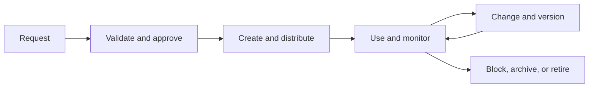

# 15. Master-Data Domains and Lifecycle

## Learning objectives

After this topic, you should be able to:

- distinguish master, reference, transaction, event, and planning data;
- identify important supply-network master-data domains;
- design create, change, use, review, and retire controls; and
- assign business ownership and stewardship.

## Concept in plain English

Master data describes the relatively stable business objects that transactions and decisions refer to. Examples include items, customers, suppliers, locations, resources, lanes, and equipment.

Master data are not “IT data.” Business roles define meaning, approve use, and accept operational consequences; technology enforces workflow, distribution, and evidence.

## Supply-network domains

| Domain | Decision examples |
|---|---|
| Item and product | planning, configuration, handling, traceability |
| Customer and location | promise, price, tax, delivery, service segment |
| Supplier | source, capacity, risk, payment, qualification |
| Resource | capacity, calendar, capability, cost |
| Warehouse | location, stock status, putaway, picking |
| Transportation | lane, mode, carrier, equipment, rate, milestone |
| Finance | company, account, cost center, currency, payment term |
| Reference | unit, code, country, calendar, reason, status |

## Lifecycle

## Ownership roles

- **Data owner:** accountable for definition, policy, and acceptable quality.
- **Data steward:** monitors quality, resolves issues, and coordinates lifecycle work.
- **Data creator or maintainer:** enters authorized changes with evidence.
- **Application owner:** ensures technical controls and distribution work.
- **Data consumer:** uses the data and reports defects with context.

## AsterWorks example

AsterWorks adds a regional configuration site. If the location record lacks calendar, time zone, capabilities, shipping point, currency, and permitted product families, planning and execution will disagree. The location owner approves one readiness checklist before activation.

## Effective dating

Some attributes change at a future time. Overwriting today’s value can corrupt current execution or historical analysis. Use effective dates or versions for calendars, rates, lead times, product status, and organizational assignments where timing matters.

## Why it matters

Invalid item, customer, supplier, location, resource, or lane records propagate errors across planning, execution, compliance, and finance.

## Decision logic

Define each domain's owner, required attributes, creation and approval, effective dating, distribution, change control, monitoring, and retirement. Do not approve the decision until mandatory conditions are feasible and the residual exposure has a named owner.

## Evidence retained through the workflow

Retain domain definition, required attributes, owner and steward, workflow, effective dates, downstream consumers, quality rules, and retirement evidence. Record the decision date and the event or threshold that requires reassessment.

## Applied decision artifact

Use a one-page **master-data domains and lifecycle decision record** with these fields:

- **Decision and boundary:** Define each domain's owner, required attributes, creation and approval, effective dating, distribution, change control, monitoring, and retirement.
- **Required evidence:** domain definition, required attributes, owner and steward, workflow, effective dates, downstream consumers, quality rules, and retirement evidence.
- **Expected result:** Invalid item, customer, supplier, location, resource, or lane records propagate errors across planning, execution, compliance, and finance.
- **Balancing condition:** Central control improves consistency, while domain stewardship keeps decisions close to business knowledge and requires coordinated governance.
- **Accountability:** name the decision owner, approval date, residual exposure owner, and measurable trigger for reassessment.

The record is complete only when another practitioner can reproduce the reasoning and identify the next action without relying on meeting memory.

## Trade-offs

Central control improves consistency, while domain stewardship keeps decisions close to business knowledge and requires coordinated governance.

## Commonly confused with

Do not confuse a preferred decision method with a guaranteed outcome. Define each domain's owner, required attributes, creation and approval, effective dating, distribution, change control, monitoring, and retirement. Validate the result with domain definition, required attributes, owner and steward, workflow, effective dates, downstream consumers, quality rules, and retirement evidence; the evidence, not the method's label, determines whether the choice worked.

## Common mistakes

- Allowing duplicate creation because search is difficult.
- Using free text for controlled business classifications.
- Changing data without impact analysis or effective date.
- Measuring field completion rather than decision fitness.
- Keeping obsolete records active indefinitely.

## Original knowledge check

A transportation lead time changes next month. Why can immediate overwrite be harmful?

Answer and rationale

### Correct answer

Current orders and future planning may require different values. An effective-dated change preserves the intended timing and historical meaning.

### Why it is correct

Invalid item, customer, supplier, location, resource, or lane records propagate errors across planning, execution, compliance, and finance. Define each domain's owner, required attributes, creation and approval, effective dating, distribution, change control, monitoring, and retirement.

### Why the other answers are wrong

Alternative responses reproduce failure modes already discussed:

- Allowing duplicate creation because search is difficult.
- Using free text for controlled business classifications.
- Changing data without impact analysis or effective date.

They do not preserve the lesson's decision boundary or evidence. The governing trade-off remains explicit: Central control improves consistency, while domain stewardship keeps decisions close to business knowledge and requires coordinated governance.

## Practitioner perspective

Use domain definition, required attributes, owner and steward, workflow, effective dates, downstream consumers, quality rules, and retirement evidence as the minimum review record. The artifact should let another practitioner reproduce the conclusion, identify the remaining exposure, and know which trigger reopens the decision.

## Related concepts

- [Section overview](./README.md)
- [Module 3 continuation](../../03-sourcing-strategy-product-design-supplier-execution/section-d-supplier-selection-contracting-and-procurement/01-purchasing-flow-and-selection-routes.md)
Continue to [automatic identification and traceability](16-automatic-identification-and-traceability.md).

---

[Previous: Cybersecurity and Third-Party Risk](14-cybersecurity-and-third-party-risk.md) · [Next: Automatic Identification and Traceability](16-automatic-identification-and-traceability.md)
