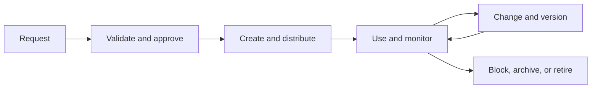

# 15. Master-Data Domains and Lifecycle

## Learning objectives

After this topic, you should be able to:

- distinguish master, reference, transaction, event, and planning data;
- identify important supply-network master-data domains;
- design create, change, use, review, and retire controls; and
- assign business ownership and stewardship.

## Concept in plain English

Master data describes the relatively stable business objects that transactions and decisions refer to. Examples include items, customers, suppliers, locations, resources, lanes, and equipment.

Master data are not “IT data.” Business roles define meaning, approve use, and accept operational consequences; technology enforces workflow, distribution, and evidence.

## Supply-network domains

| Domain | Decision examples |
|---|---|
| Item and product | planning, configuration, handling, traceability |
| Customer and location | promise, price, tax, delivery, service segment |
| Supplier | source, capacity, risk, payment, qualification |
| Resource | capacity, calendar, capability, cost |
| Warehouse | location, stock status, putaway, picking |
| Transportation | lane, mode, carrier, equipment, rate, milestone |
| Finance | company, account, cost center, currency, payment term |
| Reference | unit, code, country, calendar, reason, status |

## Lifecycle

## Ownership roles

- **Data owner:** accountable for definition, policy, and acceptable quality.
- **Data steward:** monitors quality, resolves issues, and coordinates lifecycle work.
- **Data creator or maintainer:** enters authorized changes with evidence.
- **Application owner:** ensures technical controls and distribution work.
- **Data consumer:** uses the data and reports defects with context.

## AsterWorks example

AsterWorks adds a regional configuration site. If the location record lacks calendar, time zone, capabilities, shipping point, currency, and permitted product families, planning and execution will disagree. The location owner approves one readiness checklist before activation.

## Effective dating

Some attributes change at a future time. Overwriting today’s value can corrupt current execution or historical analysis. Use effective dates or versions for calendars, rates, lead times, product status, and organizational assignments where timing matters.

## Common mistakes

- Allowing duplicate creation because search is difficult.
- Using free text for controlled business classifications.
- Changing data without impact analysis or effective date.
- Measuring field completion rather than decision fitness.
- Keeping obsolete records active indefinitely.

## Original knowledge check

A transportation lead time changes next month. Why can immediate overwrite be harmful?

Answer

Current orders and future planning may require different values. An effective-dated change preserves the intended timing and historical meaning.

## Related concepts

Continue to [automatic identification and traceability](16-automatic-identification-and-traceability.md).
