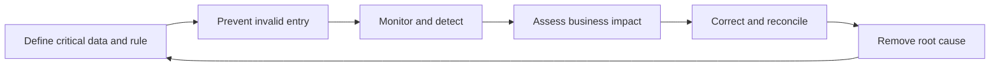

# 17. Data Quality, Cleansing, and Stewardship

## Learning objectives

After this topic, you should be able to:

- evaluate quality against a business decision;
- distinguish prevention, detection, correction, and root-cause removal;
- calculate simple completeness and defect measures; and
- assign issue ownership and closure evidence.

## Data-quality dimensions

| Dimension | Question |
|---|---|
| Accuracy | Does the value represent reality? |
| Completeness | Are required values present? |
| Consistency | Do systems and rules agree? |
| Timeliness | Is the value current enough for the decision? |
| Uniqueness | Is the business object represented once at the required level? |
| Validity | Does the value conform to format, domain, and rule? |
| Integrity | Are relationships among records complete and correct? |

Quality is contextual. A daily lead-time update may be timely for monthly network review but stale for same-day order promising.

## Closed-loop quality process

## Basic measures

### Completeness

$$
\text{Completeness}=\frac{\text{required populated fields}}{\text{required fields evaluated}}
$$

### Defect rate

$$
\text{Defect rate}=\frac{\text{records failing one or more critical rules}}{\text{records evaluated}}
$$

Use [`master-data-quality.csv`](../../assets/data/module-2/section-b/master-data-quality.csv) to compare domains and business impact.

## AsterWorks example

Ninety-eight percent of item fields are populated, but 14% of European items lack a valid customs classification. Overall completeness looks strong while a critical launch decision remains exposed. AsterWorks reports quality by critical rule and process impact, not only by total fields.

## Cleansing sequence

1. define the authoritative rule;
2. profile the affected population;
3. prioritize by operational and financial impact;
4. correct with evidence and approval;
5. reconcile downstream copies;
6. prevent recurrence at source; and
7. monitor closure and reappearance.

## Why it matters

High average completeness can hide a small number of critical defects that block customs, planning, promise, production, or payment.

## Decision logic

Define decision-critical rules, prevent invalid creation, monitor defects, assess impact, correct and approve records, remove root causes, and verify improvement. Do not approve the decision until mandatory conditions are feasible and the residual exposure has a named owner.

## Evidence retained through the workflow

Retain critical rule catalog, defect record, affected decision and objects, severity, owner, correction approval, root cause, and recurrence measure. Record the decision date and the event or threshold that requires reassessment.

## Applied decision artifact

Use a one-page **data quality, cleansing, and stewardship decision record** with these fields:

- **Decision and boundary:** Define decision-critical rules, prevent invalid creation, monitor defects, assess impact, correct and approve records, remove root causes, and verify improvement.
- **Required evidence:** critical rule catalog, defect record, affected decision and objects, severity, owner, correction approval, root cause, and recurrence measure.
- **Expected result:** High average completeness can hide a small number of critical defects that block customs, planning, promise, production, or payment.
- **Balancing condition:** Broad cleansing improves the baseline but can consume effort on low-impact fields; risk-based prioritization may leave noncritical defects visible longer.
- **Accountability:** name the decision owner, approval date, residual exposure owner, and measurable trigger for reassessment.

The record is complete only when another practitioner can reproduce the reasoning and identify the next action without relying on meeting memory.

## Trade-offs

Broad cleansing improves the baseline but can consume effort on low-impact fields; risk-based prioritization may leave noncritical defects visible longer.

## Commonly confused with

Do not confuse a preferred decision method with a guaranteed outcome. Define decision-critical rules, prevent invalid creation, monitor defects, assess impact, correct and approve records, remove root causes, and verify improvement. Validate the result with critical rule catalog, defect record, affected decision and objects, severity, owner, correction approval, root cause, and recurrence measure; the evidence, not the method's label, determines whether the choice worked.

## Common mistakes

- Launching a one-time cleanup without process prevention.
- Averaging critical and optional fields.
- Correcting a reporting copy but not the authoritative record.
- Closing defects before downstream reconciliation.
- Making stewards accountable without decision authority or capacity.

## Original knowledge check

Overall master-data completeness is 99%, but a missing hazardous-material flag can stop legal shipment. Is the dataset ready based on the aggregate score alone?

Answer and rationale

### Correct answer

**No.** Critical rules require separate thresholds and impact-based assessment.

### Why it is correct

High average completeness can hide a small number of critical defects that block customs, planning, promise, production, or payment. Define decision-critical rules, prevent invalid creation, monitor defects, assess impact, correct and approve records, remove root causes, and verify improvement.

### Why the other answers are wrong

Alternative responses reproduce failure modes already discussed:

- Launching a one-time cleanup without process prevention.
- Averaging critical and optional fields.
- Correcting a reporting copy but not the authoritative record.

They do not preserve the lesson's decision boundary or evidence. The governing trade-off remains explicit: Broad cleansing improves the baseline but can consume effort on low-impact fields; risk-based prioritization may leave noncritical defects visible longer.

## Practitioner perspective

Use critical rule catalog, defect record, affected decision and objects, severity, owner, correction approval, root cause, and recurrence measure as the minimum review record. The artifact should let another practitioner reproduce the conclusion, identify the remaining exposure, and know which trigger reopens the decision.

## Related concepts

- [Section overview](./README.md)
- [Module 3 continuation](../../03-sourcing-strategy-product-design-supplier-execution/section-d-supplier-selection-contracting-and-procurement/01-purchasing-flow-and-selection-routes.md)
Continue to [decision support, analytics, and AI](18-decision-support-analytics-and-ai.md).

---

[Previous: Automatic Identification and Traceability](16-automatic-identification-and-traceability.md) · [Next: Decision Support, Analytics, and AI](18-decision-support-analytics-and-ai.md)
