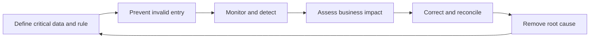
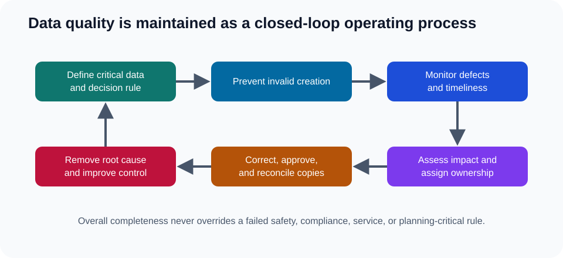

# 17. Data Quality, Cleansing, and Stewardship

## Learning objectives

After this topic, you should be able to:

- evaluate quality against a business decision;
- distinguish prevention, detection, correction, and root-cause removal;
- calculate simple completeness and defect measures; and
- assign issue ownership and closure evidence.

## Data-quality dimensions

| Dimension | Question |
|---|---|
| Accuracy | Does the value represent reality? |
| Completeness | Are required values present? |
| Consistency | Do systems and rules agree? |
| Timeliness | Is the value current enough for the decision? |
| Uniqueness | Is the business object represented once at the required level? |
| Validity | Does the value conform to format, domain, and rule? |
| Integrity | Are relationships among records complete and correct? |

Quality is contextual. A daily lead-time update may be timely for monthly network review but stale for same-day order promising.

## Closed-loop quality process

## Basic measures

### Completeness

$$
\text{Completeness}=\frac{\text{required populated fields}}{\text{required fields evaluated}}
$$

### Defect rate

$$
\text{Defect rate}=\frac{\text{records failing one or more critical rules}}{\text{records evaluated}}
$$

Use [`master-data-quality.csv`](../../assets/data/module-2/section-b/master-data-quality.csv) to compare domains and business impact.

## AsterWorks example

Ninety-eight percent of item fields are populated, but 14% of European items lack a valid customs classification. Overall completeness looks strong while a critical launch decision remains exposed. AsterWorks reports quality by critical rule and process impact, not only by total fields.

## Cleansing sequence

1. define the authoritative rule;
2. profile the affected population;
3. prioritize by operational and financial impact;
4. correct with evidence and approval;
5. reconcile downstream copies;
6. prevent recurrence at source; and
7. monitor closure and reappearance.

## Common mistakes

- Launching a one-time cleanup without process prevention.
- Averaging critical and optional fields.
- Correcting a reporting copy but not the authoritative record.
- Closing defects before downstream reconciliation.
- Making stewards accountable without decision authority or capacity.

## Original knowledge check

Overall master-data completeness is 99%, but a missing hazardous-material flag can stop legal shipment. Is the dataset ready based on the aggregate score alone?

Answer

**No.** Critical rules require separate thresholds and impact-based assessment.

## Related concepts

Continue to [decision support, analytics, and AI](18-decision-support-analytics-and-ai.md).
