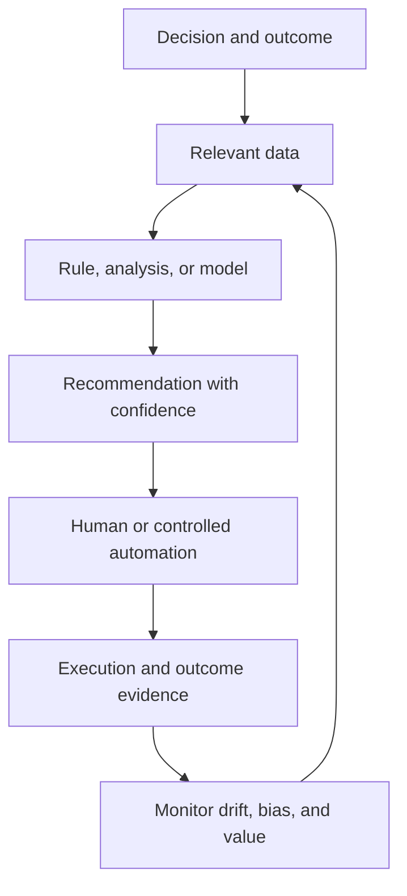

# 18. Decision Support, Analytics, and AI

## Learning objectives

After this topic, you should be able to:

- distinguish descriptive, diagnostic, predictive, prescriptive, and automated uses;
- design analytics around a decision and feedback loop;
- evaluate aggregation, model validation, and data leakage; and
- define human oversight and automation boundaries.

## Analytics ladder

| Level | Question | Example |
|---|---|---|
| Descriptive | What happened? | delivery performance by lane |
| Diagnostic | Why did it happen? | delays linked to booking and port dwell |
| Predictive | What may happen? | probability of missing a customer date |
| Prescriptive | What should be considered? | ranked recovery alternatives |
| Automated | Which approved action can execute safely? | rebook within cost and service guardrails |

Higher sophistication is not automatically higher value. A reliable descriptive exception may outperform an inaccurate predictive model.

## Decision loop

## Aggregation

Aggregation can reduce noise and make patterns easier to interpret, but it can also hide a high-risk customer, product, or location. Store sufficient detail for diagnosis and choose aggregation based on the decision.

## Validation questions

- Does the test period occur after the training period where time matters?
- Could outcome information leak into model inputs?
- Does the sample represent operating conditions and rare critical events?
- Are predictions calibrated and accompanied by uncertainty?
- Does performance differ materially by segment?
- Can users understand the action, constraints, and override?
- Is value measured against a credible baseline?

## AsterWorks example

A delivery-risk model is 92% accurate because most shipments arrive on time. It misses half of the actual late shipments. Accuracy alone hides weak recall for the event the business cares about. AsterWorks adds late-shipment precision, recall, calibration, lead time, and avoided-impact measures.

## Automation boundary

Automate only when:

- the action and objective are explicit;
- inputs meet defined quality thresholds;
- legal, safety, financial, and customer guardrails are encoded;
- failure is detectable and reversible where possible;
- override and escalation exist; and
- outcomes are logged and reviewed.

## Why it matters

Analytics and AI can scale poor objectives, biased data, or unsafe actions faster than manual decision making.

## Decision logic

Define the decision and baseline, validate data and model performance, set human and automated boundaries, monitor drift, and retain override and outcome evidence. Do not approve the decision until mandatory conditions are feasible and the residual exposure has a named owner.

## Evidence retained through the workflow

Retain decision objective, training and test data, model version, performance by segment, guardrails, approval mode, override, drift, and outcome. Record the decision date and the event or threshold that requires reassessment.

## Applied decision artifact

Use a one-page **decision support, analytics, and AI decision record** with these fields:

- **Decision and boundary:** Define the decision and baseline, validate data and model performance, set human and automated boundaries, monitor drift, and retain override and outcome evidence.
- **Required evidence:** decision objective, training and test data, model version, performance by segment, guardrails, approval mode, override, drift, and outcome.
- **Expected result:** Analytics and AI can scale poor objectives, biased data, or unsafe actions faster than manual decision making.
- **Balancing condition:** Greater automation improves speed and consistency but increases model, control, explainability, and failure-propagation risk.
- **Accountability:** name the decision owner, approval date, residual exposure owner, and measurable trigger for reassessment.

The record is complete only when another practitioner can reproduce the reasoning and identify the next action without relying on meeting memory.

## Trade-offs

Greater automation improves speed and consistency but increases model, control, explainability, and failure-propagation risk.

## Commonly confused with

Do not confuse a preferred decision method with a guaranteed outcome. Define the decision and baseline, validate data and model performance, set human and automated boundaries, monitor drift, and retain override and outcome evidence. Validate the result with decision objective, training and test data, model version, performance by segment, guardrails, approval mode, override, drift, and outcome; the evidence, not the method's label, determines whether the choice worked.

## Common mistakes

- Starting with available data rather than a decision.
- Reporting model accuracy without business-event performance.
- Training on future information unavailable at decision time.
- Hiding low confidence from users.
- Automating high-impact decisions without monitoring and recourse.

## Original knowledge check

A model is 95% accurate in a dataset where 95% of shipments are on time. What additional evidence is essential?

Answer and rationale

### Correct answer

Performance on late shipments, comparison with a simple baseline, calibration, decision lead time, and resulting operational value.

### Why it is correct

Analytics and AI can scale poor objectives, biased data, or unsafe actions faster than manual decision making. Define the decision and baseline, validate data and model performance, set human and automated boundaries, monitor drift, and retain override and outcome evidence.

### Why the other answers are wrong

Alternative responses reproduce failure modes already discussed:

- Starting with available data rather than a decision.
- Reporting model accuracy without business-event performance.
- Training on future information unavailable at decision time.

They do not preserve the lesson's decision boundary or evidence. The governing trade-off remains explicit: Greater automation improves speed and consistency but increases model, control, explainability, and failure-propagation risk.

## Practitioner perspective

Use decision objective, training and test data, model version, performance by segment, guardrails, approval mode, override, drift, and outcome as the minimum review record. The artifact should let another practitioner reproduce the conclusion, identify the remaining exposure, and know which trigger reopens the decision.

## Related concepts

- [Section overview](./README.md)
- [Module 3 continuation](../../03-sourcing-strategy-product-design-supplier-execution/section-d-supplier-selection-contracting-and-procurement/01-purchasing-flow-and-selection-routes.md)
Complete the [Section B review](19-section-b-review.md).

---

[Previous: Data Quality, Cleansing, and Stewardship](17-data-quality-cleansing-and-stewardship.md) · [Section review](19-section-b-review.md)
