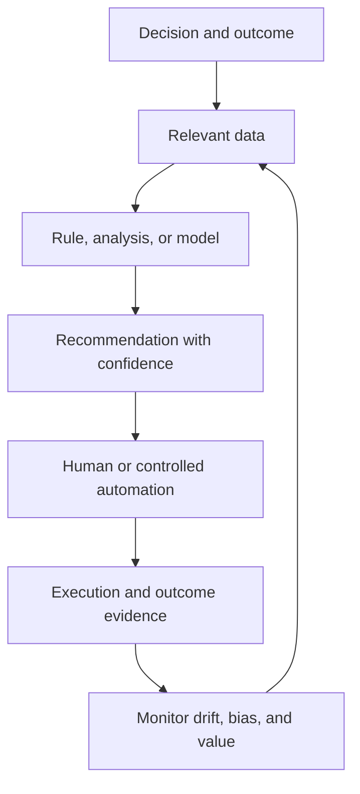

# 18. Decision Support, Analytics, and AI

## Learning objectives

After this topic, you should be able to:

- distinguish descriptive, diagnostic, predictive, prescriptive, and automated uses;
- design analytics around a decision and feedback loop;
- evaluate aggregation, model validation, and data leakage; and
- define human oversight and automation boundaries.

## Analytics ladder

| Level | Question | Example |
|---|---|---|
| Descriptive | What happened? | delivery performance by lane |
| Diagnostic | Why did it happen? | delays linked to booking and port dwell |
| Predictive | What may happen? | probability of missing a customer date |
| Prescriptive | What should be considered? | ranked recovery alternatives |
| Automated | Which approved action can execute safely? | rebook within cost and service guardrails |

Higher sophistication is not automatically higher value. A reliable descriptive exception may outperform an inaccurate predictive model.

## Decision loop

## Aggregation

Aggregation can reduce noise and make patterns easier to interpret, but it can also hide a high-risk customer, product, or location. Store sufficient detail for diagnosis and choose aggregation based on the decision.

## Validation questions

- Does the test period occur after the training period where time matters?
- Could outcome information leak into model inputs?
- Does the sample represent operating conditions and rare critical events?
- Are predictions calibrated and accompanied by uncertainty?
- Does performance differ materially by segment?
- Can users understand the action, constraints, and override?
- Is value measured against a credible baseline?

## AsterWorks example

A delivery-risk model is 92% accurate because most shipments arrive on time. It misses half of the actual late shipments. Accuracy alone hides weak recall for the event the business cares about. AsterWorks adds late-shipment precision, recall, calibration, lead time, and avoided-impact measures.

## Automation boundary

Automate only when:

- the action and objective are explicit;
- inputs meet defined quality thresholds;
- legal, safety, financial, and customer guardrails are encoded;
- failure is detectable and reversible where possible;
- override and escalation exist; and
- outcomes are logged and reviewed.

## Common mistakes

- Starting with available data rather than a decision.
- Reporting model accuracy without business-event performance.
- Training on future information unavailable at decision time.
- Hiding low confidence from users.
- Automating high-impact decisions without monitoring and recourse.

## Original knowledge check

A model is 95% accurate in a dataset where 95% of shipments are on time. What additional evidence is essential?

Answer

Performance on late shipments, comparison with a simple baseline, calibration, decision lead time, and resulting operational value.

## Related concepts

Complete the [Section B review](19-section-b-review.md).
