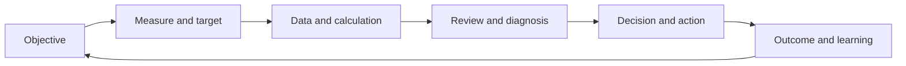
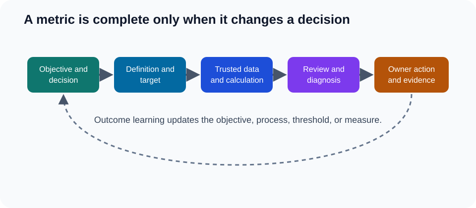

# 1. Measurement System Design

## Learning objectives

After this topic, you should be able to:

- explain why a measurement system is more than a list of metrics;
- define purpose, scope, formula, owner, cadence, target, and action;
- distinguish leading, lagging, diagnostic, and control measures; and
- identify behavior a measure may unintentionally encourage.

## Concept in plain English

A measurement system turns strategy and operating evidence into decisions and improvement. A metric has value only when people understand what it means, trust how it is calculated, and know what action follows.

## Metric definition card

Every material metric should document:

- business purpose and decision;
- scope and exclusions;
- numerator, denominator, unit, and time period;
- event and date definitions;
- authoritative data and quality checks;
- owner and audience;
- target, threshold, and direction;
- review cadence and drill-down path; and
- expected action and escalation.

## Measure roles

| Role | Purpose | Example |
|---|---|---|
| Outcome | shows whether the objective was achieved | perfect-order rate |
| Leading | signals likely future outcome | late supplier confirmations |
| Diagnostic | helps explain an outcome | port dwell time by lane |
| Control | confirms process stays within boundary | interface backlog or master-data defect rate |

One metric may serve different roles at different horizons. Inventory can be an outcome for working-capital management and a diagnostic for service instability.

## AsterWorks example

AsterWorks measures warehouse lines picked per hour. Productivity rises, but planners release smaller waves and customer orders are split across shipments. Freight and incomplete-order rates worsen.

The redesigned system pairs productivity with order completeness, release-to-ready time, freight per order, and safety. It also measures at a level where the warehouse team can diagnose the trade-off.

## Behavioral test

Before adopting a measure, ask:

1. What behavior will improve the number?
2. Could that behavior harm another objective?
3. Can users manipulate the timing, scope, or denominator?
4. Which balancing measure would expose the harm?
5. Is the owner able to influence the outcome?

## Common mistakes

- Publishing a metric without a decision or owner.
- Comparing periods with different scope or definitions.
- Changing formulas without version history.
- Rewarding a local metric that damages end-to-end performance.
- Treating the target as a forecast or guarantee.

## Original knowledge check

A procurement team is rewarded only for purchase-price variance. What balancing measures could prevent harmful behavior?

Answer

Total delivered cost, supplier quality, lead-time reliability, inventory, expedite cost, and continuity exposure are reasonable balancing measures.

## Related concepts

Continue to [strategy-to-metric selection](02-strategy-to-metric-selection.md).
