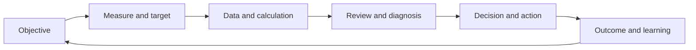

# 1. Measurement System Design

## Learning objectives

After this topic, you should be able to:

- explain why a measurement system is more than a list of metrics;
- define purpose, scope, formula, owner, cadence, target, and action;
- distinguish leading, lagging, diagnostic, and control measures; and
- identify behavior a measure may unintentionally encourage.

## Concept in plain English

A measurement system turns strategy and operating evidence into decisions and improvement. A metric has value only when people understand what it means, trust how it is calculated, and know what action follows.

## Metric definition card

Every material metric should document:

- business purpose and decision;
- scope and exclusions;
- numerator, denominator, unit, and time period;
- event and date definitions;
- authoritative data and quality checks;
- owner and audience;
- target, threshold, and direction;
- review cadence and drill-down path; and
- expected action and escalation.

## Measure roles

| Role | Purpose | Example |
|---|---|---|
| Outcome | shows whether the objective was achieved | perfect-order rate |
| Leading | signals likely future outcome | late supplier confirmations |
| Diagnostic | helps explain an outcome | port dwell time by lane |
| Control | confirms process stays within boundary | interface backlog or master-data defect rate |

One metric may serve different roles at different horizons. Inventory can be an outcome for working-capital management and a diagnostic for service instability.

## AsterWorks example

AsterWorks measures warehouse lines picked per hour. Productivity rises, but planners release smaller waves and customer orders are split across shipments. Freight and incomplete-order rates worsen.

The redesigned system pairs productivity with order completeness, release-to-ready time, freight per order, and safety. It also measures at a level where the warehouse team can diagnose the trade-off.

## Behavioral test

Before adopting a measure, ask:

1. What behavior will improve the number?
2. Could that behavior harm another objective?
3. Can users manipulate the timing, scope, or denominator?
4. Which balancing measure would expose the harm?
5. Is the owner able to influence the outcome?

## Why it matters

Measures change behavior, so an incomplete metric can improve its numerator while damaging service, cash, risk, or the end-to-end process.

## Decision logic

Start from the decision, define the outcome and diagnostic measures, balance dimensions, assign ownership, and set thresholds that trigger action. Do not approve the decision until mandatory conditions are feasible and the residual exposure has a named owner.

## Evidence retained through the workflow

Retain metric definition, purpose, formula and units, source, frequency, target, tolerance, owner, action, and balancing measure. Record the decision date and the event or threshold that requires reassessment.

## Applied decision artifact

Use a one-page **measurement system design decision record** with these fields:

- **Decision and boundary:** Start from the decision, define the outcome and diagnostic measures, balance dimensions, assign ownership, and set thresholds that trigger action.
- **Required evidence:** metric definition, purpose, formula and units, source, frequency, target, tolerance, owner, action, and balancing measure.
- **Expected result:** Measures change behavior, so an incomplete metric can improve its numerator while damaging service, cash, risk, or the end-to-end process.
- **Balancing condition:** More measures improve diagnostic coverage but dilute attention, increase data cost, and create conflicting incentives.
- **Accountability:** name the decision owner, approval date, residual exposure owner, and measurable trigger for reassessment.

The record is complete only when another practitioner can reproduce the reasoning and identify the next action without relying on meeting memory.

## Trade-offs

More measures improve diagnostic coverage but dilute attention, increase data cost, and create conflicting incentives.

## Commonly confused with

Do not confuse a preferred decision method with a guaranteed outcome. Start from the decision, define the outcome and diagnostic measures, balance dimensions, assign ownership, and set thresholds that trigger action. Validate the result with metric definition, purpose, formula and units, source, frequency, target, tolerance, owner, action, and balancing measure; the evidence, not the method's label, determines whether the choice worked.

## Common mistakes

- Publishing a metric without a decision or owner.
- Comparing periods with different scope or definitions.
- Changing formulas without version history.
- Rewarding a local metric that damages end-to-end performance.
- Treating the target as a forecast or guarantee.

## Original knowledge check

A procurement team is rewarded only for purchase-price variance. What balancing measures could prevent harmful behavior?

Answer and rationale

### Correct answer

Total delivered cost, supplier quality, lead-time reliability, inventory, expedite cost, and continuity exposure are reasonable balancing measures.

### Why it is correct

Measures change behavior, so an incomplete metric can improve its numerator while damaging service, cash, risk, or the end-to-end process. Start from the decision, define the outcome and diagnostic measures, balance dimensions, assign ownership, and set thresholds that trigger action.

### Why the other answers are wrong

Alternative responses reproduce failure modes already discussed:

- Publishing a metric without a decision or owner.
- Comparing periods with different scope or definitions.
- Changing formulas without version history.

They do not preserve the lesson's decision boundary or evidence. The governing trade-off remains explicit: More measures improve diagnostic coverage but dilute attention, increase data cost, and create conflicting incentives.

## Practitioner perspective

Use metric definition, purpose, formula and units, source, frequency, target, tolerance, owner, action, and balancing measure as the minimum review record. The artifact should let another practitioner reproduce the conclusion, identify the remaining exposure, and know which trigger reopens the decision.

## Related concepts

- [Section overview](./README.md)
- [Module 3 continuation](../../03-sourcing-strategy-product-design-supplier-execution/section-d-supplier-selection-contracting-and-procurement/02-supplier-criteria-and-scorecards.md)
Continue to [strategy-to-metric selection](02-strategy-to-metric-selection.md).

---

[Section overview](README.md) · [Next: Strategy-to-Metric Selection](02-strategy-to-metric-selection.md)
